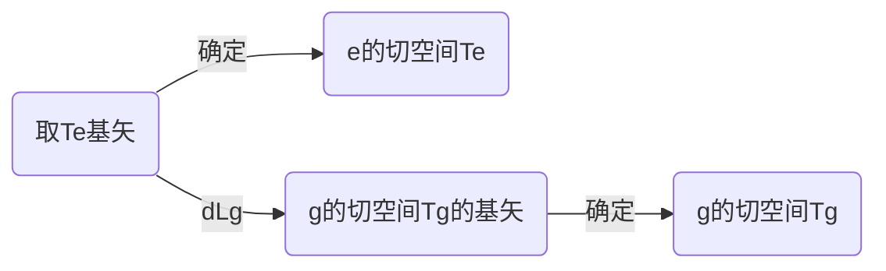
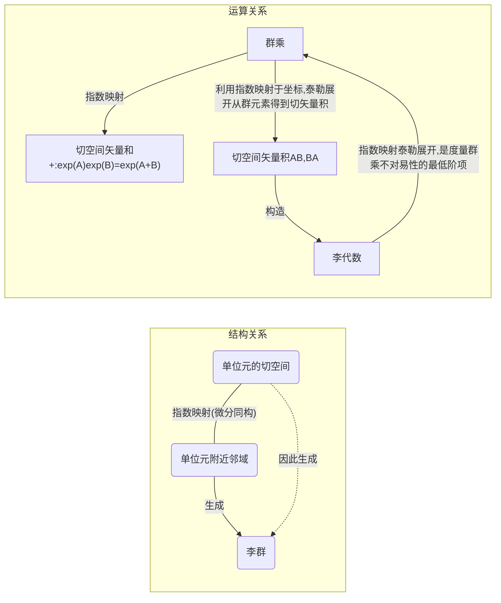
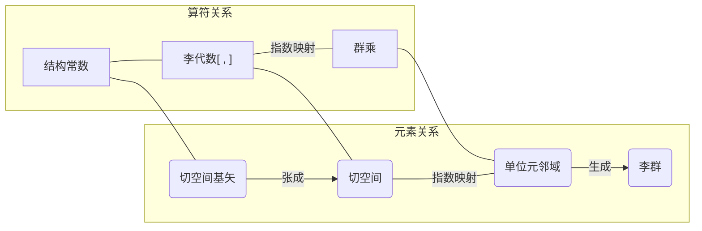

# 基本概念

## 集合

## 群

$$
集合+ 群乘\begin{cases} 封闭\\结合律\\存在单位元\\有唯一逆元\\ \end{cases}\notag
$$

## 域(field)

$$
集合 \qquad +
\begin{cases}

定义加法& \quad 在加法下是阿贝尔群 \\
定义乘法& \quad 
\begin{cases} 封闭\\结合律\\存在一个单位元\\除某个元素外都有唯一逆元(0)\\乘法A\cdot B对A、B都有分配律\\\end{cases}
\end{cases}\notag
$$

## 线性向量空间

$$
\begin{cases}
& 集合A \qquad A是一个域\\
& 集合B \qquad B中元素称为向量
	\begin{cases}
		向量加法 &\quad 集合B在向量加法下是一个阿贝尔群 \\
		标量积  & 
		\begin{cases} 
			封闭性 & a \circ \vec{b} \in B \\ 
			结合律 & a _ 1 \circ \left ( a _ 2 \circ \vec{b} _ i \right) = \left( a _ 1 \circ a _ 2 \right)\circ \vec{b} _ i  \\
			单位元 & 1\circ \vec{b} _ i=\vec{b} _ i=\vec{b} _ i \circ 1  \\
			\underline{双线性性} (分配律)&  \begin{cases}
				a _ 1 \circ \left ( \vec{b} _ 1 + \vec{b} _ 2 \right) &= a \circ  \vec{b} _ 1 + a \circ \vec{b} _ 2\\
				\left (a _ 1 +a _ 2\right) \circ \vec{b} &= a _ 1\circ \vec{b} +a _ 2\circ \vec{b}\\
				\end{cases}
		\end{cases}
	\end{cases}
\end{cases}\notag
$$

这里双线性性就是"**线性**向量空间"中线性的定义.

### 例子

所有$N\times M$矩阵在矩阵加法下构成线性向量空间.

定义在圆上$(0 \le \varphi \le 2 \pi)$的所有函数构成线性向量空间.

$$
f(\varphi)=\sum _ {-\infty}^{+\infty} a _ m \exp{(i m \varphi)} \quad , m\in \mathbb{Z}
$$

## 代数

$$
线性向量空间V + 矢量积 \square
	\begin{cases} 
		封闭性 &\vec{v} _ 1 \square \vec{v} _ 2 \in V\\
		双线性性
		&\begin{cases}
			\left(\vec{v} _ 1+\vec{v} _ 2 \right)\square \vec{v} _ 3 = \vec{v} _ 1 \square \vec{v} _ 3+\vec{v} _ 2 \square \vec{v} _ 3\\ 
			\vec{v} _ 1 \square \left(\vec{v} _ 2+\vec{v} _ 3 \right) =\vec{v} _ 1 \square \vec{v} _ 2+\vec{v} _ 1 \square \vec{v} _ 3
		\end{cases}
        \end{cases}\notag
$$

以上定义的矢量积,还可以加上不同的性质,以构成不同的代数,其中如果矢量积$\vec{A}\square\vec{B}$还满足

$$
\vec{A} \square \left(\vec{B} \square \vec{C}\right) = \left(\vec{A} \square \vec{B}\right) \vec{C}+\vec{B} \square \left( \vec{A} \square \vec{C} \right)
$$

那么这样的代数称为Lie代数,这时常常把矢量积$\vec{A}\square \vec{B}$写作$[\vec{A},\vec{B}]$ 

## 补充: 标量函数的变换算符

对于标量函数, 对宗量(自变量)$x\in \mathbb{C}^n, \quad n\in \mathbb{N}$的变换, 总可以表示成对标量函数的变换, 即

$$
\begin{align*}
x &\rightarrow \chi=Rx\\
 \Psi&\rightarrow \Phi=P _ R\Psi
\end{align*}
$$

上面大写的希腊字母表示函数值, $\psi(x)=\Psi, \quad \psi(y)=\Phi$ ,  $P _ R$ 是对标量 $\Phi$ (一个数)的变换. 

注意 而 $\Psi \in \mathbb{C}$ 是一个标量, 因此就若采用矩阵表示, $R$是一个$n\times n$矩阵, 作用于$x\in \mathbb{C}^n$, 而$P _ R$是一个算符, 作用于$\psi(x)= \Psi \in \mathbb{C}$

又因为一般有$\Phi=P _ R\Psi=P _ R\psi(x)\neq \psi(\chi)$, 因而将$\Phi$记为$\Phi=\phi(\chi)$

将上述关系整理为

$$
\begin{align*}
x &\rightarrow \chi=Rx\\
\psi(x)&\rightarrow \phi(\chi) =P _ R\psi(\chi)
\end{align*}
$$

因此$P _ R$的作用是将函数$\phi$变换为一个新的函数$\psi$. 

将上式改写之后可以得到

$$
\psi(x)={P _ R}^{-1}\phi(x)=\psi(R^{-1}\chi)
$$

因此也可以说$P _ R$的作用是"抵消" $R$的作用

$$
\phi(x)=P _ R\psi(x)=\psi(R^{-1}x)
$$

标量函数变换算符与群元素一一对应

# 拓扑空间的相关概念,拓扑群

## 拓扑空间

一个集合$X$以及它的<u>子集的集合</u>(称为子集族(a family of sets)) $\mathcal{T}$ 构成的对$(X,\mathcal{T})$称为拓扑空间，要求

$$
\begin{cases}
\emptyset , X \in \mathcal{T}\\
 \mathcal{T} 中任意多个集合的并集 \in \mathcal{T} \quad (任意并)\\
 \mathcal{T} 中有限多个集合的交集 \in \mathcal{T} \quad (有限交)\
\end{cases}\notag
$$

> 拓扑空间通过定义开集, 定义了集合的"划分方法". 开集指定了$X$中的一个点(元素)与哪些点是在一个集合(邻域)中的, 也就通过连通性得到了拓扑

### Hausdorff空间

若对任意两点$x,x'$, 都可以找到的$x,\,x'$的邻域$U _ x,\, U _ {x'}$,使得$x\in U _ x,\, x' \in U _ {x'}, \, U _ x \bigcap  U _ {x'} =\emptyset$, 就称此空间是Hausdorff空间.
> 直观的理解是, 这样的空间中任意两个点都是可以区分的.
>
> 注意并不能理解成这样的空间中,点无限致密. 因为在两个邻域"之间", 并不一定存在点. 举例来说,离散的点集中, 离散拓扑定义的拓扑空间就是Hausdorff空间.

### 度规(metric)

度规是一个二元函数$d: X \times X \rightarrow \mathbb{R}$, 将两个$X$中的元素映射到实数中, 也就是定义了$X$中任意两点的距离. 要使$d$是一个度规, 还要求$d$满足:

$$
\begin{cases}
对称性 & d(x,y) = d(y,x)\\
半正定性 & d(x,y) \ge 0 \quad, \mathrm{if\ and\ only\ if\ } x=y \\
三角形不等式 & d(x,y)+d(y,z) \ge d(x,z)
\end{cases}\notag
$$

配备了度规的拓扑空间(Topological space endowed with a metric)天然有一个度规拓扑$(X , \mathcal{T})$, 其中$\mathcal{T}$中的子集为"开球", 这样的空间$(X , \mathcal{T})$称为度规空间.

## 流形

流形的德文为mannigfaltigkeit,英文翻译为manifold, 词义为"多态,多重",中文最初翻译为"多样体",现行翻译来自于文天祥《正气歌》"天地有正气, 杂然赋流形."而原始出处则为《易经》: "大哉乾元, 万物资始, 乃统天. 云行雨施, 品物流形."

流形是对曲线,曲面的概念推广. 另一个说法是: 流形是局部看起来像$\mathbb{R}^n$,但是有更复杂的拓扑结构(定义在拓扑空间上)的数学结构.

这里要注意的是, 曲线可以存在于高维的空间，但是曲线永远是$1$维的, 只用一个参数就可以描写. 

### 流形的坐标

为了研究方便,我们可以将$n$维流形映射到$\mathbb{R}^n$

若$\mathcal{M}$是一个拓扑空间, ${U _ i}$是$\mathcal{M}$的一个开覆盖(即$\bigcup U _ i=\mathcal{M}$), $\varphi _ i $是从$U _ i$到$\mathbb{R}^m$的映射, 满足对于任意$U _ i \bigcup U _ j \neq \emptyset$的$U _ i$和$U _ j$, $\varphi _ i \circ \varphi _ j^{-1}$(这个映射即为$\varphi _ i \circ \varphi _ j^{-1}(x)=\varphi _ i \left(\varphi _ j^{-1}(x)\right)$) 是无穷可微的(光滑). 这样的拓扑空间就称为流形.

简单地说, 给一个拓扑空间配备一个性质足够好(可<u>微分</u>)的坐标映射, 就得到<u>微分</u>流形

(未完)

# 李群

## 李群定义

李群$G$的定义:

$$
\begin{cases}
G 是一个群\\
G 是一个微分流形\\
群的运算也是可微的\\
\end{cases}\notag
$$

这样的群称为李群.

## 局部李群(李群的子群)

定理: 若$G$是连通拓扑群, $e$的一个开邻域关于$G$的群乘为局部李群,则可在$G$中引入一个唯一的拓扑结构使$G$全体成为李群, 且其诱导拓扑与原拓扑一致.

# 李群的李代数

## 李群的切空间

见[^李群短文1][^李群短文2][^李群短文3] . 由李群可以由任意一个在单位元$e$附近的邻域生成, 自然会想问, 这样的邻域最小可以有多小? 可以是无穷小的切空间吗?

### 李群的单参数子群

为了先有一个直观的理解, 先从李群的单参数子群入手. 李群的单参数子群可以理解为李群$G$所在流形$\mathcal{M}$上的一条单参数曲线. 

> 李群的来源是数学家Lie 在研究形如
> 
> $$
> \dot{x}(x _ 1,x _ 2,\cdots, x _ n)=f(x _ 1,x _ 2,\cdots, x _ n)\notag
> $$
> 
> 的微分方程时引入的. 一组初始条件,就对应了一个解,即李群的一个单参数子群

### 李群的切丛性质

#### 李群的左平移

李群的左平移$L _ g$是一个李群到自身的映射:

$$
L _ g:  G \rightarrow G \qquad x \rightarrow g \circ x
$$

诱导出一个切空间的微分映射$dL _ g$. 如图所示.

由此可以得到

### 指数映射

回顾李群的概念,李群是定义在流形上的,李群的元素之间有李群群乘. 如果我们要研究切空间, 我们自然要问,切空间里面的元素是什么, 有什么运算.

直观的感受告诉我们,一个球可以看做李群, 在某一点$p$的切空间就是在$p$点的切平面. 这个平面上面的元素就是过$p$点的所有切向量(任意大小,方向). 因此这个空间是一个线性矢量空间. 除此之外,我们还可以在这个空间上定义更复杂的"代数", 表示矢量积.

但是对于李群我们不能这样做. 李群的切空间的元素之间的运算关系必须由李群群乘来确定. 这样对群乘"微分",得到的运算就会是李群切空间的运算. 因此,只要确定了切空间内元素与李群中元素的对应关系, 就可以确定切空间内元素的运算了.

这样的映射之一,就是指数映射. 为了不与单位元 $  e  $ 混淆, 指数映射一律记为$  \exp(x)  $, 而不是$  e^x  $

由$  \vec{v} _ {1} \rightarrow g  _  {\vec{v} _  1}(t)$是一一映射, 可以定义$  \exp(\vec{v} _ 1)=g  _  { \vec{v} _  1} (1)  $为指数映射.

指数映射的性质和定义在实数上的指数映射基本一致:

$$
\begin{align}
\exp{\left[\left(s+t\right)\vec{v} _ 1\right]}&=\exp{\left(s\vec{v} _ 1\right)}\exp{\left(s\vec{v} _ 1\right)}\\
\left[ \exp{\left(t \vec{v} _ 1\right)}\right]^{-1}&=\exp{\left(-t \vec{v} _ 1\right)}
\end{align}
$$

自此我们建立了李群中部分元素和李群单位元切空间$T _ e$的一一对应.

### 李群切空间到李群的邻域

有了映射,我们得到如下定理:

$e$处切空间$T  _  e$中存在切空间单位元$\vec{e}$的邻域$TU _ \vec{e}$, 使得$T U  _  {\vec{e}}$通过指数映射,与$e$的邻域微分同构.

### 指数映射的Taylor展开

#### 第一类坐标系

为了更好地研究指数映射, 在李群(流形)上引入第一类坐标系

$$
N _ e=\lbrace \exp{\sum _ {i=1}^{n}{x _ i \vec{E} _ i} | \sum _ {i=1}^{n}{x _ i \vec{E} _ i} \in N _ \vec{e}}\rbrace
$$

这个坐标系的含义是, 通过切空间的基矢量 $\vec{E} _ i$, 展开切空间单位元邻域 $ N  _  { \vec{e} } $得到$N  _  \vec{e}$ 中的坐标$x _ i$ , 然后将切空间的任意一个向量$\vec{v}= \sum _ {i=1}^{n}{x _ i \vec{E} _ i}$通过指数映射$\exp{\vec{v}}$得到李群单位元素邻域的元素$\exp{\sum  _  {i=1}^{n}{x _ i \vec{E} _ i}}$. 

#### 建立Taylor公式

定理: 存在$\mathfrak{g}$的原点邻域$N _ \vec{e}$.满足若$\vec{x} \in N  _  \vec{e}$, 则 $0\le t \le 1 $都有$t \vec{x} \in N  _  \vec{e}$, 且对$G$上解析的函数$f$有:

$$
f(g\cdot \exp{\vec{x}})=\sum _ {n=0}^{\infty} \frac{1}{n!}\left(\vec{x}^n f\right)(g)=\exp{(\vec{x})} f\left(g\right)
$$

取$g=e,f(x)=x$可以看出上式就是指数函数的展开

$$
\exp{\vec{x}} = \sum _ {n=0}^{\infty}\frac{1}{n!} \vec{x}^n \label{exponetialExpension}
$$

注意到这里第一次出现了切空间的运算$\vec{x}^n$

> 定理的证明如下(待完善)
> 
> $$
> \begin{align*}
> \left(\vec{x}f\right) g & = \left(\vec{x}f \cdot L _ g\right)(\exp{t \vec{x}}| _ {t=0}) \\
> & = \left(d \theta \left(\frac{d}{dt}\right)f \cdot L _ g\right)(\exp{t \vec{x}}| _ {t=0})\\
> & =\frac{d}{dt} f  \left(g \exp{t \vec{x}}| _ {t=0}\right)\\
> &\Rightarrow \\
> \left(\vec{x}f\right) \left( g \exp{u \vec{x}}\right) & = \frac{d}{d u} f  \left(g \exp{u \vec{x}}| _ {t=0}\right) \\
> &\Rightarrow \\
> \left(\vec{x}^nf\right) \left( g \exp{u \vec{x}}\right) & = \frac{d^n}{ {d u}^n} f  \left(g \exp{u \vec{x}}| _ {t=0}\right) \\
> \end{align*}
> $$
>

### 切空间运算,李代数

见[^海森堡量子力学]. 切空间运算是依赖于映射的. 之前通过指数映射我们得到了切空间的运算规律.

应用指数运算和群的封闭性:  

$$
\begin{align}
\exp{\vec{x}} \cdot \exp{\vec{y}} & = \exp{\vec{z}}\notag\\
&=(1+\vec{x}+\frac{1}{2} \vec{x}^2+\cdots)(1+\vec{y}+\frac{1}{2} \vec{y}^2+\cdots) \label{expProduct}\\
\end{align}
$$

若上式 $(\ref{expProduct})$ 中 $\vec{x}$ , $ \vec{y} $ 对易, 则:

$$
\begin{align*}
\exp{\vec{x}} \cdot \exp{\vec{y}}&=(1+(\vec{x}+\vec{y})+\frac{1}{2!}(\vec{x}+\vec{y})^2+\frac{1}{3!}(\vec{x}+\vec{y})^3+\cdots)
\end{align*}
$$

若上式 $(\ref{expProduct})$ 中 $\vec{x}$ , $ \vec{y} $ 不对易, 则

$$
\begin{align*}
\exp{\vec{x}} \cdot \exp{\vec{y}}&=(1+(\vec{x}+\vec{y})+\frac{1}{2!}(\vec{x}+\vec{y})\cdot(\vec{x}+\vec{y})+\frac{1}{3!}(\vec{x}+\vec{y})\cdot(\vec{x}+\vec{y})\cdot(\vec{x}+\vec{y})+\cdots)
\end{align*}
$$

为了将$\vec{z}$表示成$\vec{x}+\vec{y}$的形式, 我们计算由于不对易性导致式 $(\ref{expProduct})$ 的差:

$$
\begin{align}
(\vec{x}+\vec{y})^n-\begin{matrix} \underbrace{ (\vec{x}+\vec{y})\cdot(\vec{x}+\vec{y})\cdot\cdots\cdot(\vec{x}+\vec{y})} \\ n 个(\vec{x}+\vec{y})\end{matrix}
&=\sum _ i{\binom{i}{n}\vec{x}^i\vec{y}^{n-i}}-\sum _ i{P _ n^i(\vec{x},\vec{y})} \notag \\
&=\sum _ i{
\binom{i}{n}\sum _ j{
\left(\vec{x}^i\vec{y}^{n-i}-
\begin{matrix} \underbrace{ \vec{x}\cdot\vec{y}\cdot\vec{x}\cdot\vec{x}\cdot\vec{y}\cdot\cdots} \\ 第j 种排列\end{matrix}\right)
}}\notag\\
\end{align}
$$

如果$\left[\vec{x},\vec{y}\right]$是一个复数(c-number), 利用BCH公式[^BCH公式], 得到二者之差为:

$$
\begin{align}
&=\left(1+\left(\vec{x}+\vec{y}\right)+\frac{1}{2}\left(\vec{x}^2+2\vec{x}\cdot\vec{y}+\vec{y}^2\right)+\mathcal{O}(3)\right) \notag\\
&=\left(1+\left(\vec{x}+\vec{y}\right)+\frac{1}{2}\left(\vec{x}^2+\vec{y}\cdot\vec{x}+\vec{x}\cdot\vec{y}+\vec{y}^2+\left(\vec{x}\cdot\vec{y}-\vec{y}\cdot\vec{x}\right)\right)+\mathcal{O}(3)\right) \notag\\
&=\left(1+\left(\vec{x}+\vec{y}\right)+\frac{1}{2}\left(\vec{x}^2+\vec{y}\cdot\vec{x}+\vec{x}\cdot\vec{y}+\vec{y}^2\right)+\frac{1}{2} \left(\vec{x}\cdot\vec{y}-\vec{y}\cdot\vec{x}\right)+\mathcal{O}(3)\right) \notag\\
&=\left(1+\left(\vec{x}+\vec{y}\right)+\frac{1}{2}\left(\vec{x}+\vec{y}\right)(\vec{x}+\vec{y})+\frac{1}{2}\left[\vec{x},\vec{y}\right]+\mathcal{O}(3)\right) \notag\\
& = \exp{\left(\left(\vec{x}+\vec{y}\right)+\frac{1}{2}\left[\vec{x},\vec{y}\right]\right)}\\
& \phantom{=t\left(\vec{x}\right.}\uparrow \phantom{\vec{y})+\frac{t^2}{2}} \uparrow\notag\\
& \phantom{=t\left(\right.}矢量和 \quad 李代数矢量积\notag\\
\end{align}
$$

因此可以说,李代数是李群结构非对易性的线性化(即"低阶近似"), (是反应不对易性的第一项)

$$
\begin{align}
\exp{(A+B)}&=\exp{A}\exp{B}\exp{\left(-\frac{1}{2}[A,B]\right)}\notag\\
&=\exp{C}\notag
\end{align}\\
C=A+B+\frac{1}{2}[A,B]+\frac{1}{12}[[A,B],B]+\frac{1}{12}[[B,A],A]+\cdots\\
[[A,B],B]=[[B,A],A]=0\notag
$$

## 李群的无穷小性质

李群的"无穷小元素"实际上不在李群中. 他们指的实际上是单位元$e$所在切空间$T _ e$的切向量. 但是可以将切向量映射到在单位元附近的李群元素. 他们的积表现为矢量和.对应逆表现为矢量反向.

$$
\left(1+\delta\right)\left(1+\varepsilon\right) = 1+\delta + \varepsilon +\delta\varepsilon \approx 1 +\left(\delta + \varepsilon\right)\notag
$$

很显然的是, $\left(1+\delta\right)+\left(1+\varepsilon\right) \neq 1 +\left(\delta + \varepsilon\right)$ . 用$\Delta $, $E$表示他们对应的切矢量,即$\Delta = \exp{\delta}$, $E = \exp{\varepsilon}$

$$
\begin{align}
\delta \cdot \varepsilon&=\exp{\Delta} \cdot \exp{E} \notag\\
&= \left(1+\Delta+\frac{1}{2}\Delta^2+\cdots\right)\left(1+E+\frac{1}{2}E^2+\cdots\right)\notag\\
&=\left(1+\left(\Delta+E\right)+\cdots\right)\notag\\
&=\exp{\left(\Delta+ E\right)} \label{productLikeVectorSum}
\end{align}
$$

因此式$(\ref{productLikeVectorSum})$才是"元素积<u>表现</u>(在一阶近似下)为(对应切矢量的)矢量和"的真正含义.

## 李群的生成元

由以上关系, 只要用切空间的基矢以及结构常数就可以生成整个李群. **切空间的一组基矢就是李代数的生成元**

# 举例

## 三维转动群

见[^三维转动群]

### 三维转动群的群元素与切向量

三维转动群的变换矩阵构成一个李群.其中选取绕$z$轴旋转$\omega$角度的矩阵, 构成一个单参数李群:

$$
R _ z(\omega)=\begin{bmatrix}\cos{\omega}&-\sin{\omega}&0\\ \sin{\omega}&\cos{\omega}&0\\0&0&1\end{bmatrix}
$$

单位元为

$$
R _ z(0)=\begin{bmatrix}1&0&0\\ 0&1&0\\0&0&1\end{bmatrix}=\mathbf{I} \notag
$$

单位元的切空间内切向量为

$$
\begin{align*}
\dot{\vec{R}} _ z(0)=\left.\frac{d}{d\omega}R _ z(\omega)\right| _ {\omega=0}&=\left.\begin{bmatrix}\cos{\omega}&-\sin{\omega}&0\\ \sin{\omega}&\cos{\omega}&0\\0&0&0\end{bmatrix}\right| _ {\omega=0}\\
&=\left.\begin{bmatrix}-\sin{\omega}&-\cos{\omega}&0\\ \cos{\omega}&-\sin{\omega}&0\\0&0&0\end{bmatrix}\right| _ {\omega=0}\\
&=\begin{bmatrix}0&-1&0\\1&0&0\\0&0&0\end{bmatrix}
\end{align*}
$$

同样可以得到其余两个轴的转动关系,总结得到:

$$
\begin{align*}
R _ x(\omega)=\begin{bmatrix}1&0&0\\ 0&\cos{\omega}&-\sin{\omega}\\0&\sin{\omega}&\cos{\omega}\end{bmatrix}\qquad
\dot{\vec{R}} _ x(0)&=\begin{bmatrix}0&0&0\\0&0&-1\\0&1&0\end{bmatrix}\\
R _ y(\omega)=\begin{bmatrix}\cos{\omega}&0&\sin{\omega}\\ 0&1&0\\-\sin{\omega}&0&\cos{\omega}\end{bmatrix}\qquad
\dot{\vec{R}} _ y(0) &=\begin{bmatrix}0&0&1\\0&0&0\\-1&0&0\end{bmatrix}\\
R _ z(\omega)=\begin{bmatrix}\cos{\omega}&-\sin{\omega}&0\\ \sin{\omega}&\cos{\omega}&0\\0&0&1\end{bmatrix}\qquad
\dot{\vec{R}} _ z(0)&=\begin{bmatrix}0&-1&0\\1&0&0\\0&0&0\end{bmatrix}
\end{align*}
$$

以上就是三维转动李群生成元的$3 \times3$矩阵表示.  注意到

$$
\begin{align*}
{\dot{\vec{R}} _ x(0)}^2&=\begin{bmatrix}0&0&0\\0&0&-1\\0&1&0\end{bmatrix}\begin{bmatrix}0&0&0\\0&0&-1\\0&1&0\end{bmatrix}=\begin{bmatrix}0&0&0\\0&-1&0\\0&0&-1\end{bmatrix}\\
{\dot{\vec{R}} _ x(0)}^3&=\begin{bmatrix}0&0&0\\0&-1&0\\0&0&-1\end{bmatrix}\begin{bmatrix}0&0&0\\0&0&-1\\0&1&0\end{bmatrix}=\begin{bmatrix}0&0&0\\0&0&1\\0&-1&0\end{bmatrix}\\
{\dot{\vec{R}} _ x(0)}^4&=\begin{bmatrix}0&0&0\\0&0&1\\0&-1&0\end{bmatrix}\begin{bmatrix}0&0&0\\0&0&-1\\0&1&0\end{bmatrix}=\begin{bmatrix}0&0&0\\0&1&0\\0&0&1\end{bmatrix}\\
{\dot{\vec{R}} _ x(0)}^5&=\begin{bmatrix}0&0&0\\0&1&0\\0&0&1\end{bmatrix}\begin{bmatrix}0&0&0\\0&0&-1\\0&1&0\end{bmatrix}=\begin{bmatrix}0&0&0\\0&0&-1\\0&1&0\end{bmatrix}\\
\end{align*}
$$

### 三维转动群的指数映射

因此有切矢量的指数映射, 泰勒展开后得到群元素(式$(\ref{exponetialExpension})$的类比):

$$
\begin{align}
\exp{\left(\omega\dot{\vec{R}} _ x(0)\right)}&=\sum _ n{\frac{1}{n!}\left(\omega\dot{\vec{R}} _ x(0)\right)^n} \notag\\ 
&=I\cdot(1+{\frac{1}{2!}\omega^2{\left(\dot{\vec{R}} _ x(0)\right)}^2}+{\frac{1}{4!}\omega^4{\left(\dot{\vec{R}} _ x(0)\right)}^4}+\cdots)
+(\omega \dot{\vec{R}} _ x(0)+{\frac{1}{3!}\omega^3{\left(\dot{\vec{R}} _ x(0)\right)}^3}+{\frac{1}{5!}\omega^5{\left(\dot{\vec{R}} _ x(0)\right)}^5}\cdots)\notag\\
&=I+(-{\frac{1}{2!}\omega^2}+{\frac{1}{4!}\omega^4}+\cdots)\begin{bmatrix}0&0&0\\0&1&0\\0&0&1\end{bmatrix}
+(\omega-{\frac{1}{3!}\omega^3}+{\frac{1}{5!}\omega^5}\cdots)\begin{bmatrix}0&0&0\\0&0&-1\\0&1&0\end{bmatrix}\notag\\
&=\begin{bmatrix}1&0&0\\0&0&0\\0&0&0\end{bmatrix}+\begin{bmatrix}0&0&0\\0&1&0\\0&0&1\end{bmatrix}+(-{\frac{1}{2!}\omega^2}+{\frac{1}{4!}\omega^4}+\cdots)\begin{bmatrix}0&0&0\\0&1&0\\0&0&1\end{bmatrix}
+(\omega-{\frac{1}{3!}\omega^3}+{\frac{1}{5!}\omega^5}\cdots)\begin{bmatrix}0&0&0\\0&0&-1\\0&1&0\end{bmatrix}\notag\\
&=\begin{bmatrix}1&0&0\\0&0&0\\0&0&0\end{bmatrix}+(1-{\frac{1}{2!}\omega^2}+{\frac{1}{4!}\omega^4}+\cdots)\begin{bmatrix}0&0&0\\0&1&0\\0&0&1\end{bmatrix}
+(\omega-{\frac{1}{3!}\omega^3}+{\frac{1}{5!}\omega^5}\cdots)\begin{bmatrix}0&0&0\\0&0&-1\\0&1&0\end{bmatrix}\notag\\
&=\begin{bmatrix}1&0&0\\0&0&0\\0&0&0\end{bmatrix}+\cos{\omega}\begin{bmatrix}0&0&0\\0&1&0\\0&0&1\end{bmatrix}+\sin{\omega}\begin{bmatrix}0&0&0\\0&0&-1\\0&1&0\end{bmatrix}\notag\\
&=\begin{bmatrix}1&0&0\\0&\cos{\omega}&-\sin{\omega}\\0&\sin{\omega}&\cos{\omega}\end{bmatrix}\notag\\
&=R _ x(\omega)
\end{align}
$$

### 三维转动群的"无穷小元素"的作用: 计算生成元

因此按照之前的说法, 三维转动李群的切空间元素就是三个矩阵(实际上是Pauli矩阵的变形). 

无穷小元素按照之前定义, 具有下述性质

$$
(1+\delta\mathbf{1})(1+\varepsilon\mathbf{1})=(1+(\delta+\varepsilon)\mathbf{1})
$$

而与切空间向量对应的群元素有

$$
\begin{align*}
\exp{(\delta\vec{R} _ x)}\cdot\exp{(\varepsilon\vec{R} _ x)}&=\left(1+\delta\vec{R} _ x+\frac{1}{2!}\delta^2{\vec{R} _ x}^2+\cdots\right)\cdot\left(1+\varepsilon\vec{R} _ x+\frac{1}{2!}\varepsilon^2{\vec{R} _ x}^2+\cdots\right)\\
&=\left(1+(\delta+\varepsilon)\vec{R} _ x+\frac{1}{2!}(\delta^2+2\delta\varepsilon+\varepsilon^2){\vec{R} _ x}^2 +\cdots\right)\\
&=\left(1+(\delta+\varepsilon)\vec{R} _ x+\frac{1}{2!}(\delta+\varepsilon)^2{\vec{R} _ x}^2+\cdots\right)\\
&=\exp{((\delta+\varepsilon)\vec{R} _ x)}
\end{align*}
$$

可以看出,在最低阶近似下, 切空间向量指数映射满足"无穷小元素"的运算规则:

可以说, ==无穷小元素只是一个计算的手段, 可以方便地得到**标量算符**生成元应当满足的关系.== 

#### 无穷小元素计算举例

例如对转动群

$$
\begin{align*}
R&=1+\varepsilon g& R&=\exp(\varepsilon g)\\
P _ R&=1+\omega \varepsilon g & P _ R&=\exp(\omega\varepsilon g)\\
&\mathrm{some\ calculation} &&\mathrm{some\ calculation}\\
f(\omega)&=0 & f(\omega)&=0\\
\end{align*}\\
\omega \mathrm{就是标量算符的生成元}\\
两者计算结果是一样的
$$

### 三维转动群的"生成元"

下面研究这个李群的无穷小生成元.

$$
\begin{align*}
P _ {R(\alpha)}\psi(x)&=\psi({R(\alpha)}^{-1}x)\\
&=\psi(x)+\sum _ {n=2}^{\infty}{\frac{1}{n!}\frac{\partial^n \psi({R(\alpha)}^{-1}x)}{ {\partial \alpha}^n}\alpha^n}\\
&=\psi(x)+\sum _ {n=2}^{\infty}{\frac{1}{n!}\frac{\partial^n \psi({R(\alpha)}^{-1}x)}{ {\partial \left({R(\alpha)}^{-1}x\right)}^n}\frac{\partial^n \left({R(\alpha)}^{-1}x\right)}{ {\partial \alpha}^n} \alpha^n}\\
&=\psi(x)+\sum _ {n=2}^{\infty}{\frac{1}{n!}\frac{\partial^n \psi(x)}{ {\partial x}^n}\frac{\partial^n \left({R(\alpha)}^{-1}x\right)}{ {\partial \alpha}^n} \alpha^n}\\
\end{align*}
$$

## 物理中的对称性生成元

### 平移对称性的生成元

# 参考文献

[^三维转动群]: 物理学中的群论 马中骐.

[^李群短文1]: Mario Micheli. *Basics IX : Lie groups and Lie algebras*. PDF file. April 25, 2018. <http://www.dam.brown.edu/people/mariom/AM282-01/HANDOUTS/Basic+EPDiff.pdf>

[^李群短文2]: Tom Church. *LIE GROUPS AND LIE ALGEBRAS.* PDF file.April 25, 2018. <http://math.uchicago.edu/~womp/2007/lie2007.pdf>

[^李群短文3]: <http://idv.sinica.edu.tw/ftliang/diff _ geom/*diff _ geometry(II)/Lie _ theory/2lie _ algebra.pdf>

[^海森堡量子力学]: Heisenberg's QM", P58, Baker-Campbell-Hausdorff Formula

[^BCH公式]: https://en.wikipedia.org/wiki/Baker%E2%80%93Campbell%E2%80%93Hausdorff _ formula
