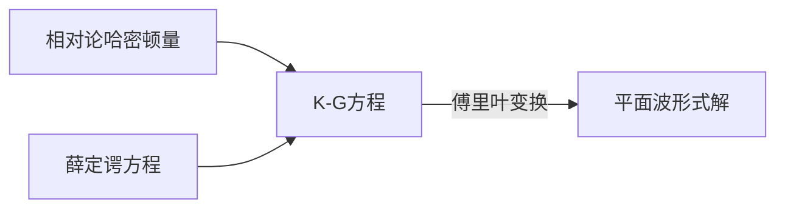

# 约定

$$
\newcommand{\d}{\mathrm{d}}
\newcommand{\slash}[1]{\not{#1}}
\newcommand{\bra }[1]{ \left\langle {#1} \right\vert }
\newcommand{\ket }[1]{ \left\vert {#1} \right\rangle }
\newcommand{\braket}[2]{\left\langle {#1} \vert   {#2} \right\rangle}
\newcommand{\Res}[1]{\operatorname{Res} \left( {#1} \right)}
\newcommand{\imag}[1]{\operatorname{Im} \left( {#1} \right)}
\newcommand{\D}[1]{ \frac{\d}{\d {#1}}}
\newcommand{\Partial}[1]{ \frac{\partial}{\partial {#1}}}
\newcommand{\Eqn}[1]{\text{Eqn. }\ref{#1} }
\newcommand{\idmat}{\mathbb{I}} 
\newcommand{\Torder}[1]{\mathrm{T} \left\lbrace{#1}\right\rbrace }
\newcommand{\expp}[1]{\exp{ \left({#1}\right)}}
\newcommand{\Norder}[1]{:\!\!{#1}\!\!:}
\newcommand{\Pbracket}[2]{\left[{#1},{#2}\right]}
\newcommand{\contract}[1]{\overparen{ {#1} }}
\\
\begin{align}
p=p^\mu&=(E/c,\vec{p})\\
x^\mu&=(ct,\vec{x})\\
g _ {\mu\nu}&=(+,-,-,-)\\
p=p^\mu&=(E/c,-\vec{p})\\
E _ {\pm p}&=\pm\sqrt{\vec{p}^2+m^2}, \quad E _ {-p}=-E _ p
\end{align}
$$

泛函求导用$\eth$表示

# K-G方程

## 哈密顿量

要构建相对论量子力学, 哈密顿量$H$ 要满足

$$
p _ \mu p^\mu=E^2-{\vec{p}}^2=m^2
$$

(由 $E^2={\vec{p}}^2c^2+m^2c^4$ 自然单位制$c=0$)

## 运动方程

利用

$$
p^\mu=-i\hbar \frac{\partial}{\partial {x}^\mu}
$$

得到

$$
-\frac{\partial}{\partial {x}^\mu} \frac{\partial}{\partial {x} _ \mu}=m^2
$$

带入定态薛定谔方程

$$
H \phi = E \phi
$$

得到

$$
\left(\Box ^2 + m^2\right)\phi(x)=0
$$

即为K-G方程

## 方程的解

> 一维..
>
> 二维..
>
> 三维..
>
> 根据以上傅里叶变换的结果得到

$$
\left(\Box ^2 + m^2\right)\phi(x)=0
$$

的傅里叶变换是4维的

$$
\phi(x)=\int \d^4p \operatorname{A}(\vec{p})e^{ipx}\delta(p _ \mu p^\mu-m^2)+\int \d^4p \operatorname{B}(\vec{p})e^{-ipx}\delta(p _ \mu p^\mu-m^2)
$$

> 由$\delta$函数的性质,
> 
> $$
> \delta(f(x))=\sum _ i{\frac{x-a _ i}{\left\vert {f}^\prime(a _ i)\right\vert}}
> $$
>

得到

$$
\begin{align*}
\delta(p _ \mu p^\mu-m^2)&=\delta\left(p _ 0p^0-{\vec{p}}^2-m^2\right)\\
&=\delta\left(p _ 0p^0-({\vec{p}}^2+m^2)\right)\\
&=\delta((p^0)^2-E _ p^2)\\
&=\frac{1}{2\left\vert p^0 \right\vert} \left( \delta(p^0-E _ p)+\delta(p^0+E _ p) \right)
\end{align*}
$$

带入傅里叶变换继续计算

$$
\begin{align*}
\int \d^4p \operatorname{A}(\vec{p})e^{ipx}\delta(p _ \mu p^\mu-m^2)
&=\int \d^4p \operatorname{A}(\vec{p})e^{ipx}\frac{1}{2\left\vert p^0 \right\vert} \left( \delta(p^0-E _ p)+\delta(p^0+E _ p) \right)\\
&=\int dp^0\int \d^3 {\vec{p} \operatorname{A}(p^0,\vec{p})e^{i(p^0t-\vec{p}\cdot\vec{x})}\frac{1}{2\left\vert p^0 \right\vert} \left( \delta(p^0-E _ p)+\delta(p^0+E _ p) \right)}\\
\end{align*}
$$

注意到两个 $\delta$ 函数只有一个成立, 因此取$p^0\gt 0$的一个

> 之前解方程曾有要求
>
> 是对123维情况的类比, $p^0\gt 0$规定了一个正方向
>
> 这里也可以写成更简单的形式

$$
\begin{align*}
&=\int dp^0\int \d^3 {\vec{p} \operatorname{A}(p^0,\vec{p})e^{i(p^0t-\vec{p}\cdot\vec{x})}\frac{1}{2\left\vert p^0 \right\vert} \delta(p^0-E _ p)}\\
&=\int \d^3 \vec{p}\left({ \operatorname{A}(p^0,\vec{p})e^{i(p^0t-\vec{p}\cdot\vec{x})}\frac{1}{2\left\vert p^0 \right\vert} \int dp^0\delta(p^0-E _ p)}\right)\\
&=\int \d^3 \vec{p}\left( \int dp^0\delta(p^0-E _ p){  \operatorname{A}(p^0,\vec{p})e^{i(p^0t-\vec{p}\cdot\vec{x})}\frac{1}{2\left\vert p^0 \right\vert }} \right)\\
&=\int \d^3 \vec{p} \operatorname{A}(E _ p,\vec{p})e^{i(E _ pt-\vec{p}\cdot\vec{x})}\frac{1}{2\left\vert E _ p \right\vert }\\
&=\int \d^3 \vec{p} \frac{\operatorname{A}(E _ p,\vec{p})}{2  E _ p }e^{i(E _ pt-\vec{p}\cdot\vec{x})}\\
\end{align*}
$$

因此可以将$\phi(x)$写成更简单的形式

$$
\phi(x)=\int \d^3 \vec{p} \left(\frac{\operatorname{A}(E _ p,\vec{p})}{2 E _ p }e^{i(E _ pt-\vec{p}\cdot\vec{x})} + \frac{\operatorname{B}(E _ p,\vec{p})}{2 E _ p }e^{-i(E _ pt-\vec{p}\cdot\vec{x})}\right)
$$

令$a(\vec{p})=\frac{\operatorname{A}(E _ p,\vec{p})}{\sqrt{2E _ p }}$, $b(\vec{p})=\frac{\operatorname{B}(E _ p,\vec{p})}{\sqrt{2E _ p }}$(因为$E _ p$是$p$的函数), $\phi(x)$可以写为:

$$
\phi(x)=\int \d^3 \vec{p} \left( \frac{a(\vec{p})}{\sqrt{2E _ p}}e^{i(E _ pt-\vec{p}\cdot\vec{x})} +  \frac{b(\vec{p})}{\sqrt{2E _ p}} e^{-i(E _ pt-\vec{p}\cdot\vec{x})}\right)
$$

### 实数解

如果是实标量场, 有$\phi(x)=\phi^\dagger(x)$, 得到

$$
\phi^\dagger(x)=\int \d^3\vec{p}\frac{1}{\sqrt{2E _ p}}\left( b^\dagger(\vec{p})e^{i(E _ pt-\vec{p}\cdot\vec{x})} +  a^\dagger(\vec{p}) e^{-i(E _ pt-\vec{p}\cdot\vec{x})}\right)
$$

得到

$$
\begin{align}
a(\vec{p})&=b^\dagger(\vec{p})\\
b(\vec{p})&=a^\dagger(\vec{p})
\end{align}
$$

因此实标量场的解为

$$
\phi(x)=\int \frac{\d^3\vec{p}}{\sqrt{2E _ p}}\left( a(\vec{p})e^{i(E _ pt-\vec{p}\cdot\vec{x})} +  a^\dagger(\vec{p}) e^{-i(E _ pt-\vec{p}\cdot\vec{x})}\right)
$$

## 场的量子化

到此为止, 所有的分析都是基于量子力学的, 没有涉及场的概念

这一节的内容就是二次量子化, 引入场的概念

### 傅里叶变换

先将$a(\vec{p})$用逆傅里叶变换写出, 方便起见, 这里有一个常数

$$
\begin{align*}
\phi(x)&=\int \frac{\d^3\vec{p}}{(2\pi)^{\frac32}\sqrt{2E _ p}}\left( a(\vec{p})e^{i(E _ pt-\vec{p}\cdot\vec{x})} +  a^\dagger(\vec{p}) e^{-i(E _ pt-\vec{p}\cdot\vec{x})}\right)\\
&=\int \frac{\d^3\vec{p}}{(2\pi)^{\frac32}\sqrt{2E _ p}} a(\vec{p})e^{i(E _ pt-\vec{p}\cdot\vec{x})} + \int \frac{\d^3\vec{p}}{(2\pi)^{\frac32}\sqrt{2E _ p}}  a^\dagger(\vec{p}) e^{-i(E _ pt-\vec{p}\cdot\vec{x})} \\
&=\int \frac{\d^3\vec{p}}{(2\pi)^{\frac32}\sqrt{2E _ p}} a(\vec{p})e^{i(E _ pt-\vec{p}\cdot\vec{x})} + \int \frac{\d^3\vec{p}}{(2\pi)^{\frac32}\sqrt{2E _ p}}  a^\dagger( {\color{Red}-\vec{p}}) e^{-i(E _ {\color{Red}-p}t {\color{Red}+\vec{p}}\cdot\vec{x})} \\
&=\int \frac{\d^3\vec{p}}{(2\pi)^{\frac32}\sqrt{2E _ p}} \left(a(\vec{p})e^{i(E _ pt-\vec{p}\cdot\vec{x})} + a^\dagger( -\vec{p}) e^{-i(-E _ pt +\vec{p}\cdot\vec{x})} \right)\\
&=\int \frac{\d^3\vec{p}}{(2\pi)^{\frac32}\sqrt{2E _ p}} \left(a(\vec{p})+a^\dagger( -\vec{p}) \right)e^{ipx}\\
\end{align*}
$$

又有傅里叶变换

$$
\begin{cases}
\phi(x)=\int \frac{\d^3\vec{p}}{(2\pi)^{\frac32}\sqrt{2E _ p}} \tilde{\phi}(\vec{p}) e^{ipx}\\\
\tilde{\phi}(\vec{p})  =\int \frac{\d^3\vec{x}}{(2\pi)^{\frac32}\sqrt{2E _ p}} \phi(x) e^{-ipx}\\
\end{cases}
$$

> ==这里是三重积分, 四重积分可以转化为三重, 如何证明 文献忘记是哪一个了==

对于共轭动量密度有

$$
\pi(x)=\dot{\phi}(x)
$$

由对时间偏导可以交换到对动量的积分

$$
\begin{align*}
\pi(x)&=\frac{\partial}{\partial t} \int \frac{\d^3\vec{p}}{(2\pi)^{\frac32}\sqrt{2E _ p}}\left( a(\vec{p})e^{i(E _ pt-\vec{p}\cdot\vec{x})} +  a^\dagger(\vec{p}) e^{-i(E _ pt-\vec{p}\cdot\vec{x})}\right) \\
&=\int \frac{\d^3\vec{p}}{(2\pi)^{\frac32}\sqrt{2E _ p}}\frac{\partial}{\partial t} \left( a(\vec{p})e^{i(E _ pt-\vec{p}\cdot\vec{x})} +  a^\dagger(\vec{p}) e^{-i(E _ pt-\vec{p}\cdot\vec{x})}\right) \\
&=\int \frac{\d^3\vec{p}}{(2\pi)^{\frac32}}i\sqrt{\frac{E _ p}{2}} \left( -a(\vec{p})e^{i(E _ pt-\vec{p}\cdot\vec{x})} +  a^\dagger(\vec{p}) e^{-i(E _ pt-\vec{p}\cdot\vec{x})}\right)\\
\end{align*}
$$

同样可以得到类似关系

==待补充==

得到

$$
\begin{align}
a(\vec{p})&=\frac12\left(\sqrt{2{E} _ p}\tilde{\phi}(\vec{p})+i\sqrt{\frac{2}{E _ p}}\tilde{\pi}(\vec{p})\right)\\
a^\dagger(\vec{p})&=\frac12\left(\sqrt{2{E} _ p}\tilde{\phi}(-\vec{p})-i\sqrt{\frac{2}{E _ p}}\tilde{\pi}(-\vec{p})\right)
\end{align}
$$

又有

$$
\begin{align*}
\tilde\phi(-\vec{p})&=\tilde\phi^\dagger(\vec{p})\\
\tilde\pi(-\vec{p})&=\tilde\pi^\dagger(\vec{p})
\end{align*}
$$

### 二次量子化

利用共轭动量密度和==???==的对易关系, 可以推导出$a$和$a^\dagger$ 的对易关系

$$
\begin{align}
[a _ p,a^\dagger _ q]&=a _ pa^\dagger _ q-a^\dagger _ qa _ p\\
&=...\\
&=i\delta(\vec{p}-\vec{q})
\end{align}
$$

---

这里$a$与$a^\dagger$原本都是平面波展开的系数, 也就是常数(无论是实数还是复数). 常数的对易应当为零.

但是在推导过程中发现他们的对易不是零. 说明它们是**算符**而不是**数**. 对应地, 说明K-G方程的解$\phi(x)$不是一般意义上的一个波函数(函数值是一个复数), 而是一个算符.

这样把波函数"**看作是**"算符的过程, 叫做二次量子化.

二次量子化具体发生在那哪一步? 发生在认为K-G方程的解(应为波函数)对应场广义坐标密度(算符)的那一步. ==justification?==

------

对应的可以利用$a$和$a^\dagger$表示哈密顿量

哈密顿量$H$和对应地哈密顿量密度$\mathcal{H}$有

$$
H=\int \d^3 x\mathcal{H}
$$

由经典场论的结果

$$
\begin{align}
\mathcal{L}&=\frac12(\partial^\mu\phi)((\partial _ \mu\phi)-\frac12m^2\phi^2\\
\pi(x)&=\frac{\eth \mathcal{L}}{\eth (\partial^0\phi)}=\frac{\eth \mathcal{L}}{\eth (\dot\phi)}=...=\dot\phi(x)\\
\mathcal{H}&=\pi(x)\dot{\phi}(x)-\mathcal{L}\\
&=\pi^2(x)-\frac12({(\dot{\phi}(x))}^2-{(\nabla\phi(x))}^2-m^2{\phi(x)}^2)\\
&=\frac12(\pi^2+{(\nabla\phi)}^2+m^2\phi^2)
\end{align}
$$

分别计算三项

$$
\begin{align*}
\int \d^3 \vec{x} {(\pi(x))}^2 
&=\int \d^3\vec{x} \left( \int \frac{\d^3\vec{p}}{(2\pi)^{\frac32}}i\sqrt{\frac{E _ p}{2}} \left( -a(\vec{p})e^{ipx} +  a^\dagger(\vec{p}) e^{-ipx}\right)\right)
\\& \qquad \cdot \left(\int \frac{\d^3\vec{q}}{(2\pi)^{\frac32}}  i\sqrt{\frac{E _ q}{2}} \left( -a(\vec{q})e^{iqx} +  a^\dagger(\vec{q}) e^{-iqx}\right) \right)\\
&=\int \d^3 \vec{x}  \int \d^3\vec{p} \int  \d^3\vec{q} \frac{-1}{2(2\pi)^{3}} \sqrt{E _ pE _ q}\left( -a(\vec{p})e^{ipx} +  a^\dagger(\vec{p}) e^{-ipx}\right) 
\\& \qquad \cdot \left( -a(\vec{q})e^{iqx} +  a^\dagger(\vec{q}) e^{-iqx}\right)  \\
&=\int \d^3 \vec{x}  \int \d^3\vec{p} \int  \d^3\vec{q} \frac{-1}{2(2\pi)^{3}} \sqrt{E _ pE _ q}\\
& \qquad \left(a(\vec p)a(\vec q)e^{i(p+q)x}+a^\dagger(\vec p)a^\dagger(\vec q)e^{-i(p+q)x}-a^\dagger(\vec p)a(\vec q)e^{i(q-p)x}-a(\vec p)a^\dagger(\vec q)e^{i(p-q)x}\right)\\
&= \int \d^3\vec{p} \int  \d^3\vec{q} \frac{-1}{2(2\pi)^{3}} \sqrt{E _ pE _ q}\int \d^3 \vec{x} \\
& \qquad \left(a(\vec p)a(\vec q)e^{i(p+q)x}+a^\dagger(\vec p)a^\dagger(\vec q)e^{-i(p+q)x}-a^\dagger(\vec p)a(\vec q)e^{i(q-p)x}-a(\vec p)a^\dagger(\vec q)e^{i(p-q)x}\right)\\
&= \int \d^3\vec{p} \int  \d^3\vec{q} \frac{- \sqrt{E _ pE _ q}}{2(2\pi)^{3}}
\left(a(\vec p)a(\vec q)e^{i(E _ p+E _ q)t}+a^\dagger(\vec p)a^\dagger(\vec q) e^{-i(E _ p+E _ q)t}\right)\delta(\vec p+\vec q)\\
&\qquad - \int \d^3\vec{p} \int  \d^3\vec{q} \frac{- \sqrt{E _ pE _ q}}{2(2\pi)^{3}}\left(a^\dagger(\vec p)a(\vec q)e^{i(E _ p-E _ q)t}+a(\vec p)a^\dagger(\vec q)e^{-i(E _ p-E _ q)t}\right)\delta(\vec p-\vec q)\\
&= \int \d^3\vec{p}  \frac{-E _ p}{2(2\pi)^{3}} \left(a(\vec p)a(-\vec p)e^{2iE _ pt}+a^\dagger(\vec p)a^\dagger(-\vec p)e^{-2iE _ pt}-a^\dagger(\vec p)a(\vec p)-a(\vec p)a^\dagger(\vec p) \right)\\
\end{align*}
$$

其余两项同理可得

因此得到哈密顿量

$$
\begin{align}
\notag  H&=\int \d^3 \vec{x} \mathcal{H} \\ \notag
&=\frac12\int \d^3 \vec{p} E _ p \left(a^\dagger(\vec p)a(\vec p)+a(\vec p)a^\dagger(\vec p)\right)\\
\end{align}
$$

和谐振子的很像

## 零点能与Normal Ordering

一个重大问题在于, 这样的哈密顿量零点能是无穷大. 因为空间每一点都是一个谐振子, 每一个谐振子都有不为零的零点能, 导致场的零点能是无穷大. 

$$
\begin{align}
H &=\frac12 \int \d^3 \vec{p} E _ p \left(a^\dagger(\vec p)a(\vec p)+a(\vec p)a^\dagger(\vec p)\right)\\
&=\int \d^3 \vec{p} E _ p \left(a^\dagger(\vec p)a(\vec p)+\frac12\left[a(\vec p),a^\dagger(\vec p)\right]\right)\\
&=\int \d^3 \vec{p} E _ p \left(a^\dagger(\vec p)a(\vec p)+\frac12\delta(\vec0) \right)\\
\end{align}
$$

但是这并不影响能量差的计算, 毕竟只有能量差才是物理可观测量.

消除零点能, 可以直接计算能量差, 如:

$$
\begin{align}
\langle n |H | n\rangle &=\langle n |\int \d^3 \vec{p} E _ p \left(a^\dagger(\vec p)a(\vec p)+\frac12\left[a(\vec p),a^\dagger(\vec p)\right]\right)  | n\rangle\\
&=\int \d^3 \vec{p} E _ p \langle n |\left(a^\dagger(\vec p)a(\vec p)+\frac12\left[a(\vec p),a^\dagger(\vec p)\right]\right)| n\rangle  \\
&=\int \d^3 \vec{p} E _ p \langle n |a^\dagger(\vec p)a(\vec p)| n\rangle  +\int \d^3 \vec{p} E _ p \langle n |\frac12\left[a(\vec p),a^\dagger(\vec p)\right] | n\rangle  \\
&=nE _ p+\langle 0 |H | 0\rangle
\end{align}
$$

但对于更复杂的情形(如高次项, 类似晶体中的非谐效应导致不同p之间的耦合) 这样计算较为复杂.

采用Normal Ordering的方式计算更为简便. 即先令$\left[a(\vec p),a^\dagger(\vec p)\right] =0$, 把$a^\dagger(\vec p)$一律放在$a(\vec p)$前面, 再恢复二者对易关系, 往后计算. 这种计算方法在前面的例子中等价于直接舍去对易项. 因此把normal ordering 之后的哈密顿量写作

$$
:H: \equiv \int \d^3 \vec{p} E _ p a^\dagger(\vec p)a(\vec p)
$$

## 对称性分析

## 传播子

### 传播子与格林函数

计算在$y$处粒子传播到$x$处的概率幅$\left\langle y| x\right\rangle$有:

$$
\begin{align*}
 \bra{0}\phi(x)\phi(y)\ket{0}
&=\bra{0}\int \frac{\d^3 \vec{p}}{(2\pi)^\frac32} \frac{1}{\sqrt{2E _ p}}\int \frac{\d^3 \vec{q}}{(2\pi)^\frac32} \frac{1}{\sqrt{2E _ q}}(a(\vec{p})e^{-ipx}+a^\dagger(\vec{p}) e^{ipx})(a(\vec{q})e^{-iqy}+a^\dagger(\vec{q}) e^{iqy}) \ket{0}\notag\\
&=\int \frac{\d^3 \vec{p}}{(2\pi)^\frac32} \frac{1}{\sqrt{2E _ p}}\int \frac{\d^3 \vec{q}}{(2\pi)^\frac32} \frac{1}{\sqrt{2E _ q}} \bra{0}(a(\vec{p})e^{-ipx}+a^\dagger(\vec{p}) e^{ipx})(a(\vec{q})e^{-iqy}+a^\dagger(\vec{q}) e^{iqy})\ket{0} \\
&=\int \frac{\d^3 \vec{p}}{(2\pi)^\frac32} \frac{1}{\sqrt{2E _ p}}\int \frac{\d^3 \vec{q}}{(2\pi)^\frac32} \frac{1}{\sqrt{2E _ q}} \\
& \qquad\bra{0}\left(a(\vec{p})a(\vec{q})e^{-iqy-ipx}+a^\dagger(\vec{p})a(\vec{q})e^{-iqy+ipx} +a(\vec{p})a^\dagger(\vec{q})e^{iqy-ipx}+a^\dagger(\vec{p})a^\dagger(\vec{q}) e^{iqy+ipx}\right)\ket{0}\notag\\
&=\int \frac{\d^3 \vec{p}}{(2\pi)^\frac32} \frac{1}{\sqrt{2E _ p}}\int \frac{\d^3 \vec{q}}{(2\pi)^\frac32} \frac{1}{\sqrt{2E _ q}} 
\bra{0}a(\vec{p})a^\dagger(\vec{q})e^{iqy-ipx}\ket{0}\notag\\
&=\int \frac{\d^3 \vec{p}}{(2\pi)^\frac32} \frac{1}{\sqrt{2E _ p}}\int \frac{\d^3 \vec{q}}{(2\pi)^\frac32} \frac{1}{\sqrt{2E _ q}} 
\left\langle{\vec p}\vert{\vec q}\right\rangle e^{iqy-ipx}\notag\\
&=\int \frac{\d^3 \vec{p}}{(2\pi)^\frac32} \frac{1}{\sqrt{2E _ p}}\int \frac{\d^3 \vec{q}}{(2\pi)^\frac32} \frac{1}{\sqrt{2E _ q}} 
\delta(\vec p -\vec q) e^{iqy-ipx}\notag\\
&=\int \frac{\d^3 \vec{p}}{(2\pi)^\frac32} \frac{1}{2E _ p} e^{-ip(x-y)}\notag\\
\end{align*}
$$

得到的结论是有问题的, 即使$x$$y$是类空的, 得到的概率幅也不为零.

> 注意到
> 
> $$
> \begin{align}
> \bra{0} \Pbracket{\phi(x)}{\phi(y)} \ket{0}&=\bra{0} \phi(x)\phi(y)\ket{0}-\bra{0} \phi(y)\phi(x) \ket{0}
> \end{align}
> $$
> 
> 因此对于类空间隔, RHS 两项相消, 给出概率幅为$0$. 

### Feynman 传播子

Feynman传播子的定义为

$$
D _ F(x-y)\equiv \bra{0}T\phi(x)\phi(y)\ket{0}\\
T\phi(x)\phi(y)\equiv \begin{cases}D(x-y),\quad t _ x\gt t _ y\\D(y-x) ,\quad t _ x\lt t _ y \end{cases}\\
$$

利用编时算符, 得到的编时乘积就不再违反相对论.

可以利用$\Theta$函数将Feynman传播子写作

$$
\begin{align*}
D _ F(x-y)&=\Theta(t _ x-t _ y)\bra{0} \phi(x)\phi(y)\ket{0}-\Theta(t _ y-t _ x)\bra{0} \phi(y)\phi(x) \ket{0}\\
&=\Theta(t _ x-t _ y)\int \frac{\d^3 \vec{p}}{(2\pi)^\frac32} \frac{1}{2E _ p} e^{-ip(x-y)}+\Theta(t _ y-t _ x)\int \frac{\d^3 \vec{p}}{(2\pi)^\frac32} \frac{1}{2E _ p} e^{ip(x-y)}\\
&=\Theta(t _ x-t _ y)\int \frac{\d^3 \vec{p}}{(2\pi)^\frac32} \frac{1}{2E _ p} e^{-iE _ p(t _ x-t _ y)+i\vec{p}\cdot(\vec{x}-\vec{y})}+\Theta(t _ y-t _ x)\int \frac{\d^3 \vec{p}}{(2\pi)^\frac32} \frac{1}{2E _ p} e^{iE _ p(t _ x-t _ y)-i\vec{p}\cdot(\vec{x}-\vec{y})}\\
\phantom{}\xrightarrow{q=(E _ p,-\vec{p})} &=\Theta(t _ x-t _ y)\int \frac{\d^3 \vec{p}}{(2\pi)^\frac32} \frac{1}{2E _ p} e^{-iE _ p(t _ x-t _ y)+i\vec{p}\cdot(\vec{x}-\vec{y})}+\Theta(t _ y-t _ x)\int \frac{\d^3 \vec{q}}{(2\pi)^\frac32} \frac{1}{2E _ q} e^{iE _ q(t _ x-t _ y)+i\vec{q}\cdot(\vec{x}-\vec{y})}\\
\phantom{}\xrightarrow{p=q}&=\Theta(t _ x-t _ y)\int \frac{\d^3 \vec{p}}{(2\pi)^\frac32} \frac{1}{2E _ p} e^{-iE _ p(t _ x-t _ y)+i\vec{p}\cdot(\vec{x}-\vec{y})}+\Theta(t _ y-t _ x)\int \frac{\d^3 \vec{p}}{(2\pi)^\frac32} \frac{1}{2E _ p} e^{iE _ p(t _ x-t _ y)+i\vec{p}\cdot(\vec{x}-\vec{y})}\\
&=\int \frac{\d^3 \vec{p}}{(2\pi)^\frac32} e^{i\vec{p}\cdot(\vec{x}-\vec{y})} \left(\Theta(t _ x-t _ y)\frac{1}{2E _ p} e^{-iE _ p(t _ x-t _ y)}+\Theta(t _ y-t _ x)\frac{1}{2E _ p} e^{iE _ p(t _ x-t _ y)}\right)\\
\end{align*}
$$

利用留数定理可以将这两项表示为一个积分, 即构造一个积分具有两个一阶极点, 在这两个一阶极点的积分值分别是上式中的$\frac{1}{2E _ p} e^{iE _ p(t _ x-t _ y)}$和$\frac{1}{2E _ p} e^{-iE _ p(t _ x-t _ y)}$.

> 逆着利用留数定理, 构造$f(p _ 0)$, 有两个一阶极点$\pm E _ p$, 
>
> $$
> \begin{align*}
> f(p _ 0)&= \frac{1}{p^2-m^2}e^{-ip(x-y)}  \\
> &=\frac{1}{(p _ 0)^2-({\vec{p}}^2+m^2)}e^{-ip _ 0(t _ x-t _ y)}e^{i\vec{p}\cdot(\vec{x}-\vec{y})} \\
> &=\frac{e^{-ip _ 0(t _ x-t _ y)}}{(p _ 0)^2-{E _ p}^2}e^{i\vec{p}\cdot(\vec{x}-\vec{y})} \\
> &=e^{i\vec{p}\cdot(\vec{x}-\vec{y})}\left(\frac{-\frac{1}{2E _ p}e^{-ip _ 0(t _ x-t _ y)}}{p _ 0-E _ p}+\frac{\frac{1}{2E _ p}e^{-ip _ 0(t _ x-t _ y)}}{p _ 0+E _ p}\right)
> \end{align*}
> $$
>
> 因此$f(p _ 0)$在一阶极点的留数有
>
> $$
> \begin{align}
> \Res{f(E _ p)}&=\frac{1}{2E _ p}e^{-iE _ p(t _ x-t _ y)}\\
> \Res{f(-E _ p)}&=-\frac{1}{2E _ p}e^{iE _ p(t _ x-t _ y)}
> \end{align}
> $$
>
> 对$p _ 0$解析延拓到复平面, 根据$(t _ x-t _ y)$的符号, 选取积分路径$C _ \pm$, 得到
>
> 
> $$
> \begin{align*}
> &\quad \oint _ {C _ \pm}  f(p _ 0)  \d p _ 0 \\
> &=e^{i\vec{p}\cdot(\vec{x}-\vec{y})}\oint _ {C _ \pm} \d p _ 0 \left(\frac{-\frac{1}{2E _ p}e^{-ip _ 0(t _ x-t _ y)}}{p _ 0-E _ p}+\frac{\frac{1}{2E _ p}e^{-ip _ 0(t _ x-t _ y)}}{p _ 0+E _ p}\right) \\
> &= e^{-i\vec{p}\cdot(\vec{x}-\vec{y})} 2\pi i \begin{cases} -\Res{f(E _ p)}&\quad t _ x-t _ y \gt 0, &  C _ {+,{\color{Red}\circlearrowright }}: \imag{p _ 0} \lt 0\\  \Res{f(-E _ p)} &\quad  t _ x-t _ y \lt 0, &  C _ {-,{\color{Red} \circlearrowleft} } :  \imag{p _ 0} \gt 0\end{cases} \\
> &=2i\pi e^{-i\vec{p}\cdot(\vec{x}-\vec{y})}\begin{cases}- \frac{1}{2E _ p}e^{iE _ p(t _ x-t _ y)}&\quad t _ x-t _ y \gt 0 \\  - \frac{1}{2E _ p}e^{-iE _ p(t _ x-t _ y)}&\quad  t _ x-t _ y \lt 0\end{cases} \\
> &= 2i\pi e^{-i\vec{p}\cdot(\vec{x}-\vec{y})}(-1)\begin{cases}\frac{1}{2E _ p} e^{-iE _ p(t _ x-t _ y)}, & C _ +\\ \frac{1}{2E _ p} e^{iE _ p(t _ x-t _ y)}, & C _ -\end{cases}
> \end{align*}
> $$
>
> 因此利用$\Theta(x-y)+\Theta(y-x)=\begin{cases} 1+0 & x\gt y \\ \frac12+ \frac12 & x=y \\ 0+1 & x\lt y \end{cases}\quad\equiv1$得到化简的形式, 
>
> $$
> \begin{align}
> &\phantom{=} \Theta(t _ x-t _ y)\frac{1}{2E _ p} e^{-iE _ p(t _ x-t _ y)}+\Theta(t _ y-t _ x)\frac{1}{2E _ p} e^{iE _ p(t _ x-t _ y)}\notag\\
> &=\Theta(t _ x-t _ y)\frac{1}{-2\pi i} \oint _ {C _ +}  f(p _ 0)  \d p _ 0 +\Theta(t _ y-t _ x) \frac{1}{-2\pi i}\oint _ {C _ -}  f(p _ 0)  \d p _ 0 \notag\\
> &=\frac{1}{-2\pi i}\left(\Theta(t _ x-t _ y)\oint _ {C _ 0+C _ {l}}  f(p _ 0)  \d p _ 0+\Theta(t _ y-t _ x)\oint _ {C _ 0+C _ {u}}  f(p _ 0)  \d p _ 0\right) \notag\\
> &=\frac{1}{-2\pi i}\left(\Theta(t _ x-t _ y)+\Theta(t _ y-t _ x)\right)\oint _ {C _ 0}  f(p _ 0)  \d p _ 0 +\frac{1}{-2\pi i}\Theta(t _ x-t _ y)\oint _ {C _ {l}}  f(p _ 0)  \d p _ 0\notag \\
> &\qquad +\frac{1}{-2\pi i}\Theta(t _ y-t _ x)\oint _ {C _ {u}}  f(p _ 0)  \d p _ 0 \notag\\
> \xrightarrow[\oint _ {C _ {l,u}}  f(p _ 0)  \d p _ 0\rightarrow 0]{R\rightarrow\infty, }&=\frac{1}{-2\pi i}\oint _ {C _ 0}  f(p _ 0)  \d p _ 0
>  \label{residualFeynman}
>  \end{align}
> $$
>

利用式$(\ref{residualFeynman})$ 得到

$$
\begin{align}
D _ F(x-y)
&=\int \frac{\d^3 \vec{p}}{(2\pi)^\frac32} e^{i\vec{p}\cdot(\vec{x}-\vec{y})} \left(\Theta(t _ x-t _ y)\frac{1}{2E _ p} e^{-iE _ p(t _ x-t _ y)}+\Theta(t _ y-t _ x)\frac{1}{2E _ p} e^{iE _ p(t _ x-t _ y)}\right)\notag\\
&=\int \frac{\d^3 \vec{p}}{(2\pi)^\frac32}\frac{1}{-2\pi i} \oint _ {C _ 0} \d p _ 0\frac{1}{p^2-m^2}e^{-ip(x-y)}\notag\\
&=\int \frac{\d^3 \vec{p}}{(2\pi)^\frac32}\frac{1}{2\pi } \oint _ {C _ 0} \d p _ 0\frac{i}{p^2-m^2}e^{-ip(x-y)}\notag\\
&=\oint _ {C _ 0}\frac{\d^4 p}{(2\pi)^\frac32}\frac{1}{2\pi } \frac{i}{p^2-m^2}e^{-ip(x-y)}\\
\end{align}
$$

为了表示方便, 引入如下记号

$$
\begin{align}
D _ F(x-y)&\equiv\lim _ {\varepsilon\rightarrow0}{\int\frac{\d^4 p}{2\pi)^4} \frac{i}{p^2-m^2+i\varepsilon}e^{-ip(x-y)}}\\
\end{align}
$$

### 格林函数

带入K-G方程, 可以看出, Feynman传播子就是K-G方程的格林函数

$$
\begin{align*}
&\phantom{=}\left(\partial _ \mu\partial^\mu+m^2\right)D _ F(x-y)\\
&=\left(\partial _ \mu\partial^\mu+m^2\right)\oint _ {C _ 0}\frac{\d^4 p}{(2\pi)^\frac32}\frac{1}{2\pi } \frac{i}{p^2-m^2}e^{-ip(x-y)}\\
&=\oint _ {C _ 0}\frac{\d^4 p}{(2\pi)^\frac32}\frac{1}{2\pi }\frac{i}{p^2-m^2} \left(\partial _ \mu\partial^\mu+m^2\right)e^{-ip(x-y)}\\
&=\oint _ {C _ 0}\frac{\d^4 p}{(2\pi)^\frac32}\frac{1}{2\pi }\frac{i}{p^2-m^2}  \left(-p^2+m^2\right)e^{-ip(x-y)}\\
&=\oint _ {C _ 0}\frac{\d^4 p}{(2\pi)^\frac32}\frac{-i}{2\pi }e^{-ip(x-y)}\\
&=\frac{-i}{2\pi }\delta(x-y)
\end{align*}
$$

# Dirac方程

没有在K-G里面讲: 负能量粒子的问题E可正可负

狄拉克想要一个线性方程

方程的提出是一个随机的过程, 但之后人们发现这个方程描述的是自旋$\frac12$的粒子, 而不是狄拉克原先设想的那样. 接下来我们按照狄拉克的思路描写这个方程的产生.

==希望我有时间可以直接从:要描述spin=1/2粒子开始写方程 角度来写==

## 哈密顿量

$$
H^2=p^2+m^2\\
\rightarrow H=\gamma^0(\vec{\gamma}\cdot\vec{p}+m)
$$

可以看作是对哈密顿量的开方操作

### $\gamma$矩阵的性质

$\gamma$矩阵的上下标的来源, 其实是因为他们是矢量. 把它们当作标量, 才导致旋量这一变换十分复杂的量. 详见[^gamma as vector]

下面推导按$\gamma$矩阵是常数矩阵.

...

## 运动方程

$$
i\hbar \frac{\partial}{\partial t}\psi(x)=\gamma^0(-i\vec{\gamma}\cdot \vec{\nabla}+m)\psi(x)
$$

可以写为

$$
(i\gamma^\mu \partial _ \mu-m)\psi(x)=0
$$

## 方程的解

对于平面波$\psi(x)=u(\vec p)e^{-ipx}$, $\psi(x)=v(\vec p)e^{ipx}$ 分别为方程的正频解和负频解

$$
\begin{align}
(p^\mu\gamma _ \mu-m)u(\vec p ) &= 0\\
(p^\mu\gamma _ \mu+m)v(\vec p ) &= 0
\end{align}
$$

注意狄拉克本来想要只有正能量的解, 可是这里仍然会有负能量的解.

## 场的量子化

### Dirac场的拉格朗日量

$$
\mathcal{L}=\bar{\psi}(i\not\partial -m)\psi
$$

### Dirac场的量子化

狄拉克方程有两个解. 类似地可以写成

$$
\psi(x)=\int \d^3\vec{p}
$$

## 对称性分析

## 传播子

# 相互作用

## 相互作用的形式[^langrangian1]

相互作用的哈密顿量的一般形式是

$$
\mathcal{L}=\frac 12 (\partial \phi)^2-V _ 0(\phi)
$$

之前研究的都是自由粒子, 势场满足

$$
V _ 0(\phi)=\frac12 {m _ 0}^2\phi^2
$$

这样的势场是有解析解的. 不同的动量(振动模式)之间没有耦合.

为了表示相互作用, 仿照固体物理中的做法, 引入高阶项(非谐效应), 会产生不同模式之间的耦合, 也就是粒子的相互作用.

> 引用[^langrangian1], "where the *potential* V is a polynomial in $\phi$, e.g. $V(\phi)=\phi^4$. This contains no picture of "how" the field interacts, just as the $\frac 12 m^2 \phi^2$ term contains no explanation of "how" this is the mass. "

因此势场可以表示成

$$
V(\phi) =\underbrace{\frac 12 {m _ 0}^2\phi^2} _ {V _ 0}+\underbrace{\frac{1}{3!}g\phi^3+\frac{1}{4!}\lambda\phi^4+\cdots } _ {V _ {interaction}}
$$

高阶项[^first book]的系数量纲为质量的倒数, 会有问题, 目前不考虑.

得到描述相互作用的拉格朗日量

$$
\mathcal{L}=\mathcal{L} _ 0+\mathcal{L} _ {int}\\
\mathcal{L} _ {int}=-V _ {int}
$$

此时K-G方程的解

$$
(\partial^2+m^2)\phi =V _ {int}\neq 0
$$

因此$\phi\ket{\Omega}$与$\phi\ket{0}$不同, 不再是产生一个新的粒子. 从这一角度也可以说明为何要用$\ket{\Omega}$ 标记基态.

## 相互作用哈密顿量

引入相互作用绘景

$$
H _ I=\underbrace{\underbrace{H _ 0} _ \text{Hisenburg Picture}+\underbrace{H _ {int}} _ \text{Schrodinger  Picture}} _ \text{Interaction Picture}
$$

即

$$
\begin{align}
\ket{\psi} _ I&=e^{iH _ 0t}\ket{\psi} _ S   && \text{S for Schrodinger}\\
\hat{O} _ I&=e^{iH _ 0t}\hat{O} _ H e^{-iH _ 0t}  &&\text{H for Hisenburg}\\
\end{align}
$$

因此薛定谔方程

$$
i \D{t}\ket{\psi(t)} _ S=H\ket{\psi(t)} _ S
$$

可以化简得到

$$
\begin{align}
i \D{t}\left( e^{-iH _ 0t}\ket{\psi(t)} _ I\right)&=\left(H _ 0+H _ {int}\right)e^{-iH _ 0t}\ket{\psi(t)} _ I\notag\\
H _ 0 e^{-iH _ 0t}\ket{\psi(t)} _ I+e^{-iH _ 0t}\D{t} \ket{\psi(t)} _ I&=H _ 0 e^{-iH _ 0t}\ket{\psi(t)} _ I+H _ {int} e^{-iH _ 0t}\ket{\psi(t)} _ I\notag\\
e^{-iH _ 0t}\D{t} \ket{\psi(t)} _ I&=H _ {int} e^{-iH _ 0t}\ket{\psi(t)} _ I\notag\\
\D{t} \ket{\psi(t)} _ I&=e^{iH _ 0t}H _ {int} e^{-iH _ 0t}\ket{\psi(t)} _ I\notag\\
\D{t} \ket{\psi(t)} _ I&={(H _ {int})} _ I(t)\ket{\psi(t)} _ I
\label{simplifedSchrodingerEqn}
\\
\end{align}
$$

引入含时演化算符$U(t,t _ 0)$

$$
\ket{\psi(t)} _ I=U(t,t _ 0)\ket{\psi(t _ 0)} _ I
\label{defU}
$$

带入$\Eqn{simplifedSchrodingerEqn}$得到

$$
i\D{t}U(t,t _ 0)=H _ I(t)U(t,t _ 0) 
\label{diffEqnforU}
$$

有边界条件的微分方程式$\Eqn{diffEqnforU}$可以表达为

$$
U(t,t _ 0)=U(t _ 0,t _ 0)-i\int _ {t _ 0}^{t}H _ I(\tau _ 1)U(\tau _ 1,t _ 0)\d \tau _ 1
\label{intEqnforU}
$$

写出$\Eqn{intEqnforU}$的迭代形式, 初始值选取为$U(t _ 0,t _ 0)=\idmat$

$$
\begin{align*}
U^{(1)}(t,t _ 0)&=\idmat-i\int _ {t _ 0}^{t}H _ I(\tau _ 1)\underbrace{U^{(0)}(\tau _ 1,t _ 0)} _ {=\idmat}\d \tau _ 1\\
U^{(2)}(t,t _ 0)&=\idmat-i\int _ {t _ 0}^{t}H _ I(\tau _ 2)U^{(1)}(\tau _ 2,t _ 0)\d \tau _ 2\\
&= \idmat-i\int _ {t _ 0}^{t}H _ I(\tau _ 2) \left(\idmat -i\int _ {t _ 0}^{\tau _ 2}H _ I(\tau _ 1)\underbrace{U^{(0)}(\tau _ 1,t _ 0)} _ {=\idmat}\d \tau _ 1\right) \d\tau _ 2\\
&=\idmat + (-i)\int _ {t _ 0}^{t}H _ I(\tau _ 2)\d \tau _ 2 + (-i)^2 \int _ {t _ 0}^{t} \d \tau _ 2 \int _ {t _ 0}^{\tau _ 2} \d \tau _ 1 H _ I(\tau _ 2) H _ I(\tau _ 1)\\
&=\idmat + (-i)\int _ {t _ 0}^{t}H _ I(\tau _ 1)\d \tau _ 1 + (-i)^2 \int _ {t _ 0}^{t} \d \tau _ 1 \int _ {t _ 0}^{\tau _ 1} \d \tau _ 2 H _ I(\tau _ 1) H _ I(\tau _ 2) \qquad \rm{interchange\ \tau _ 1\ and\ \tau _ 2}\\
& \phantom{=}\vdots \\
U^{(\infty)}(t,t _ 0)&=\idmat+\sum _ {n=1}^{\infty}\left((-i)^n\int _ {t _ 0}^{t} \d \tau _ 1\int _ {t _ 0}^{\tau _ 1} \d \tau _ 2 \cdots  \int _ {t _ 0}^{\tau _ n} \d \tau _ n H _ I(\tau _ 1) H _ I(\tau _ 2) \cdots H _ I(\tau _ n)\right)\\
\end{align*}
$$

注意到, 由定义, 不同时间的哈密顿量对易

$$
H _ I(x)H _ I(y)=e^{iH _ 0x}H _ {int}e^{-iH _ 0x}e^{iH _ 0y}H _ {int}e^{-iH _ 0y}=e^{iH _ 0y}H _ {int}e^{-iH _ 0y}e^{iH _ 0x}H _ {int}e^{-iH _ 0x}=H _ I(y)H _ I(x)
$$

因此定义

$$
U(t,t _ 0)\equiv U^{(\infty)}(t,t _ 0)=\idmat+\sum _ {n=1}^{\infty}\left((-i)^n\int _ {t _ 0}^{t} \d \tau _ 1\int _ {t _ 0}^{\tau _ 1} \d \tau _ 2 \cdots  \int _ {t _ 0}^{\tau _ n} \d \tau _ n H _ I(\tau _ 1) H _ I(\tau _ 2) \cdots H _ I(\tau _ n)\right)\\
\label{UnonTorder}
$$

利用编时算符, 可以将式$\Eqn{UnonTorder}$进一步化简.

> 注意到对于$n=2$情形, $H(-t)=e^{iH _ 0t}He^{-iH _ 0t}=(e^{iH _ 0t}H^\dagger e^{-iH _ 0t})^\dagger=e^{-iH _ 0t}He^{iH _ 0t}=H(t)$
>
> $$
> \begin{align*}
> \int _ {t _ 0}^{t} \d \tau _ 1\int^{\tau _ 1} _ {t _ 0} \d \tau _ 2 H _ I(\tau _ 1) H _ I(\tau _ 2)
> &=\int _ {t _ 0}^{t} \d \tau _ 2\int^{\tau _ 2} _ {t _ 0} -\d \tau _ 1 H _ I(\tau _ 2) H _ I(-\tau _ 1) 
> 	&  \tau _ 1\rightarrow \tau _ 2 , \ \tau _ 2\rightarrow -\tau _ 1 \\
> &=\int _ {t _ 0}^{t} \d \tau _ 2\int _ {t _ 0}^{\tau _ 2} \d \tau _ 1  H _ I(\tau _ 2)H _ I(\tau _ 1) \\
> \end{align*}
> $$
>
> 利用编时算符:
>
> $$
> \Torder{H _ I(\tau _ 2)H _ I(\tau _ 1)}=\begin{cases}H _ I(\tau _ 2)H _ I(\tau _ 1),\quad t _ x\gt t _ y\\H _ I(\tau _ 1)H _ I(\tau _ 2) ,\quad t _ x\lt t _ y \end{cases}
> $$
>
> 可以将上式写成
>
> $$
> \begin{align*}
> \underbrace{\int _ {t _ 0}^{t} \d \tau _ 1\int^{\tau _ 1} _ {t _ 0}} _ {t _ 0\lt\tau _ 2\lt \tau _ 1\lt t} \d \tau _ 2 H _ I(\tau _ 1) H _ I(\tau _ 2)
> &=\underbrace{\int _ {t _ 0}^{t} \d \tau _ 2\int _ {t _ 0}^{\tau _ 2}} _ {t _ 0\lt\tau _ 1\lt \tau _ 2\lt t} \d \tau _ 1  H _ I(\tau _ 2)H _ I(\tau _ 1)
> \\
> \underbrace{\int _ {t _ 0}^{t} \d \tau _ 1\int^{\tau _ 1} _ {t _ 0} \d \tau _ 2 \underbrace{\Torder{H _ I(\tau _ 1) H _ I(\tau _ 2)}} _ {t _ 0\lt\tau _ 2\lt \tau _ 1\lt t} } _ \text {upper triangle}
> &=\underbrace{\int _ {t _ 0}^{t} \d \tau _ 2\int _ {t _ 0}^{\tau _ 2} \d \tau _ 1   \underbrace{\Torder{H _ I(\tau _ 1)H _ I(\tau _ 2)}} _ {t _ 0\lt\tau _ 1\lt \tau _ 2\lt t} } _ \text{lower triangle}
> \end{align*}
> $$
>
> 
>
>
>
>
>
> 因此可以得到
>
> $$
> \begin{align*}
> \underbrace{\int _ {t _ 0}^{t} \d \tau _ 2\int _ {t _ 0}^{t} \d \tau _ 1 \Torder{H _ I(\tau _ 1)H _ I(\tau _ 2)}} _ \text{entire square}
> &=2\underbrace{\int _ {t _ 0}^{t} \d \tau _ 2\int _ {t _ 0}^{\tau _ 2} \d \tau _ 1 \underbrace{\Torder{H _ I(\tau _ 1)H _ I(\tau _ 2)}} _ {t _ 0\lt\tau _ 1\lt \tau _ 2\lt t} } _ \text{lower triangle, top-bottom}
> \\
> &=\underbrace{2\int _ {t _ 0}^{t} \d \tau _ 1\int^{\tau _ 1} _ {t _ 0} \d \tau _ 2 H _ I(\tau _ 1) H _ I(\tau _ 2)} _ \text{lower triangle, left-right}
> \end{align*}
> $$
>
> 类似地, 对于$n=3$, 因子为$6=3!$. 因此
>
> $$
> \begin{align}
> &\quad(-i)^n\int _ {t _ 0}^{t} \d \tau _ 1\int _ {t _ 0}^{\tau _ 1} \d \tau _ 2 \cdots  \int _ {t _ 0}^{\tau _ n} \d \tau _ n H _ I(\tau _ 1) H _ I(\tau _ 2)\cdots  H _ I(\tau _ n)\notag\\
> & =\frac{(-i)^n}{n!}\int _ {t _ 0}^{t} \d \tau _ 1\int _ {t _ 0}^{t} \d \tau _ 2 \cdots  \int _ {t _ 0}^{t} \d \tau _ n \Torder{H _ I(\tau _ 1) H _ I(\tau _ 2)\cdots  H _ I(\tau _ n)}\notag\\
> &= \frac{(-i)^n}{n!}\int _ {t _ 0}^{t} \d \tau _ 1\int _ {t _ 0}^{t} \d \tau _ 2 \cdots  \int _ {t _ 0}^{t} \d \tau _ n \Torder{H _ I(\tau _ 1) H _ I(\tau _ 2)\cdots  H _ I(\tau _ n)}\notag\\
> &= \frac{(-i)^n}{n!}\Torder{\int _ {t _ 0}^{t} \d \tau _ 1\int _ {t _ 0}^{t} \d \tau _ 2 \cdots  \int _ {t _ 0}^{t} \d \tau _ nH _ I(\tau _ 1) H _ I(\tau _ 2)\cdots  H _ I(\tau _ n)}\notag\\
> &= \frac{(-i)^n}{n!}\Torder{\left(\int _ {t _ 0}^{t} \d \tau _ 1H _ I(\tau _ 1) \right)\left(\int _ {t _ 0}^{t} \d \tau _ 2  H _ I(\tau _ 2)\right)\cdots \left( \int _ {t _ 0}^{t} \d \tau _ n H _ I(\tau _ n)\right)}\notag\\
> &=\Torder{\frac{(-i)^n}{n!}\left(\int _ {t _ 0}^{t} \d \tau H _ I(\tau) \right)^n}
> \label{TorderProdH}
> \end{align}
> $$
>

利用$\Eqn{TorderProdH}$可以将$\Eqn{UnonTorder}$进一步化简为

$$
\begin{align*}
U(t,t _ 0)&=\idmat+\sum _ {n=1}^{\infty}\left((-i)^n\int _ {t _ 0}^{t} \d \tau _ 1\int _ {t _ 0}^{\tau _ 1} \d \tau _ 2 \cdots  \int _ {t _ 0}^{\tau _ n} \d \tau _ n H _ I(\tau _ 1) H _ I(\tau _ 2) \cdots H _ I(\tau _ n)\right)\\
&=\idmat + \sum _ {n=1}^{\infty}\left(\Torder{\frac{(-i)^n}{n!}\left(\int _ {t _ 0}^{t} \d \tau H _ I(\tau) \right)^n}\right)\\
&=\Torder{\idmat + \sum _ {n=1}^{\infty}\left(\frac{(-i)^n}{n!}\left(\int _ {t _ 0}^{t} \d \tau H _ I(\tau) \right)^n\right)}\\
&=\Torder{\expp{-i\int _ {t _ 0}^{t} \d \tau H _ I(\tau) }}\\
\end{align*}
$$

## S矩阵

注意$\Eqn{defU}$中, 

$$
\ket{\psi(t)} _ I=U(t,t _ 0)\ket{\psi(t _ 0)} _ I \notag
$$

如果取$t _ 0\rightarrow -\infty$, $t\rightarrow \infty$, 则有

$$
\ket{\psi(\infty)}=U(\infty,-\infty)\ket{\psi(-\infty)}
$$

注意到上式两边分别是初始和结束的波函数, 分别定义为$\ket{i}$, $\ket{f}$, 再定义S(scattering)矩阵:

$$
S=U(\infty,-\infty)=\Torder{\expp{-i\int _ {-\infty}^{\infty} \d \tau H _ I(\tau) }}\\
$$

将哈密顿量写成哈密顿量密度, 将S矩阵写成

$$
S=\Torder{\expp{-i\int _ {-\infty}^{\infty} \d \tau \int \d^3 \vec{x} \mathcal{H} _ I(\vec{x},\tau) }}
=\Torder{\expp{-i\int _ {-\infty}^{\infty} \d^4 x \mathcal{H} _ I(x) }}
$$

## Wick 定理

$S$矩阵含有编时乘积, 但哈密顿量密度是Normal Order的. 将编时乘积转换为Normal Ordering的过程由Wick 定理给出.

>  要计算$\bra{i}S\ket{f}$, 就要计算$\bra{0}H\ket{0}$, 即要计算类似$\bra{0}\Torder{\phi(x) \phi(y)}\ket{0}$的式子.

### 举例计算

先考虑两个标量场的乘积:

$$
\bra{0}\Torder{\phi(x) \phi(y)}\ket{0}=\Theta(t _ x-t _ y) \bra{0}\phi(x)\phi(y)\ket{0} + \Theta(t _ y-t _ x) \bra{0}\phi(y)\phi(x)\ket{0}
$$

把$\phi(x)$和$\phi(y)$表示成湮灭算符和产生算符的部分.

$$
\begin{align}
&\phi(x)=\phi _ +(x)+\phi _ -(x)\\
&\phi _ +(x)\ket{0}=0\\
&\bra{0}\phi _ -(x)=0
\end{align}
$$

得到

$$
\bra{0}\phi(x)\phi(y)\ket{0} = \bra{0}\phi _ +(x)\phi _ +(y) + \phi _ +(x) \phi _ -(y)+ \phi _ -(x)\phi _ +(y) + \phi _ -(x)\phi _ -(y)\ket{0}
$$

Normal Order之后得到

$$
\begin{align*}
\Norder{\phi(x)\phi(y)} &= \phi _ +(x)\phi _ +(y) + \phi _ -(x)\phi _ +(y)+ \phi _ -(x)\phi _ +(y) + \phi _ -(x)\phi _ -(y)\\
&= \phi _ +(x)\phi _ +(y) + {\color{Red}\phi _ +(x)\phi _ -(y)}+ \phi _ -(x)\phi _ +(y) + \phi _ -(x)\phi _ -(y) + {\color{Green}\phi _ -(x)\phi _ +(y)} - {\color{Red}\phi _ +(x)\phi _ -(y)}\\
&=\phi(x)\phi(y) + \phi _ -(x)\phi _ +(y)-\phi _ +(x)\phi _ -(y)\\
&=\phi(x)\phi(y) +\Pbracket{\phi _ -(x)}{\phi _ +(y)}
\end{align*}
$$

因此得到Normal Order和Time Order之间的关系, 利用$\Theta(t _ x-t _ y)+\Theta(t _ y-t _ x)=0$:

$$
\begin{align*}
\Torder{\phi(x) \phi(y)}&=\Theta(t _ x-t _ y) \phi(x)\phi(y)+\Theta(t _ y-t _ x)\phi(y)\phi(x)\\
&=\Theta(t _ x-t _ y)\left(\Norder{\phi(x)\phi(y)}+\Pbracket{\phi _ +(x)}{\phi _ -(y)}\right)+ \Theta(t _ y-t _ x)\left(\Norder{\phi(x)\phi(y)}+\Pbracket{\phi _ +(x)}{\phi _ -(y)}\right)\\
&=\Norder{\phi(x)\phi(y)} +\Theta(t _ x-t _ y) \Pbracket{\phi _ +(x)}{\phi _ -(y)} + \Theta(t _ y-t _ x) \Pbracket{\phi _ +(x)}{\phi _ -(y)} 
\end{align*}
$$

利用Feynman传播子:

$$
\begin{align*}
\bra{0}\Torder{\phi(x) \phi(y)}\ket{0}&=\bra{0}\Norder{\phi(x)\phi(y)}\ket{0}+\bra{0}\Big(\Theta(t _ x-t _ y) \Pbracket{\phi _ +(x)}{\phi _ -(y)} + \Theta(t _ y-t _ x) \Pbracket{\phi _ +(x)}{\phi _ -(y)}\Big)\ket{0}\\
&=\bra{0}\Norder{\phi(x)\phi(y)}\ket{0}+D _ F(x-y)
\end{align*}
$$

而Time Order的乘积$\Norder{\phi(x)\phi(y)}$始终有湮灭算符在后,

$$
\bra{0}\Norder{\phi(x)\phi(y)}\ket{0}\equiv0
$$

得到

$$
\begin{align*}
\bra{0}\Torder{\phi(x) \phi(y)}\ket{0}&=D _ F(x-y)
\end{align*}
$$

利用contraction写为

$$
\bra{0}\Torder{\phi(x) \phi(y)}\ket{0} =\contract{\phi(x) \phi} (y)
$$

对于三个相乘的, 自然有

$$
\begin{align*}
\bra{0}\Torder{\phi(x _ 1) \phi(x _ 2) \phi(x _ 3) }\ket{0}&=\bra{0}\contract{\phi(x _ 1) \phi}(x _ 2)\phi(x _ 3)\ket{0}+\bra{0}\phi(x _ 1)\contract{\phi(x _ 2) \phi}(x _ 3)\ket{0}+\bra{0}\contract{\phi(x _ 1) \phi(x _ 2) \phi}(x _ 3\ket{0})\\
&=\bra{0}\Norder{\phi(x _ 1)}\ket{0}D _ F(x _ 2-x _ 3)+\bra{0}\Norder{\phi(x _ 3)}\ket{0}D _ F(x _ 1-x _ 2)+\bra{0}\Norder{\phi(x _ 2)}\ket{0}D _ F(x _ 1-x _ 3)\\
&=0
\end{align*}
$$

### 一般的Wick 定理

$$
\begin{align*}
\bra{0}\Torder{\phi(x _ 1) \phi(x _ 2) \cdots \phi(x _ n) }\ket{0}
&=\bra{0}\Norder{\phi(x _ 1) \phi(x _ 2) \cdots \phi(x _ n) }\ket{0}\\
&+\bigg[\contract{\phi(x _ 1) \phi}(x _ 2) \phi(x _ 3) \cdots \phi(x _ n)+\text{all permutaion} \bigg]\\
&+\bigg[\contract{\phi(x _ 1) \phi}(x _ 2) \contract{\phi(x _ 3) \phi}(x _ 4) \cdots \phi(x _ n)+\text{all permutaion} \bigg]\\
&+\cdots\\
&+\begin{cases}
	\bigg[\contract{\phi(x _ 1) \phi}(x _ 2) \contract{\phi(x _ 3) \phi}(x _ 4) \cdots \contract{\phi(x _ {n-1})\phi}(x _ n)+\text{all permutaion} \bigg] &n \text{ even} \\
	\bigg[\contract{\phi(x _ 1) \phi}(x _ 2) \contract{\phi(x _ 3) \phi}(x _ 4) \cdots \contract{\phi(x _ {n-2})\phi}(x _ {n-1})\phi(x _ n)+\text{all permutaion} \bigg] & n \text{ odd}
\end{cases}
\end{align*}
$$

> 证明:
> 
> $$
> \begin{align*}
> &\bra{0}\Torder{\phi(x _ 1) \phi(x _ 2) \cdots \phi(x _ n) }\ket{0}\\
> &=\bra{0}\Norder{\phi(x _ 1) \phi(x _ 2) \cdots \phi(x _ n) }\ket{0}\\
> &+\bigg[\contract{\phi(x _ 1) \phi}(x _ 2) \phi(x _ 3) \cdots \phi(x _ n)+\text{all permutaion} \bigg]\\
> &+\bigg[\contract{\phi(x _ 1) \phi}(x _ 2) \contract{\phi(x _ 3) \phi}(x _ 4) \cdots \phi(x _ n)+\text{all permutaion} \bigg]\\
> &+\cdots\\
> &+\begin{cases}
> 	\bigg[\contract{\phi(x _ 1) \phi}(x _ 2) \contract{\phi(x _ 3) \phi}(x _ 4) \cdots \contract{\phi(x _ {n-1})\phi}(x _ n)+\text{all permutaion} \bigg] &n \text{ even} \\
> 	\bigg[\contract{\phi(x _ 1) \phi}(x _ 2) \contract{\phi(x _ 3) \phi}(x _ 4) \cdots \contract{\phi(x _ {n-2})\phi}(x _ {n-1})\phi(x _ n)+\text{all permutaion} \bigg] & n \text{ odd}
> \end{cases}
> \end{align*}
> $$
>
>
> $$
> \begin{align*}
> &\bra{0}\Torder{\phi(x _ 1) \phi(x _ 2) \cdots \phi(x _ n) \phi(x _ {n+1}) }\ket{0}\\
> &=\bra{0}\Norder{\phi(x _ 1) \phi(x _ 2) \cdots \phi(x _ n) \phi(x _ {n+1}) }\ket{0}\\
> &+\bigg[\contract{\phi(x _ 1) \phi}(x _ 2) \phi(x _ 3) \cdots \phi(x _ n)+\text{all permutaion} \bigg]\phi(x _ {n+1}) \\
> &+\bigg[\contract{\phi(x _ 1) \phi}(x _ 2) \contract{\phi(x _ 3) \phi}(x _ 4) \cdots \phi(x _ n)+\text{all permutaion} \bigg]\phi(x _ {n+1}) \\
> &+\cdots\\
> &+\begin{cases}
> 	\bigg[\contract{\phi(x _ 1) \phi}(x _ 2) \contract{\phi(x _ 3) \phi}(x _ 4) \cdots \contract{\phi(x _ {n-1})\phi}(x _ n)+\text{all permutaion} \bigg]\phi(x _ {n+1})  &n \text{ even} \\
> 	\bigg[\contract{\phi(x _ 1) \phi}(x _ 2) \contract{\phi(x _ 3) \phi}(x _ 4) \cdots \contract{\phi(x _ {n-2})\phi}(x _ {n-1})\phi(x _ n)+\text{all permutaion} \bigg]\phi(x _ {n+1})  & n \text{ odd}
> \end{cases}
> \end{align*}
> $$
>
> 

## 自由真空与相互作用真空

之前计算的都是自由真空$\ket{0}$的期望值, 但是真正代表散射概率的$\bra{i}S\ket{f}$应该是相互作用真空$\ket{\Omega}$的期望值.

二者的区别在于分别是总哈密顿量$H=H _ 0+H _ {int}$中自由粒子哈密顿量$H _ 0$的不同本征矢量.

$$
\begin{align}
H _ 0\ket{0}&=0\\
H _ 0\ket{\Omega}&=E _ \Omega \ket{\Omega}
\end{align}
$$

利用总哈密顿量$H=H _ 0+H _ {int}$的本征矢$\ket{n}$展开为完备基, 自由真空的含时演化有(相互作用绘景下,$H _ 0$部分是薛定谔绘景)

$$
\begin{align}
e^{-iHT}\ket{0}&=e^{-iHT}\sum _ n{\ket{n}\bra{n}}\ket{0}\notag\\
&=\sum _ ne^{-iE _ nT}\ket{n}\braket{n}{0}\notag \\
&=e^{-iE _ \Omega T}\ket{\Omega}\braket{\Omega}{0}+\sum _ {n\neq \ket{\Omega}}e^{-iE _ nT}\ket{n}\braket{n}{0} 
\label{oandOmega}
\\
\end{align}
$$

在$\Eqn{oandOmega}$中, 第一项的因子的指数是相互作用真空能量$E _ \Omega$, 是所有本征值中最小的. 因此取$T\rightarrow \infty(1-i\varepsilon)$

==为什么要这样取极限, 直接$\infty$不行吗, 这样是精确的还是近似?==

$$
\begin{align*}
\lim _ {T\rightarrow \infty(1-i\varepsilon)}e^{-iHT}\ket{0}&=\lim _ {T\rightarrow \infty(1-i\varepsilon)} e^{-iE _ \Omega T}\ket{\Omega}\braket{\Omega}{0}+\lim _ {T\rightarrow \infty(1-i\varepsilon)}\sum _ {n\neq \ket{\Omega}}e^{-iE _ nT}\ket{n}\braket{n}{0} \\
\lim _ {T\rightarrow \infty(1-i\varepsilon)}e^{-iHT}\ket{0}&=\lim _ {T\rightarrow \infty(1-i\varepsilon)} e^{-iE _ \Omega T}\ket{\Omega}\braket{\Omega}{0}+0\\
\left(\lim _ {T\rightarrow \infty(1-i\varepsilon)}e^{-iHT}\right)\ket{0}&=\left(\lim _ {T\rightarrow \infty(1-i\varepsilon)} e^{-iE _ \Omega T} \right)\ket{\Omega}\braket{\Omega}{0}\\
\end{align*}
$$

得到

$$
\ket{\Omega}=\lim _ { T\rightarrow \infty(1-i\varepsilon)} \frac{e^{-iHT}\ket{0}}{  e^{-iE _ \Omega T} \braket{\Omega}{0}}
$$

这里要求$\braket{\Omega}{0}\neq 0$, 即低阶近似下的真空与自由真空"相似".

==...==

得到[^skriptQFT1]

$$
\bra{\Omega}\Torder{\prod _ i{\phi(x _ i)}}\ket{\Omega}=\lim _ {T\rightarrow \infty(1-i\varepsilon)} \frac{\bra{0}\Torder{\prod _ i{\phi(x _ i)}e^{-i\int _ {-T}^{T}dtH _ I(t)}}\ket{0}}{\bra{0}\Torder{\ e^{-i\int _ {-T}^{T}dtH _ I(t)}}\ket{0}}
$$

可见在此处解释了T的路径问题(Eqn 2.107 & 2.110) [^skriptQFT1].

## Feynman图

## 相互作用的传播子

目的是计算

$$
\bra{\Omega}T\phi(x)\phi(y)\ket{\Omega}
$$

对相互作用的假设如下:

- 相互作用发生在$t=0$时刻
- 相互作用的粒子来自于$t=-\infty$ , 此时的粒子处于自由状态
- 相互作用产生的粒子到$t=\infty$时的粒子也处于自由状态

# 参考文献

[^gamma as vector]: Nikolić, H. (2014). How (not) to teach Lorentz covariance of the Dirac equation. *European Journal of Physics*, *35*(3), 035003.
[^langrangian1]: About the notion of the self-interaction of a field, ACuriousMind (https://physics.stackexchange.com/users/50583/acuriousmind),Physics Stack Exchange, URL:https://physics.stackexchange.com/q/277861  version: 2016-09-02,https://physics.stackexchange.com/q/277861

[^ first book]: first book in quantum field theory
[^skriptQFT1]: skriptQFT1

