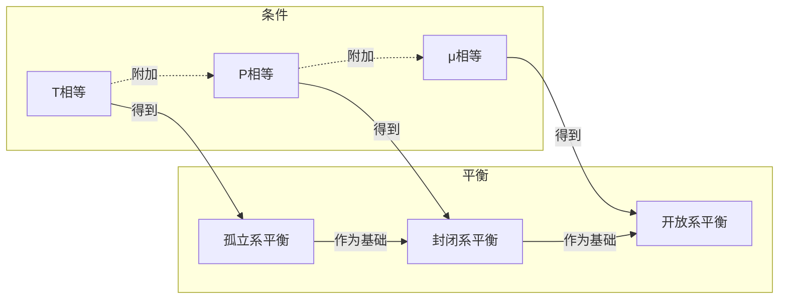

# 系统

统计力学应当不依赖于具体的力学规律,而只是关于群体现象的一种描述. 对于气体可以应用统计力学, 对于上亿个皮球也可以应用统计力学. 不同之处在于系综不同, 理想气体是全同粒子,而宏观的皮球则可以区分.

实验结果告诉我们理想气体必须是量子系综. 我们先从经典系综入手, 看什么时候会与试验矛盾, 并研究在一定条件下如何过渡到量子系综. 

无论哪种情况, 我们这里讨论的系统指的都是相空间的一个点. 系统在演化的过程中在相空间形成一条轨迹,每一点对应的就是这个系统所处的状态. 无论是经典力学还是量子力学, 给定能量和粒子数, 孤立系统如何演化都可以由初始条件来确定. 因为我们难以得到一个庞大的系统的初始条件, 我们只研究那些依赖于能量和粒子数的性质(宏观性质), 这就是热力学研究的性质, 因此在热力学中, 我们==可以仅用能量和粒子数来描述一个系统==. 

==用量子力学和经典力学描述系统的差别, 虽然根本上说求别在于运动方程是薛定谔方程还是哈密顿方程. 但是因为我们可以仅用能量和粒子数来描述一个系统, 这两种描述的差别在于这两者的推论: 刘维尔定理是否成立,能量是不是连续分布, 粒子是不是全同的.???==

## 相空间数密度 $ \rho $ 的性质

 $ \rho $ 为相空间点 $ (p,q) $ 处的点密度.

$$
N=\int _ V{\tilde{\rho}{(p,q)}d\Gamma}
$$

$ \rho $  为归一化的密度

$$
\rho=\int _ V\frac{\tilde{\rho}}{N}d\Gamma
$$

## 刘维尔定理

相空间的点(状态)不会凭空产生或消失, 研究的状态数是一定的. (这里的系统状态不一定是平衡的). 这个连续性条件可以表述为

> 相空间内代表点 $ (p,q) $ 的含时演化速率为 $ \vec{v}(p.q) $ 
>
> 则相空间体积 $ \omega $ 内代表点的数目该变量等于从体积 $ \omega $ 的表面 $ \sigma $ 逸出的点的数目

即为:

$$
\frac{\partial}{\partial t}\int _ \omega \rho d \Gamma = -\int _ \sigma \vec{v}\cdot \hat{n} d \sigma
$$

化为面积分, 并且注意到 $ \nabla=(\frac{\partial}{\partial q _ i}\hat{q} _ i,\frac{\partial}{\partial p _ i}\hat{p} _ i) $ , 即 $ \nabla $ 算符只与对应的速度项作用

$$
\begin{align*}
\vec{\nabla} \cdot \vec{v}&=(\frac{\partial}{\partial q _ i}\hat{q} _ i,\frac{\partial}{\partial p _ i}\hat{p} _ i)\cdot(\dot{q} _ i \hat{q} _ i,\dot{p} _ i \hat{p} _ i)\\
&=\frac{\partial}{\partial q _ i}\dot{q} _ i {\hat{q} _ i}^2 +\frac{\partial}{\partial p _ i}\dot{p} _ i {\hat{p} _ i}^2+\frac{\partial}{\partial q _ i}\dot{p} _ i \hat{q} _ i  \hat{p} _ i +\frac{\partial}{\partial p _ i}\dot{q} _ i \hat{q} _ i  \hat{p} _ i\\
&=\frac{\partial}{\partial q _ i}\dot{q} _ i+\frac{\partial}{\partial p _ i}\dot{p} _ i
\end{align*}
$$

利用哈密顿方程:

$$
\begin{align*}
\vec{\nabla} \cdot \vec{v}&=\frac{\partial}{\partial q _ i}\dot{q} _ i+\frac{\partial}{\partial p _ i}\dot{p} _ i\\
&=\frac{\partial}{\partial q _ i} \frac{\partial H}{\partial q _ i}+\frac{\partial}{\partial p _ i}\left(-\frac{\partial H}{\partial q _ i}\right)\\
&=0
\end{align*}
$$

得到

$$
\begin{align*}
\frac{\partial}{\partial t}\int\omega \rho d \Gamma &= -\int _ \sigma \rho\vec{v}\cdot \hat{n} d \sigma\\
&=-\int _ \omega \mathbf{\nabla}\cdot \left(\rho \vec{v}\right) d \Gamma\\
&=\int _ \omega{\left(\left(\vec{\nabla}\rho\right)\cdot\vec{v}+\rho\left(\vec{\nabla}\cdot\vec{v}\right)\right)d \Gamma }\\
&=\int _ \omega{\left(\vec{\nabla}\rho\right)\cdot\vec{v}d \Gamma }\\
\end{align*}
$$

移项,得到积分 $ \int _ \omega\left(\frac{\partial}{\partial t}\rho - \left(\vec{\nabla}\rho\right)\cdot\vec{v}\right)d \Gamma =0 $ ,因此, 被积函数 $ \frac{\partial}{\partial t}\rho-\left(\vec{\nabla}\rho\right)\cdot\vec{v}=0 $ . 将被积函数化简得到:

$$
\begin{align}
\frac{\partial}{\partial t}\rho - \left(\vec{\nabla}\rho\right)\cdot\vec{v}&=\frac{\partial}{\partial t}\rho+\frac{\partial\rho}{\partial q _ i}\dot{q} _ i+\frac{\partial\rho}{\partial p _ i}\dot{p} _ i \notag\\
&=\frac{d}{dt}\rho \notag\\
&=0
\end{align}
$$

因此相空间内的代表点的集体像一个不可压缩液体. **而且** $ \rho $ **是一个守恒量.**

## 对系统的观测

有两种得到系统的某个观测量 $ O $ 的方法

> 1. 对同一个系统连续地测量 $ O $ 的值. 测量次数很大时, 观测值的加权平均就是最后的观测量. 
>
>    ​	假设测量对系统的影响任意小 $ \leftrightarrow $  总共只有一次测量, 但假设测量发生在不同的时间, 测量值的平均
>
> 2. 对许多个"一样的"系统进行测量. 测量系统数目很大时, 观测值的加权平均就是最后的观测量.

如果每次测量对系统的影响可以忽略不计, 那么两种测量方法就是等价的.

如果每次测量对系统的影响不可以忽略不计,  那么这两种测量方法得到的结果就不一定相等. ==这两种结果相等是不是实验"可重复性的要求?"==

实验中的测量 应当是第一种.

>我的思考:
>
>实验的可重复性指的是 无论是在不同的时刻对系统进行的测量, (测量1)  还是对多个初始条件相同的系统进行的测量(测量2), 都应当满足物理定律随空间平移和随时间平移的不变性. 因而这两种测量的值相同是物理定律的要求

由测量2, 测量系统足够多时, 测量的概率密度 $ \mathbb{P}(p,q) $ 收敛于这个系综内的系统分布函数 $ \rho(p,q) $ , 得到

$$
\mathbb{P}(p,q)d\Gamma =\rho(p,q)d \Gamma
$$

即概率密度就是系综内的系统分布函数. 要求系统的宏观量, 就要求系统的概率分布,就要求数密度函数 $ \rho(p,q) $ 的值.

==**<u>也就是说,  $ \rho $ 包含了系统的全部信息</u>**==

## 系统的宏观量计算方法

为了得到系统的观测量的表达式, 要从粒子满足的运动方程出发, 得到 $ \rho $ 的表达式, 才能第一性地计算相应的宏观量.

# 系统的分类与对应的 $ \rho $ , 宏观量的计算

## 系统的分类

### 孤立系

最直观的系统是孤立系. 孤立系的能量和粒子数都是守恒的. 与之对应的还有能量不守恒但粒子数守恒的封闭系, 能量与粒子数都不守恒的开放系.
孤立系由于能量不变, 孤立系的能量只有一个允许值

$$
\rho(p,q)=\rho(\varepsilon _ 0)\delta(E-\varepsilon _ 0)
$$

### 封闭系

总可以把一个封闭系看成是一个孤立系的一部分. 孤立系的其余部分称为热库. 封闭系的能量 $ E _ c $ 可以连续变化, 就要求整个孤立系的能量 $ E _ i $ 非常大, 才能满足封闭系的能量可以取任意值的条件. 等价于要求热库的能量 $ E _ r $ 很大,  $ E _ c\ll E _ r $  . 封闭系的 $ \rho $ 要利用孤立系的平衡来得出.

### 开放系

按照求封闭系的思路, 总可以把一个开放系看成是一个孤立系的一部分. 孤立系的其余部分称为粒子库, 同时也是热库. 封闭系的能量 $ E _ c $ 和粒子数 $ N _ c $ 可以连续变化, 就要求整个孤立系的能量 $ E _ i $ 和粒子数 $ N _ i $ 非常大, 才能满足封闭系的能量可以取任意值, 粒子数可以任意多的条件. 等价于就要求粒子库的能量 $ E _ r $ ,  $ N _ r $ 很大,  $ E _ c\ll E _ r $ . 开放系的 $ \rho $ 也要利用孤立系的平衡来得出.

## 孤立系

### 孤立系的 $ \rho $ 

所有的系统都可以看作是孤立系统的一部分. 下面讨论孤立系的观测量的表达式.

最直观的系统是孤立系. 孤立系的能量和粒子数都是守恒的. 与之对应的还有能量不守恒但粒子数守恒的封闭系, 能量与粒子数都不守恒的开放系.
孤立系由于能量不变, 孤立系的能量只有一个允许值

$$
\rho(p,q)=\rho(\varepsilon _ 0)\delta(E-\varepsilon _ 0)
$$

### 孤立系的观测值计算

####  $ \ln{\rho} $ 的可加性

经典力学的系统之间的区别, 只有系统的粒子数和总能量 $ (E,N) $ 就可以确定.

把一个系统 $ S $ 划分为两个子系统 $ A $ , $ B $ 

$$
N _ S=\int{\rho _ S \delta(E _ S-\varepsilon _ 0) d \Gamma _ S}\notag\\
N _ A=\int{\rho _ A \delta(E _ A-E _ 1) d \Gamma _ A}\notag\\
N _ B=\int{\rho _ B \delta(E _ B-E _ 2) d \Gamma _ B}\notag\\
$$

其中 $ E _ S $ 和 $ E _ A $ , $ E _ B $ 的关系为:

$$
\begin{align*}
N _ S(\varepsilon _ 0)&=\int{ dE _ a N _ A(E _ a) N _ B(\varepsilon _ 0-E _ a)}\\
&=\int{ dE \left(\int{\rho _ A \delta(E _ A-E _ a) d \Gamma _ A}\int{\rho _ B \delta(E _ B-E _ a-\varepsilon _ 0) d \Gamma _ B}\right)}\\
&=\int{\rho _ A\rho _ B \left(\int{dE _ A \delta(E _ A-E _ a)\delta(E _ B-E _ a-\varepsilon _ 0)}\right) d\Gamma _ A d\Gamma _ B }\\
&=\int{\rho _ A\rho _ B \delta(E _ B-E _ A-\varepsilon _ 0) d\Gamma _ A d\Gamma _ B }\\
&=\int{\rho _ S \delta(E _ S-\varepsilon _ 0) d \Gamma _ S}
\end{align*}
$$

又有

$$
\begin{align}
E _ A+E _ B=E _ S\notag\\
d\Gamma _ A\cdot d\Gamma _ B = d\Gamma _ S \label{classicalDGammaProduct}
\end{align}
$$

式 $ (\ref{classicalDGammaProduct}) $ 建立在系统粒子可区分的基础上.

我们得到总系统与子系统间 $ \rho $ 的关系:

$$
\rho _ A\rho _ B=\rho _ S \notag
$$

取对数得到

$$
\ln{\rho _ A}+\ln{\rho _ B}=\ln{\rho _ S}
$$

#### 概率密度的表达式

利用 $ \delta $ 函数的性质 式 $ (\ref{integralofdeltafx}) $   $ \int _ {-\infty}^{+\infty}\delta(f(x))=\sum _ {i}\frac{1}{\lvert f'(a _ i)\rvert}, \quad  f(a _ i)=0 $  得到:

$$
\begin{align}
\int\delta(E-\varepsilon _ 0)d\Gamma&=\int\delta(E(p,q)-\varepsilon _ 0)[dp][dq] \notag\\
&= \frac{1}{\left. \frac{dE}{d\Gamma} \right|  _ {E=\varepsilon _ 0}} \label{deltaE-E0}\\
\end{align}
$$

利用式 $ (\ref{deltaE-E0})​ $ 得到

$$
\begin{align*}
\int \mathbb{P}d\Gamma &=\int\rho(p,q)d \Gamma\\
& =\int\rho(\varepsilon _ 0)\delta(E-\varepsilon _ 0)d\Gamma\\
&= \rho(\varepsilon _ 0)\int\delta(E-\varepsilon _ 0)d\Gamma\\
& = \rho(\varepsilon _ 0) \cdot  \frac{1}{\left. \frac{dE}{d\Gamma} \right|  _ {E=\varepsilon _ 0}} \\
\end{align*}
$$

又有 $ \int \mathbb{P}d\Gamma =1​ $ , 得到 $ \rho(\varepsilon _ 0)​ $ 

$$
\rho(\varepsilon _ 0) \cdot \frac{1}{\left. \frac{dE}{d\Gamma} \right|  _ {E=\varepsilon _ 0}} =1 \notag
$$

带入 $ \rho(p,q)d \Gamma=\rho(\varepsilon _ 0)\delta(E-\varepsilon _ 0)d\Gamma $   得到:

$$
\rho(p,q)= \left. \frac{dE}{d\Gamma} \right|  _ {E=\varepsilon _ 0}  \delta(E-\varepsilon _ 0) = \frac{1}{\left. \frac{d\Gamma}{dE} \right|  _ {E=\varepsilon _ 0}} \delta(E-\varepsilon _ 0)  \notag
$$

#### 概率密度用能态密度表达

定义能态密度 $ \Omega $ 为相空间体积对能量的微分:

$$
\begin{gather}
\Omega(E)=\frac{d\Gamma}{dE}\\
\mathrm{Volume\ in\ phase\ space}=\int d\Gamma=\int \Omega(E)dE
\end{gather}
$$

这里只要系统给定,  $ \Omega $ 就是一个已知量.

有:

$$
\rho(E)=\frac{1}{\Omega(\varepsilon _ 0)} \delta(E-\varepsilon _ 0)\\
$$

#### 系统宏观量用能态密度表达

至此得到

$$
\begin{align}
\langle O\rangle&=\int _ {-\infty}^{ {-\infty}}{O(p,q)\mathbb{P}(p,q)dpdq}\notag\\
&=\int _ {-\infty}^{ {-\infty}}O(p,q)\rho(p,q)d \Gamma \notag\\
&=\int _ {-\infty}^{ {-\infty}}O(p,q)\frac{1}{\Omega(\varepsilon _ 0)} \delta(E-\varepsilon _ 0)d\Gamma \notag\\
&=\frac{1}{\Omega(\varepsilon _ 0)} \int _ {-\infty}^{ {-\infty}}O(p,q)\delta(E-\varepsilon _ 0)d\Gamma \\
\end{align}
$$

### 一些特殊的宏观量

#### 能量

==能量和粒子数是仅有的确定系统微观状态的物理量==, 

$$
\begin{align}
\langle H\rangle &=\frac{1}{\Omega(\varepsilon _ 0)} \int _ {-\infty}^{ {-\infty}}H(p,q)\delta(E-\varepsilon _ 0)d\Gamma \notag\\
& =\int _ {-\infty}^{ {-\infty}}\varepsilon _ 0  \frac{1}{\Omega(\varepsilon _ 0)} d\Gamma \notag\\
& = \varepsilon _ 0\int _ {-\infty}^{ {-\infty}}  \frac{1}{\Omega(\varepsilon _ 0)} d\Gamma \notag\\
& = \varepsilon _ 0
\end{align}
$$

### 孤立系的平衡

计算了孤立系的观测值, ==我们可以用实验验证相应的系统(可以吗?)== 

接下来研究孤立系的平衡问题,即: 什么时候一个孤立系可以被看成和另外一个孤立系等价?

考虑两个系统 $ A $ , $ B $ . 他们平衡的条件是净能量交换为零. 由于 $ \rho $ 包含了系统的全部信息, 只要两个系统构成的总系统的分布函数与两个孤立系构成的分布函数, 我们就说这两个系统处在平衡态.

这个定义和直观感受是一致的. 如果两个系统平衡, 把他们变成孤立系, 放置一段时间之后再相互作用, 二者的能量都不再变化.

如果无论如何划分系统 $ S $ ,子系统 $ A $ , $ B $ 都处在平衡态,就说系统S是平衡的.

这个定义也和直观理解是一致的. 如果一个系统"处处相同"(无论如何划分系统 $ S $ ), 系统就是稳定的, 就处在平衡态.

这样定义的问题在于, 到底有没有这样的状态? 系统可不可能"处处相同"?

回答: 现实中没有这样的系统. 我们研究的系统是自由度无穷大的系统, 是类似质点的模型. 现实的系统都是近似.

另外一个问题是, 平衡的系统之间是等价的. 定义平衡的系统就定义了等价类. 怎么定义一个元素与某一个元素等价而与另一个元素不等价?  可以用一个量来刻画. 如果这两个元素这个量相同, 就说他们等价. 用什么量来刻画这个等价关系? 接下来可以看到, 这个等价类的量定义为温度. 用平衡替换上面的说法就是, 用温度定义一个系统与某一个系统平衡而与另一个系统不平衡.

以下分两种情况计算, 来得到系统平衡的条件.

设总系统 $ S $  的能量为 $ E _ s $ , 子系统 $ A $  的能量为 $ E _ a $  , 子系统 $ B $  的能量为 $ E _ b $ .   $ E _ a $  ,  $ E _ b $ ,  $ E _ s $  为变量,  $ E _ a+E _ b=E _ s $ . 总系统的能量守恒,  $ E _ s \equiv \varepsilon _ s $ . 在平衡时 $ E _ a= \varepsilon _ a, \quad E _ b= \varepsilon _ b  $ , 且有 $ \varepsilon _ a+\varepsilon _ b=\varepsilon _ s $ ,

对于系统 $ A $ , $ S $ 概率密度归一化:

$$
\begin{align*}
1&=\underbrace{\int\cdots\int} _ {n _ s}\rho _ sd\Gamma _ s\\
&=\underbrace{\int\cdots\int} _ {n _ a}\underbrace{\int\cdots\int} _ {n _ b}\rho _ s d\Gamma _ ad\Gamma _ b\\
&=\underbrace{\int\cdots\int} _ {n _ a}\left(\underbrace{\int\cdots\int} _ {n _ b}\rho _ s d\Gamma _ b\right)d\Gamma _ a\\
1&=\underbrace{\int\cdots\int} _ {n _ a}\rho _ ad\Gamma _ a
\end{align*}
$$

对于与系统 $ B $ 平衡的系统 $ A $ :

$$
\begin{align}
\rho _ a^{\mathrm{equilibrium}}&=\underbrace{\int\cdots\int} _ {n _ b}\rho _ s d\Gamma _ b \notag\\
&=\int\rho _ s d\Gamma _ b\notag\\
&=\int\frac{1}{\Omega _ s(E _ s)}\delta(E _ s-\varepsilon _ s)d\Gamma _ b\notag\\
&=\int\frac{1}{\Omega _ s(E _ s)}\delta(E _ b+E _ a-\varepsilon _ s)d\Gamma _ b\notag\\
&=\frac{1}{\Omega _ s(E _ s)}\int\delta(E _ b-(\varepsilon _ s-E _ a))d\Gamma _ b\notag\\
&=\frac{1}{\Omega _ s(E _ s)}\Omega _ b(\varepsilon _ s-E _ a)\notag\\
\label{rhoaequilibrium}
\end{align}
$$

子系统A在平衡时可视作孤立系:

$$
\rho _ a^{\mathrm{isolated}}=\frac{1}{\Omega _ a(E _ a)}\delta(E _ a-\varepsilon _ a) \label{rhoaisolated}
$$

结合 $ (\ref{rhoaequilibrium}), (\ref{rhoaisolated}) $  平衡时,  $ \rho _ a^{\mathrm{equilibrium}}=\rho _ a^{\mathrm{isolated}} $  得到:

$$
\delta(E _ a-\varepsilon _ a)=\frac{\Omega _ a(E _ a)\Omega _ b(\varepsilon _ s-E _ a)}{\Omega _ s(E _ s)}
$$

同理对B系统也有:

$$
\delta(E _ b-\varepsilon _ b)=\frac{\Omega _ b(E _ b)\Omega _ a(\varepsilon _ s-E _ b)}{\Omega _ s(E _ s)}
$$

又有 $ E _ a+E _ b=E _ s, \quad \varepsilon _ a+\varepsilon _ b=\varepsilon _ s $ ,得到:

$$
\delta(E _ a-\varepsilon _ a)=\frac{\Omega _ a(E _ a)\Omega _ b(E _ b)}{\Omega _ s(E _ s)}=\delta(E _ b-\varepsilon _ b)
$$

再由 $ \delta $ 函数与 $ \Omega $ 的关系:

$$
\frac{1}{\Omega _ a(\varepsilon _ a)}\int\delta(E _ a-\varepsilon _ a)d\Gamma _ a=1 \notag\\
\int\delta(E _ a-\varepsilon _ a)d\Gamma _ a=\Omega _ a(\varepsilon _ a) \notag\\
$$

得到: 

$$
\begin{align*}
\quad \delta(E _ a-\varepsilon _ a) &=\frac{d\Omega _ a(\varepsilon _ a)}{d\Gamma _ a}\\
&=\frac{d\Omega _ a(\varepsilon _ a)}{d \varepsilon _ a}\frac{d \varepsilon _ a}{d\Gamma _ a}\\
&=\frac{d\Omega _ a(\varepsilon _ a)}{d \varepsilon _ a} {\left.\frac{d E _ a}{d\Gamma _ a}\right|} _ {E _ a=\varepsilon _ a}\\
&=\frac{d\Omega _ a(\varepsilon _ a)}{d \varepsilon _ a}\frac{1}{\Omega(\varepsilon _ a)}\\
&=\left.\frac{d \ln{(\Omega(E _ a))}}{d E _ a}\right| _ {E _ a=\varepsilon _ a}
\end{align*}
$$

得到:

$$
\left.\frac{d}{d E _ a}\ln{(\Omega(E _ a))}\right| _ {E _ a=\varepsilon _ a}=\left.\frac{d}{d E _ b}\ln{(\Omega(E _ b))}\right| _ {E _ b=\varepsilon _ b}
$$

至此我们得到一个表征等价关系的量S'

$$
S(E)=\ln(\Omega(E))
$$

若两个系统平衡,

$$
S' _ a(E _ a)=S' _ b(E _ b)=\frac{1}{T}
$$

## 封闭系

总可以把一个封闭系看成是一个孤立系的一部分. 孤立系的其余部分称为热库. 封闭系的能量 $ E _ c $ 可以连续变化, 就要求整个孤立系的能量 $ E _ i $ 非常大, 才能满足封闭系的能量可以取任意值的条件. 等价于要求热库的能量 $ E _ r $ 很大,  $ E _ c\ll E _ r $ 

在封闭系与热库达成平衡时, 他们可以看作是两个孤立系. 这样就回到了前面定义孤立系的平衡状态.

### 封闭系的 $ \rho $ 

仿照推导微正则分布的方法, 利用两个归一化条件, (总系统是一个孤立系)

$$
\begin{align*}
1&=\int\rho _ cd\Gamma _ c\\
1&=\int \rho _ sd\Gamma _ s\\
&=\iint \rho _ s d \Gamma _ rd\Gamma _ c\\
&=\int \left(\int\rho _ sd\Gamma _ r\right)d\Gamma _ c
\end{align*}
$$

得到 $ \rho _ c $ 的表达式(热库的能量基本不改变, 因而也是一个孤立系)

$$
\begin{align*}
\rho _ c&= \int \rho _ sd\Gamma _ r\\
&=\int\frac{1}{\Omega _ s(E _ s)}\delta(E _ s-(E _ r+E _ c)) d\Gamma _ r\\
&=\int\frac{1}{\Omega _ s(\varepsilon _ s)}\delta(\varepsilon _ s-(E _ r+E _ c))d\Gamma _ r\\
&=\int\frac{1}{\Omega _ s(\varepsilon _ s)}\delta(E _ r-(\varepsilon _ s-E _ c))d\Gamma _ r, \quad (\delta(x)=\delta(-x))\\
&=\frac{\Omega _ r(\varepsilon _ s-E _ c)}{\Omega _ s(\varepsilon _ s)}\\
\end{align*}
$$

这样就把未知的孤立系的分布函数表示成了已知的 $ \Omega $ 的比值.

#### 封闭系的稳定

因为能量可交换, 我们自然要问, 封闭系的稳定一定与孤立系的稳定判定不同. 也就是我们要推导封闭系等价的条件. 什么量一样, 两个封闭系就是一样的? 能量一样, 孤立系就一样. 温度和压强一样, 两个封闭系就一样.

封闭系的稳定如何定义成了我们要研究的问题. 

#### *<u>封闭系的稳定如何定义</u>*

封闭系的平衡似乎是一个很难说清的问题. 

封闭系与温度恒定的热库相接触, 因此封闭系温度是一个定值, 处处温度相同. 但是孤立系的稳定条件就是是温度处处相同. 那么封闭系的平衡条件难道和孤立系的一样吗? 封闭系允许能量交换, 也就是说, 即使封闭系处于平衡状态, 也可以与外界(热库) 源源不断地交换能量. 这一点是孤立系平衡所不允许的.

可以这样概括封闭系和孤立系的的平衡条件的不同: 封闭系的平衡条件是温度不变, 而孤立系的平衡条件是能量不变(尽管从能量不变可以推出温度不变).

也就是说, **封闭系平衡的条件比孤立系平衡的条件更苛刻**, 这是因为孤立系的约束比孤立系要强, 平衡时只用少量的约束就可以让孤立系平衡, 但是封闭系就要更多的约束条件才能达到一样的平衡.

封闭系的温度不变, 能量改变意味着什么呢? ==意味着气体的能量改变不是通过热交换发生的, 气体的能量改变是通过对外做功产生的???.==要定义气体对外做功, 显然需要定义气体的压强.

#### 封闭系的熵

封闭系的平衡是建立在孤立系的平衡条件之上的. 我们要研究的是, 在孤立系平衡的条件上, 再加上一个什么条件可以使得两个封闭系平衡?

要回答这个问题, 我们先研究当两个封闭系可以看作是孤立系时, 满足什么条件. 由孤立系平衡条件, 二者温度相同.

重新考虑整个体系. 系统平衡时没有能量流动. 把总系统S看作孤立系, 系统AB都是孤立系

再利用 $ k _ 0\ln\Omega=S $ , 将 $ \rho $ 化简. 这里利用前面得到的结论 $ \frac{1}{T}=\frac{d S}{d E} $ , 进行计算.

$$
\begin{align*}
\rho _ c&=\frac{\Omega _ r(\varepsilon _ s-E _ c)}{\Omega _ s(\varepsilon _ s)}\\
&=\frac{\Omega _ r(\varepsilon _ s-E _ c)}{\Omega _ b(\varepsilon _ s)}\cdot\frac{\Omega _ b(\varepsilon _ s)}{\Omega _ s(\varepsilon _ s)}\\
&=e^{S _ b(\varepsilon _ s-E _ c)-S _ b(\varepsilon _ s)}\cdot e^{S _ b(\varepsilon _ s)-S _ s(\varepsilon _ s)}\\
&=e^{\frac{S _ b(\varepsilon _ s-E _ c)-S _ b(\varepsilon _ s)}{(-E _ c)}\cdot (-E _ c)}\cdot e^{S _ b(\varepsilon _ s)-S _ s(\varepsilon _ s)}\\
\xrightarrow{E _ c\ll\varepsilon _ s}&=e^{\left.\frac{S _ b(E)}{d E}\right| _ {E=\varepsilon _ s}\cdot (-E _ c)}\cdot e^{S _ b(\varepsilon _ s)-S _ s(\varepsilon _ s)}\\
&=e^{-\frac{1}{k _ 0 T _ r}\cdot E _ c}\cdot e^{S _ b(\varepsilon _ s)-S _ s(\varepsilon _ s)}
\end{align*}
$$

得到封闭系的 $ \rho $ 的表达式:

$$
\rho _ c(E)=e^{-\psi -\frac{E}{k _ 0 T}}, \quad \psi=-\left(S _ b(\varepsilon _ s)-S _ s(\varepsilon _ s)\right)
$$

其中 $ \psi $ 是与研究的子系统无关的量.
由 $ \rho $ 的归一性:

$$
\begin{align*}
1&=\int\mathbb{P}(p,q)d\Gamma\\
&=\int\rho _ c(E(p,q))d\Gamma\\
&=\int e^{-\psi -\frac{E}{k _ 0 T}} d\Gamma\\
\end{align*}
$$

可以得到 $ \psi $ 的表达式:

$$
\begin{align*}
e^{\psi}=\int e^{-\frac{E}{k _ 0 T}} d\Gamma\\
\end{align*}
$$

等号右边全是已知量. 因此定义 $ e^\psi=Z $ , 将​ $ \rho $ 重写为:

$$
\begin{align}
Z&=e^{\psi}=\int e^{-\frac{E}{k _ 0 T}} d\Gamma \\
\rho _ c&=\frac{1}{Z}e^{-\frac{E}{k _ 0 T}}=\frac{e^{-\frac{E}{k _ 0 T}}}{\int e^{-\frac{E}{k _ 0 T}}  d\Gamma}
\end{align}
$$

当两个封闭系可以看作是孤立系时, 这样一来, $ \psi=-\left(S _ b(\varepsilon _ s)-S _ s(\varepsilon _ s)\right) $ 中二者之差并不独立于研究的系统.

$$
\begin{align}
\quad \psi &=-\left(S _ b(\varepsilon _ s)-S _ s(\varepsilon _ s)\right)\\
&=-\left(S _ b(\varepsilon _ s)-(S _ b(\varepsilon _ b)+S _ c(\varepsilon _ c))\right)\\
&=-\left((S _ b(\varepsilon _ s)-S _ b(\varepsilon _ b))-S _ c(\varepsilon _ c)\right)\\
&=-\left(\frac{S _ b(\varepsilon _ b+\varepsilon _ c)-S _ b(\varepsilon _ b)}{\varepsilon _ c}\varepsilon _ c-S _ c(\varepsilon _ c)\right)\\
&=-\left(\left.\frac{\partial S _ b(E)}{\partial E}\right| _ {E=\varepsilon _ b}\varepsilon _ c-S _ c(\varepsilon _ c)\right)\\
&=-\left(\frac{\varepsilon _ c}{k _ 0 T}-S _ c(\varepsilon _ c)\right)\\
\end{align}
$$

因此有

$$
\begin{align}
\psi=-\frac{1}{ {k _ 0 T}}\left(E-T\cdot S(E)\right)\\
\end{align}
$$

因此借助孤立系的熵, 我们定义了一个新的可加量 $ \psi=\frac{1}{k _ 0T}(E-TS) $ 

#### 封闭系的划分

封闭系的能量可以变化, 因此能量一定不是衡量两个封闭系平衡的条件. 仿照孤立系的平衡条件, 我们选取两个封闭的系统, 按照前面的方法, 先将两个封闭系看作是无关的, 再描述封闭系的平衡.

按照之前的方法, 我们要把一个封闭系划分成两个封闭系, 然后推导出这两个孤立系相等的量. 然后定义一个封闭系处于平衡态, 当且仅当无论如何划分封闭子系, 两个封闭子系都有相等的量的条件.

先考虑两个无关的封闭系A,B. 它们与同一个热库相接触, 但是彼此之间隔绝,没有能量粒子或其他交换.

将一个封闭系S分为两个封闭系A和B. 由封闭系的定义, 他们是同一个封闭系 $ S $ 的不同部分,因此两个封闭子系的温度是同一个定值, 都等于总系统S的温度  $ T _ a=T _ b $ .

$$
\begin{align*}
\rho^{closed} _ a&=\frac{1}{Z _ a}e^{-\frac{E _ a}{k _ 0T _ a}}\\
\rho^{closed} _ b&=\frac{1}{Z _ b}e^{-\frac{E _ b}{k _ 0T _ b}}\\
\end{align*}
$$

对于平衡中的封闭系A和B

$$
\begin{align*}
1 &= \int\rho^{equilibrium} _ ad\Gamma _ a\\
&=\iint \rho _ s d\Gamma _ a d\Gamma _  b\\
\Rightarrow \rho^{equilibrium} _ a&=\int \rho _ s d\Gamma _ b\\
&=\int \frac{1}{Z _ s}e^{-\frac{E _ s}{k _ 0T _ s}} d\Gamma _ b\\
\end{align*}
$$

==能量的可加性始终成立???==,  $ E _ a+E _ b=E _ s $ .得到

$$
\begin{align*}
\rho^{closed} _ a&= \rho^{equilibrium} _ a\\
\frac{1}{Z _ a}e^{-\frac{E _ a}{k _ 0T _ a}}&=\int \frac{1}{Z _ s}e^{-\frac{E _ s}{k _ 0T _ s}} d\Gamma _ b\\
\frac{1}{Z _ a}e^{-\frac{E _ a}{k _ 0T}}&=\frac{1}{Z _ s}\int e^{-\frac{E _ a}{k _ 0T}-\frac{E _ b}{k _ 0T}}d\Gamma _ b\\
&=\frac{1}{Z _ s} e^{-\frac{E _ a}{k _ 0T}} \int e^{-\frac{E _ b}{k _ 0T}}d\Gamma _ b\\
&=\frac{1}{Z _ s} e^{-\frac{E _ a}{k _ 0T}}\cdot Z _ b\cdot \int \frac{1}{Z _ b}e^{-\frac{E _ b}{k _ 0T}}d\Gamma _ b\\
&=\frac{Z _ b}{Z _ s} e^{-\frac{E _ a}{k _ 0T}}
\end{align*}
$$

得到Z是一个可乘量,  $ \ln Z $ 是一个可加量

$$
\begin{align}
Z _ aZ _ b&=Z _ s\\
\ln{Z _ a}+\ln{Z _ b}&=\ln{Z _ s}
\end{align}
$$

定义 $ \psi=\ln{Z} $ , 则有 $ Z=e^{-\psi} $ 

#### 封闭系的稳态

封闭系稳定应该如下定义:

> 1. 将封闭系S划分为两个封闭子系A和B, 如论如何划分, 这两个封闭子系都好像彼此隔绝.
> 2. 整个封闭系S表现得像一个孤立系

这样一来就可以利用前面推导的结果.

> > 注意这里的推导和孤立系的稳定推导很不一样, 因为孤立系没有可以改变的量, 因此直接计算即可, 这里封闭系的能量可以改变, 因此这里要先定义能量的改变, 再使得能量的改变量dE为零

先定义能量的改变量:

由于温度不会变化, 封闭系的能量变化只能是对外做功有位移 $ dq $  导致的.

$$
\begin{align*}
E _ a&=F _ a+TS _ a\\
dE _ a&=dF _ a+S _ adT _ a\\
&=(\frac{\partial F}{\partial T}dT+\frac{\partial F}{\partial q}dq)\\
&=\frac{\partial E _ a}{\partial q _ a}dq _ a
\end{align*}
$$

因此有:

$$
dE _ b=\frac{\partial E}{\partial q _ b}d q _ b
$$

由于总系统是一个孤立系, 能量改变量为0

$$
\begin{align*}
dE _ a+dE _ b&=dE _ s=0\\
\end{align*}
$$

至此我们得到封闭系等价的重要关系

$$
dE _ a=-dE _ b
$$

这与孤立系等价关系具有类比;

$$
\frac{\partial S _ 1 }{\partial E _ 1}=\frac{\partial S _ 2}{\partial E _ 2}
$$

继续推导, 定义 $ P _ a:=\frac{\partial H}{\partial q} $ 可以得到:

$$
\begin{align}
\frac{\partial H _ a}{\partial q _ a}dq _ a&=-\frac{\partial H _ b}{\partial q _ b}dq _ b\\
P _ adV _ a&=-P _ bdV _ b&
\end{align}
$$

由于整体是一个孤立系,  $ dV _ a+dV _ b=0 $  得到:

$$
P _ a=P _ b
$$

### 封闭系的观测量

#### 封闭系的能量

由观测量的定义:

$$
\begin{align}
\langle E\rangle &=\int H(p,q) \mathbb{P}(p,q) d\Gamma\notag\\
& =\int H(p,q) \rho _ cd\Gamma\notag\\
&=\int E\frac{1}{Z}e^{-\frac{E}{k _ 0 T}}\notag\\
&=\frac{1}{Z}\int E e^{-\frac{E}{k _ 0 T} } d\Gamma\\
\end{align}
$$

注意到

$$
\begin{align*}
\frac{\partial Z}{\partial (\frac{1}{k _ 0T})}&=\frac{\partial }{\partial (\frac{1}{k _ 0T})}{\int  e^{-\frac{E}{k _ 0 T} } d\Gamma}\\
\xrightarrow{偏导与积分变量不同可交换}&=\int \frac{\partial }{\partial (\frac{1}{k _ 0T})} e^{-\frac{E}{k _ 0 T} } d\Gamma\\
&=\int -E e^{-\frac{E}{k _ 0 T} } d\Gamma\\
&=-\int E e^{-\frac{E}{k _ 0 T} } d\Gamma\\
\end{align*}
$$

带入上式得到

$$
\begin{align}
\langle E\rangle 
&=\frac{1}{Z}\int E e^{-\frac{E}{k _ 0 T} } d\Gamma \notag\\
&=-\frac{1}{Z}\frac{\partial Z}{\partial (\frac{1}{k _ 0T})}\notag \\
&=-\frac{\partial}{\partial (\frac{1}{k _ 0T})} \ln Z\\
&=-\frac{\partial}{\partial (\frac{1}{k _ 0T})} \psi\\
\end{align}
$$

## 开放系

按照求封闭系的思路, 总可以把一个开放系看成是一个孤立系的一部分. 孤立系的其余部分称为粒子库, 同时也是热库. 开放系的能量 $ E _ o $ 和粒子数 $ n _ o $ 可以连续变化, 就要求整个孤立系的能量 $ E _ s $ 和粒子数 $ n _ s $ 非常大, 才能满足封闭系的能量可以取任意值, 粒子数可以任意多的条件. 等价于就要求粒子库的能量 $ E _ r $ ,  $ n-r $ 很大,  $ E _ o\ll E _ r $ ,  $ n _ o\ll n _ s $ .

### 开放系的 $ \rho $ 

$$
\begin{align}

S(E)&=\ln{\Omega(E)} \notag\\

&=\ln\left(V^N \left(\frac{2e\pi m}{D}\right)^{\frac{ND}{2}}\left(\frac{E}{N}\right)^{\frac{ND}{2}} 2\left(\pi ND\right)^{\frac{1}{2}} \right)\\

\end{align}
$$

仿照前面的做法, 注意到开放系粒子数 $ n _ o $ 可以变化. 系统的微观分布函数也会随之改变. 也就是说,  $ \rho $ 和 $ \Omega $ 不仅仅是 $ E $ 的函数, 也是 $ n $ 的函数. 因此 $ \rho=\rho(n,E) $ ,  $ \Omega=\Omega(n,E) $ 

为了方便地表示 $ \underbrace{\int\cdots\int} _ {n _ o}\rho _ od\Gamma _ o  $ 和 $ \underbrace{\int\cdots\int} _ { {n _ o}^\prime}{\rho _ o}^\prime d{\Gamma _ o}^\prime  $ 的不同, 把积分  $ \underbrace{\int\cdots\int} _ {n _ o}d\Gamma _ o $ 记为 $ \int d\Gamma _ {o,n _ o} $ , 为了清晰起见, 先保留 $ \underbrace{\int\cdots\int} _ {n _ o}d\Gamma _ o $  记法.

$$
\begin{align*}
1&=\underbrace{\int\cdots\int} _ {n _ s}\rho _ {s}(s _ o,E _ o)d\Gamma _ {s,n _ s}\\
&=\underbrace{\int\cdots\int} _ {n _ o}\underbrace{\int\cdots\int} _ {n _ r}\rho _ {s}(s _ o,E _ o) d\Gamma _ {r,n _ r}d\Gamma _ {o,n _ o}\\
&=\underbrace{\int\cdots\int} _ {n _ o}\left(\underbrace{\int\cdots\int} _ {n _ r}\rho _ {s}(s _ o,E _ o) d\Gamma _ {r,n _ r}\right)d\Gamma _ {o,n _ o}\\
1&=\underbrace{\int\cdots\int} _ {n _ o}\rho _ {o}(n _ o,E _ o)d\Gamma _ {o,n _ o}
\end{align*}
$$

得到 $ \rho _ {o,n _ o} $ 的表达式:

$$
\begin{align*}
\rho _ {o,n _ o}^{equlibrium}&=\underbrace{\int\cdots\int} _ {n _ r}\rho _ {s}(s _ o,E _ o) d\Gamma _ {r,n _ r}\\
&=\int \rho _ {s}(s _ o,E _ o) d\Gamma _ {r,n _ r}\\
&=\int \frac{1}{\Omega _ {s}(n _ s,E _ s)}\delta(E _ s-\varepsilon _ s)d\Gamma _ {r,n _ r}\\
&=\int \frac{1}{\Omega _ {s}(n _ s,E _ s)}\delta(E _ o+E _ r-\varepsilon _ s)d\Gamma _ {r,n _ r}\\
&=\frac{\Omega _ {r}(n _ r,\varepsilon _ s-E _ o)}{\Omega _ {s}(n _ s,\varepsilon _ s)}\\
&=\frac{\Omega _ {r}(n _ r,\varepsilon _ s-E _ o)}{\Omega _ {s}(n _ s,\varepsilon _ s)}\\
\end{align*}
$$

### 开放系的稳定

重复类似正则分布的过程, 开放系的两个子系都是开放系.如果这两个开放系平衡, 他们都可以看作是封闭系, 也可以看作是孤立系,

也就是开放系的平衡要建立在封闭系的平衡之上. 封闭系的平衡又要建立在孤立系的平衡之上.

#### 开放系的熵

开放系的两个子系都是开放系.如果这两个开放系平衡, 他们都可以看作是封闭系, 也可以看作是孤立系,

利用之前定义的封闭系的熵(用孤立系的也行, 只不过多了一次推导)

$$
\begin{align*}
\rho^{equlibrium} _ {o,n _ o}&=\frac{\Omega _ {r}(n _ r,\varepsilon _ s-E _ o)}{\Omega _ {s}(n _ s,\varepsilon _ s)}\\
&=\frac{\Omega _ {r}(n _ r,\varepsilon _ s-E _ o)}{\Omega _ {r}(n _ s,\varepsilon _ s-E _ o)}\cdot\frac{\Omega _ {r}(n _ s,\varepsilon _ s-E _ o)}{\Omega _ {r}(n _ s,\varepsilon _ s)}\cdot\frac{\Omega _ {r}(n _ s,\varepsilon _ s)}{\Omega _ {s}(n _ s,\varepsilon _ s)}\\
&=e^{S _ r(n _ r,\varepsilon _ s-E _ o)-S _ r(n _ s,\varepsilon _ s-E _ o)}e^{S _ r(n _ s,\varepsilon _ s-E _ o)-S _ r(n _ s,\varepsilon _ s)}e^{S _ r(n _ s,\varepsilon _ s)-S _ s(n _ s,\varepsilon _ s)}\\
&=e^{\frac{S _ r(n _ s-n _ o,\varepsilon _ s-E _ o)-S _ r(n _ s,\varepsilon _ s-E _ o)}{-n _ o}(-n _ o)}e^{\frac{S _ r(n _ s,\varepsilon _ s-E _ o)-S _ r(n _ s,\varepsilon _ s)}{-E _ o}(-E _ o)}e^{S _ r(n _ s,\varepsilon _ s)-S _ s(n _ s,\varepsilon _ s)}\\
&=e^{\left.\frac{\partial S _ r}{\partial n}\right| _ {n=n _ s}(-n _ o)}e^{\left.\frac{\partial S _ r}{\partial E}\right| _ {E=\varepsilon _ r}(-E _ o)}e^{S _ r(n _ s,\varepsilon _ s)-S _ s(n _ s,\varepsilon _ s)}\\
&=e^{\left.\frac{\partial S _ r}{\partial E}\frac{\partial E}{\partial n}\right| _ {n=n _ s}(-n _ o)}e^{\left.\frac{\partial S _ r}{\partial E}\right| _ {E=\varepsilon _ r}(-E _ o)}e^{S _ r(n _ s,\varepsilon _ s)-S _ s(n _ s,\varepsilon _ s)}\\
&=e^{-\frac{1}{k _ 0T}\frac{\partial E}{\partial n}\cdot n _ o}e^{-\frac{1}{k _ 0T}E _ o}e^{S _ r(n _ s,\varepsilon _ s)-S _ s(n _ s,\varepsilon _ s)}
\end{align*}
$$

得到 $ \rho $ 的表达式:

$$
\rho=-\zeta+\frac{\mu}{k _ 0T}N-\frac{1}{k _ 0T}E,\quad \zeta=-(S _ r(n _ s,\varepsilon _ s)-S _ s(n _ s,\varepsilon _ s))
$$

同样得到 $ \zeta $ 的表达式, 并将 $ \rho $ 重写:

$$
Z=e^{\zeta}=\int e^{-\frac{1}{k _ 0T}\frac{\partial E}{\partial n}\cdot n _ o}e^{-\frac{1}{k _ 0T}E _ o}d\Gamma\\
\rho=\frac{1}{Z}e^{-\frac{1}{k _ 0T}\frac{\partial E}{\partial n}\cdot n _ o}e^{-\frac{1}{k _ 0T}E _ o}=\frac{e^{-\frac{1}{k _ 0T}\frac{\partial E}{\partial n}\cdot n _ o}e^{-\frac{1}{k _ 0T}E _ o}}{\int e^{-\frac{1}{k _ 0T}\frac{\partial E}{\partial n}\cdot n _ o}e^{-\frac{1}{k _ 0T}E _ o}d\Gamma}
$$

还是类似地, 当两个开放系可以看做两个封闭系时(把两个开放系看成孤立系也可以 只不过多了一次推导)

$$
\begin{align*}
\zeta&=-(S _ r(n _ s,\varepsilon _ s)-S _ s(n _ s,\varepsilon _ s))\\
&=-\bigg(\Big(S _ r(n _ s,\varepsilon _ s)-S _ r(n _ r,\varepsilon _ r)\Big)-S _ o(n _ o,\varepsilon _ o)\bigg)\\
&=-\Bigg(\bigg(\Big(S _ r(n _ s,\varepsilon _ s)-S _ r(n _ s,\varepsilon _ r)\Big)+\Big(S _ r(n _ s,\varepsilon _ r)-S _ r(n _ r,\varepsilon _ r)\Big)\bigg)-S _ o(n _ o,\varepsilon _ o)\Bigg)\\
&=-\left(\frac{S _ r(n _ s,\varepsilon _ s)-S _ r(n _ s,\varepsilon _ r)}{\varepsilon _ o}\varepsilon _ o+\frac{S _ r(n _ s,\varepsilon _ r)-S _ r(n _ r,\varepsilon _ r)}{n _ o}n _ o-S _ o(n _ o,\varepsilon _ o)\right)\\
&=-\left(\frac{1}{k _ 0T}\varepsilon _ o+\frac{\partial S}{\partial E}\frac{\partial E}{\partial n}-S _ o(n _ o,\varepsilon _ o)\right)\\
&=-\left(\frac{1}{k _ 0T}\varepsilon _ o+\frac{1}{k _ 0T}\frac{\partial E}{\partial n}-S _ o(n _ o,\varepsilon _ o)\right)\\
\end{align*}
$$

定义化学势

$$
\mu=\frac{\partial E}{\partial n}
$$

得到:

$$
\begin{align*}
\zeta&=-\left(\frac{1}{k _ 0T}\varepsilon _ o+\frac{1}{k _ 0T}\frac{\partial E}{\partial n}-k _ 0S _ o(n _ o,\varepsilon _ o)\right)\\
&=-\frac{1}{k _ 0T}\left(\varepsilon _ o+\mu-S _ oT\right)
\end{align*}
$$

#### 开放系的划分

按照前面的方法, 先将两个封闭系看作是无关的, 再描述封闭系的平衡.

按照之前的方法, 我们要把一个开放系划分成两个开放系, 然后推导出这两个开放系相等的量. 然后定义一个开放系处于平衡态, 当且仅当无论如何划分封闭子系, 两个开放子系都有相等的量的条件.

先考虑两个无关的开放系A,B. 它们与同一个热库和粒子库相接触, 但是彼此之间隔绝,没有能量粒子或其他交换.

将一个开放系S分为两个开放系A和B. 由孤开放系的定义, 他们是同一个开放系 $ S $ 的不同部分. 开放系的温度和化学势是一个定值.  这两个开放系温度相等, 都等于总系统S的温度  $ T _ a=T _ b $ , ==化学势也都相等??? 这不是平衡条件吗??????? 为啥?????? 封闭系温度相等怎么来的???== 

$$
\rho _ a^{uncoupled}=\frac{1}{Z _ a}e^{-\frac{1}{k _ 0T}\mu _ a\cdot n _ a}e^{-\frac{1}{k _ 0T}E _ a}\\
\rho _ b^{uncoupled}=\frac{1}{Z _ b}e^{-\frac{1}{k _ 0T}\mu _ b\cdot n _ b}e^{-\frac{1}{k _ 0T}E _ b}
$$

对于平衡中的开放系A和B

$$
\begin{align*}
1 &= \int\rho^{equilibrium} _ ad\Gamma _ a\\
&=\iint \rho _ s d\Gamma _ a d\Gamma _  b\\
\Rightarrow \rho^{equilibrium} _ a&=\int \rho _ s d\Gamma _ b\\
&=\int \frac{1}{Z _ s}e^{-\frac{1}{k _ 0T}\mu _ s\cdot n _ s}e^{-\frac{1}{k _ 0T}E _ s} d\Gamma _ b\\
\end{align*}
$$

  $ E _ a+E _ b=E _ s $ ,  $ T _ a=T _ b $ ,  $ \mu _ a=\mu _ b=\mu _ s $  得到

$$
\begin{align*}
\rho^{uncoupled} _ a&= \rho^{equilibrium} _ a\\
\frac{1}{Z _ a}e^{-\frac{1}{k _ 0T}\mu _ a\cdot n _ a}e^{-\frac{1}{k _ 0T}E _ a} &= \int \frac{1}{Z _ s}e^{-\frac{1}{k _ 0T}\mu _ s\cdot n _ s}e^{-\frac{1}{k _ 0T}E _ s} d\Gamma _ b\\
&= \int \frac{1}{Z _ s}e^{-\frac{1}{k _ 0T}\mu _ s\cdot (n _ a+n _ b)}e^{-\frac{1}{k _ 0T}(E _ a+E _ b)} d\Gamma _ b\\
&=\frac{1}{Z _ s}e^{-\frac{1}{k _ 0T}\mu _ s n _ a}e^{-\frac{1}{k _ 0T}E _ a} \int e^{-\frac{1}{k _ 0T}\mu _ s\cdot n _ b }e^{-\frac{1}{k _ 0T} E _ b } d\Gamma _ b\\
&=\frac{Z _ b}{Z _ s}e^{-\frac{1}{k _ 0T}\mu _ s n _ a}e^{-\frac{1}{k _ 0T}E _ a} 
\end{align*}
$$

得到 $ \ln{Z} $ 同样是一个可加量

$$
\begin{align}
Z _ aZ _ b&=Z _ s\\
\ln{Z _ a}+\ln{Z _ b}&=\ln{Z _ s}
\end{align}
$$

#### 开放系的稳态

开放系稳定应该如下定义:

> 1. 将开放系S划分为两个开放子系A和B, 如论如何划分, 这两个开放子系都好像彼此隔绝.
> 2. 整个开放系S表现得像一个孤立系, 也像一个封闭系

这样一来就可以利用前面推导的结果.

> > 注意这里的推导和孤立系的稳定推导很不一样, 因为孤立系没有可以改变的量, 因此直接计算即可, 这里封闭系的能量和粒子数可以改变, 因此这里要先定义能量和粒子数的改变, 再使得能量的改变量dE和粒子数的改变量dn为零

这样推不出来新的东西, 最后会得到dN=dN:

???

## 插曲: 以N个无相互作用的粒子体系推导系统的平衡参量

### 自由单粒子系统

考虑一个自由的粒子. 显然粒子数和能量都是守恒的. 把这个粒子看作一个系统, 这个系统显然不是统计力学研究的系统, 因为自由度数目太小.

按图1思路, 经典粒子的微观态空间为 $ \mu $ 空间. 粒子的动量和能量关系有:

$$
\begin{align}
d\vec{p}&=\mathscr{A} _ {D-1}p^{D-1}dp \notag \\
\quad p &= {\left(2mE\right)}^{1/2} \label{singleParticleEP} \\
dp &= {\left(2m\right)}^{1/2}E^{-1/2}dE \notag
\end{align}
$$

得到态空间体积的表达式:

$$
\begin{align*}
\Psi &= \int d\Gamma\\
& = \iint d\vec{q} d\vec{p}\\
&= \int V d\vec{p}\\
&= \int V \mathscr{A} _ {D-1}p^{D-1}dp \\\
&= \int V \mathscr{A} _ {D-1} {\left(2mE\right)}^{\frac{D-1}{2}} {\left(2m\right)}^{\frac{1}{2}}E^{-\frac{1}{2}}dE \\
&= \int V \mathscr{A} _ {D-1}{\left(2m\right)}^{\frac{D}{2}}E^{\frac{D-2}{2}}dE 
\end{align*}
$$

这里的体积 $ V=\int d \vec{q} $ 就是粒子的"宏观体积", 表示粒子的运动范围.

得到

$$
\frac{d \Gamma}{d E} =\Omega(E) = V \mathscr{A} _ {D-1}{\left(2m\right)}^{\frac{D}{2}}E^{\frac{D-2}{2}}
$$

### 经典宏观系统

类似地, 对于N个质量均为 $ m $ 的粒子的宏观系统, 定义如下动量 $ \vec{\mathfrak{p}} $ 

$$
\vec{\mathfrak{p}}=(\vec{p} _ 1,\vec{p} _ 2,\cdots,\vec{p} _ N)
$$

系统的能量可以表示为:

$$
E=\sum _ i \frac{\vec{p} _ i^2}{2m}= \frac{\vec{\mathfrak{p}}^2}{2m}
$$

仿照式子 $ (\ref{singleParticleEP}) $  得到

$$
\begin{align}
d\vec{\mathfrak{p}}&=d\vec{p} _ 1\cdot d\vec{p} _ 2\cdot\cdots\cdot d\vec{p} _ N \notag \qquad 这里仿照d\vec{p}=d(p _ x,p _ y,p _ z)=dp _ xdp _ ydp _ z \notag \\
&=\mathscr{A} _ {ND-1}\mathfrak{p}^{ND-1}d\mathfrak{p}, \\
\mathfrak{p}&=\left( \sum _ i {\vec{p} _ i^2}\right)^{\frac{1}{2}}\notag \\
&=\left( 2m E\right)^{\frac{1}{2}}\\
d\mathfrak{p}&= {\left(2m\right)}^{1/2}E^{-1/2}dE 
\end{align}
$$

接着得到对于N个质量均为 $ m $ 的粒子的宏观系统相空间体积:

$$
\begin{align*}
\Psi &= \int d\Gamma\\
& = \iint [d\vec{q}] [d\vec{p}]\\
&=\left(\iint\cdots\int d\vec{q} _ 1d\vec{q} _ 2\cdots d\vec{q} _ N\right) \left(\iint\cdots\int d\vec{p} _ 1d\vec{p} _ 2\cdots d\vec{p} _ N\right)\\
&=\left((\int d\vec{q} _ 1)(\int d\vec{q} _ 2)\cdots (\int d\vec{q} _ N)\right) \int d\vec{\mathfrak{p}}\\
 &\\
&= V\cdot V\cdots V \int  \mathscr{A} _ {ND-1}\mathfrak{p}^{ND-1}d\mathfrak{p} \\\
&= \int V^N \mathscr{A} _ {ND-1} {\left(2mE\right)}^{\frac{ND-1}{2}} {\left(2m\right)}^{\frac{1}{2}}E^{-\frac{1}{2}}dE \\
&= \int V^N \mathscr{A} _ {ND-1}{\left(2m\right)}^{\frac{ND}{2}}E^{\frac{ND-2}{2}}dE 
\end{align*}
$$

得到 $ \Gamma $ 和 $ E $ 的关系:

$$
d\Gamma=V^N \mathscr{A} _ {ND-1}{\left(2m\right)}^{\frac{ND}{2}}E^{\frac{ND-2}{2}}dE
$$

从而得到得到 $ \Omega $ 的表达式:

$$
\Omega(E)=\frac{d\Gamma}{dE} =V^N \mathscr{A} _ {ND-1}{\left(2m\right)}^{\frac{ND}{2}}E^{\frac{ND-2}{2}} \notag
$$

注意在这里出现了所谓Gibbs佯谬, 这样计算得到的 $ \Omega $  与实验得到的结果不符合. 必须乘上一个因子 $ 1/N! $ 才吻合. 这个因子无法从经典力学推导出来. 出现这个因子的原因就是物理测量的系统(如气体等)微观粒子具有不可分辨的特性. 所谓不可分辨, 指的是粒子具有波的性质, 而微观粒子没有轨迹, 在波函数重叠的部分无法区分这两个粒子. ==那么统计力学的系统内的微观粒子满足这个条件吗? 统计力学假定微观粒子之间的相互作用足够微弱(在哪里假设了?), 在这个假设的前提下, 微观粒子是不能分辨的吗? 粒子之间不是没有相互作用吗? 还是说这个假设没有必要?==

带入 $ ND-1 $ 维球面面积得到:

 $ \Gamma $ 函数的性质有[^ $ \Gamma $ 函数的性质]
利用Gamma函数的性质

$$
\Gamma(x+1)\approx \sqrt{2\pi x}x^{x}e^{-x}\\
\therefore
\Gamma(x)=\frac{\Gamma(x+1)}{x}\approx \sqrt{2\pi x}x^{x-1}e^{-x}
$$

得到ND-1维球面面积为 $ (N\rightarrow \infty) $ 
$$
\begin{align*}
\mathscr{A} _ {ND-1}
&=\frac{ {2\pi}^{ND/2}}{\Gamma(ND/2)}\\
\phantom{}\xrightarrow{N\rightarrow\infty} 
&\phantom{=}\frac{2{\pi}^{ND/2}}{\sqrt{2\pi \left(\frac{ND}{2}\right)}{(\frac{ND}{2})}^{\frac{ND}{2}-1}e^{-\frac{ND}{2}}}\\
&= \frac{\sqrt{2}{\left(e\pi\right)}^{\frac{ND}{2}}}{\pi^{-\frac{1}{2}}{(\frac{ND}{2})}^{\frac{ND-1}{2}}} \notag\\
&=\frac{\sqrt{2}{\left(e\pi\right)}^{\frac{ND}{2}}}{\pi^{-\frac{1}{2}}{(\frac{ND}{2})}^{\frac{ND}{2}}(\frac{ND}{2})^{-\frac{1}{2}}}\\
&= \left(\frac{2e\pi}{ND}\right)^{ {\frac{ND}{2}}}2\left(\pi ND\right)^{\frac{1}{2}}\\
\end{align*}
$$

因此

$$
\begin{align}
\Omega(E) &=V^N\mathscr{A} _ {ND-1}\left({2mE}\right)^{DN/2} \notag\\
&=V^N\cdot\left(\frac{2e\pi}{ND}\right)^{ {\frac{ND}{2}}}2\left(\pi ND\right)^{\frac{1}{2}}\cdot \left(2mE\right)^{DN/2}\notag\\
&=V^N \left(\frac{2e\pi m}{D}\right)^{\frac{ND}{2}}\left(\frac{E}{N}\right)^{\frac{ND}{2}} 2\left(\pi ND\right)^{\frac{1}{2}} 
\end{align}
$$

> 注意:
>
> 这里==相空间的体积对能量的微分==与==相空间体积内代表点数目对能量的微分==不同. 一旦系统满足的运动规律给定, 相空间体积对能量的微分就给定了. 而相空间体积内代表点的数目对能量的微分还依赖于系统的种类, 具体的系综等等其他因素(包含在 $ \rho $ 中)
> 
> $$
> \begin{align*}
> \mathrm{Volume\ in\ phase\ space}&=\int \phantom{\rho}d\Gamma=\int \phantom{\rho}\Omega(E)dE g\\
> &\qquad\downarrow biased\ with\ \rho \\
> \mathrm{Number\ of\ points\ in\ phase\ space }&=\int\rho d\Gamma=\int \rho\Omega(E)dE \\
> \end{align*}
> $$
>

### 理想气体的平衡与能态方程

利用上面的条件, 带入理想气体的表达式, 我们得到理想气体的能态方程:
因此

$$
\begin{align}

\Omega(E) &=VN\mathscr{A} _ {ND-1}\left({2mE}\right){DN/2} \notag\\

&=VN\cdot\left(\frac{2e\pi}{ND}\right)^{ {\frac{ND}{2}}}2\left(\pi ND\right)^{\frac{1}{2}}\cdot \left(2mE\right)^{DN/2}\notag\\

&=V^N \left(\frac{2e\pi m}{D}\right)^{\frac{ND}{2}}\left(\frac{E}{N}\right)^{\frac{ND}{2}} 2\left(\pi ND\right)^{\frac{1}{2}} 

\end{align}
$$

由此得到熵以及对应的宏观量, 温度:

$$
\begin{align}

S(E)&=\ln{\Omega(E)} \notag\\

&=\ln\left(V^N \left(\frac{2e\pi m}{D}\right)^{\frac{ND}{2}}\left(\frac{E}{N}\right)^{\frac{ND}{2}} 2\left(\pi ND\right)^{\frac{1}{2}} \right)\\

\end{align}
$$

温度的计算:

$$
\begin{align*}

\frac{1}{T}&=\frac{dS(E)}{dE} \\

&=k _ 0\frac{1}{\Omega(E)}\frac{d\Omega(E)}{dE} \\

&=\frac{k _ 0}{V^N \left(\frac{2e\pi m}{D}\right)^{\frac{ND}{2}}\left(\frac{E}{N}\right)^{\frac{ND}{2}} 2\left(\pi ND\right)^{\frac{1}{2}} }\cdot V^N \left(\frac{2e\pi m}{D}\right)^{\frac{ND}{2}}\left(\frac{1}{N}\right)^{\frac{ND}{2}} 2\left(\pi ND\right)^{\frac{1}{2}} \frac{dE^{\frac{ND}{2}}}{dE} \\

&=k _ 0\frac{ND}{2}E^{-1} 

\end{align*}
$$

得到了系统的能态方程:

$$
E=\frac{1}{2}NDk _ 0T
$$

可以看出, 仿照上面的做法, 可以定义不同的平衡条件而得到不同的等价关系, 从而得到不同的==等价量==.

我们可以定义的条件显然至少还有: 粒子数不再发生变化, 体积不再发生变化. 但是在研究在这样的平衡条件之前, 我们需要得到这样的系统的分布函数. 还有粒子数, 体积这两个量的观测值表达式.

### 解释温度的定义对应于温度

之前的定义T采用了直接指定的方式. 我们说这样计算得到的量就是温度, 它表征了两个孤立系的平衡条件. 但是我们没有说明这个量和日常经验中的温度有什么联系. 为什么这个量就是温度.

### 解释压强的定义对应于压强

与温度相同, 我们以理想气体为例计算一下压强的表达式, 说明它就是我们常说的压强.

### 解释化学势的定义对应于化学势

# 遇到的问题

## 吉布斯佯谬

在推导插曲:插曲: 以N个无相互作用的粒子体系推导孤立系的相关性质时, 我们得到

$$
\begin{align}

S(E)&=\ln{\Omega(E)} \notag\\

&=\ln\left(V^N \left(\frac{2e\pi m}{D}\right)^{\frac{ND}{2}}\left(\frac{E}{N}\right)^{\frac{ND}{2}} 2\left(\pi ND\right)^{\frac{1}{2}} \right)\\

\end{align}
$$

注意到这个式子在热力学极限 $ \frac{V}{N}\rightarrow \infty $ 下行为并不好.

与实验不符合的是, 考虑下述情况:

两个系统A,B混合, 同种气体的混合熵.

得到同种气体混合熵改变了. 但是对于不可区分的气体在这不应该发生. 实验告诉我们, 气体是不可区分的全同粒子. 因此加上一个... 之后, 得到

注意到这样的S在热力学极限下行为良好.

## 不需要吉布斯佯谬的时候

上面说过, 仅仅对于粒子可区分时才会用吉布斯修正因子. 吉布斯修正因子是一个量子效应. 需要用吉布斯因子说明系统不能用经典力学描述.

何时系统可以用经典力学描述? 顾莱纳书上说晶格就可以.

# 量子描述

## 回顾

在经典力学的描述中, 从刘维尔定理出发, 根据粒子的可区分性建立了 $ \ln\rho $ 的可加性. 然后依据观测量的期望值的定义, 将概率密度表示为 $ \rho $ 的函数. 通过定义能态密度 $ \Omega $ , 求出了 $ \rho $ . 接下来通过定义不同的平衡, 得到了不同的划分等价类的函数, 得到了一系列宏观量.

量子力学与经典力学的每一点不同都将反映在上述的推导过程中. 但是上述推导过程的差别, 可以用一系列替换来完成. 下面来推导这些替换, 并说明如何从经典描述过渡到量子描述.

## 量子系统的相空间概率密度

经典力学中的相空间概率密度很好定义. 但是

1. 在量子力学中系统的共轭物理量(如坐标和动量)不可以同时确定, 也就不能定义像空间内的一个"点". 如何来描述一个系统?
2. 在量子力学中一个系统可能处于叠加态, 测量本身有不确定性.

如何定义系统在相空间的表达形式, 以及这个系统对应的可观测量的计算方法?

用密度矩阵

$$
\hat{\rho}=\sum _ {i}p _ i\left| \psi _ i \right\rangle  \left\langle \psi _ i \right|
$$

则任意一个可观测量

$$
\begin{align*}
\left\langle O \right\rangle &=\sum _ ip _ i \left\langle O \right\rangle _ i\\
&=\sum _ i p _ i \left\langle \psi _ i \right| \hat{O}\left| \psi _ i \right\rangle  \\
&=\sum _ i p _ i \left\langle \psi _ i \right| \mathbf{1} \hat{O}\left| \psi _ i \right\rangle\\
&=\sum _ i p _ i \left\langle \psi _ i \right| \left(\sum _ j \left| \psi _ j \right\rangle  \left\langle \psi _ j \right| \right) \hat{O}\left| \psi _ i \right\rangle\\
&=\sum _ i\sum _ j   p _ i \left\langle \psi _ i \right| \left| \psi _ j \right\rangle  \left\langle \psi _ j \right|  \hat{O}\left| \psi _ i \right\rangle\\
&=\sum _ i \left\langle \psi _ i \right| \left(\sum _ j   p _ i\left| \psi _ j \right\rangle  \left\langle \psi _ j \right| \right) \hat{O}\left| \psi _ i \right\rangle\\
&=\sum _ i \left\langle \psi _ i \right|\hat{\rho} \hat{O}\left| \psi _ i \right\rangle\\
&=\operatorname{Tr}{\hat{\rho} \hat{O}}
\end{align*}
$$

因此对应于经典力学,  $ \hat{\rho} $ 包含了量子力学描述的系统的全部信息.

## 量子系统的刘维尔定理

由薛定谔方程

$$
i\hbar\frac{\partial}{\partial t}\left| \psi \right\rangle   =\hat{H} \left| \psi \right\rangle
$$

得到

$$
\begin{align*}
\frac{d}{d t}\hat\rho &=\frac{\partial \left| \psi \right\rangle }{\partial t} \left\langle \psi \right|+ \left| \psi \right\rangle\frac{\partial \left\langle \psi \right| }{\partial t} \\
&=\frac{\hat{H}}{i\hbar} \left| \psi \right\rangle  \left\langle \psi \right| + \left| \psi \right\rangle  \left\langle \psi \right| \frac{\hat{H}}{-i\hbar} \\
&=\frac{1}{i\hbar}[\hat{H},\hat{\rho}]
\end{align*}
$$

如果选择的是能量表象,

$$
\begin{align*}
\frac{d}{d t}\hat\rho 
&=\frac{\hat{H}}{i\hbar} \left| \psi \right\rangle  \left\langle \psi \right| + \left| \psi \right\rangle  \left\langle \psi \right| \frac{\hat{H}}{-i\hbar} \\
&=\frac{E}{i\hbar} \left| \psi \right\rangle  \left\langle \psi \right| + \left| \psi \right\rangle  \left\langle \psi \right| \frac{E}{-i\hbar} 
\end{align*}
$$

得到对角元不随时间变化.

## 量子系统的能级

==我的问题是, 为什么可以直接把能量除一个hbar就代表相空间的疏密?==

我觉得这个没有道理

我知道对于一维无限深方势阱, 乃至N维无限深方势阱, 这个结论都是成立的.

但是对于不规则形状的势阱, 怎么搞?

# 实验

到目前为止我们通过第一性的推导得到了各种各样的宏观可测量如温度,     下面要回答的问题是, 这些量如何与实验相联系?

# 附录
##  $ \delta $ 函数的性质

性质一:

$$
\int^{+\infty} _ {-\infty}\delta(ax)dx =\frac{1}{\left| a\right|}\int^{+\infty} _ {-\infty}\delta(y)dy \label{deltaax}
$$

证明:

$$
\int^{+\infty} _ {-\infty}\delta(ax)dx =
\begin{cases}
\int^{+\infty} _ {-\infty}\delta(y)\frac{dy}{a}= \frac{1}{a}\int^{+\infty} _ {-\infty}\delta(y) dy ,\quad (a>0) \\\\
\int^{\color{Red}-\infty} _ {\color{Red}+\infty}\delta(y)\frac{dy}{a} =-\frac{1}{a}\int^{\color{Red}+\infty} _ {\color{Red}-\infty}\delta(y) dy ,\quad (a<0) \end{cases} \notag
$$

性质二:

$$
\delta(f(x))=\sum _ {i}\frac{\delta(x-a _ i)}{\lvert f'(a _ i)\rvert}, \qquad \mathrm{where}\ f(a _ i)=0
$$

证明:

$$
\begin{align*}
\int^{+\infty} _ {-\infty}g(x)\delta\left(f(x)\right)dx &=\sum _ {i}{\int^{a _ i+\varepsilon} _ {a _ i-\varepsilon}g(x)\delta\left(f(x)\right)dx}\\
& \qquad\qquad\uparrow 只在f(x)=0时 \delta 函数才不为零, 取f(x)=0的邻域计算 \\
\notag\xrightarrow{Taylor\ expension} &= \sum _ {i}{\int^{a _ i+\varepsilon} _ {a _ i-\varepsilon}g(x)\delta\left(f(a _ i)+f'(a _ i)x + \mathcal{O}(x^2)\right)dx}\\
\xrightarrow{\varepsilon\rightarrow 0}&=\sum _ {i}\int^{a _ i+\varepsilon} _ {a _ i-\varepsilon}g(x)\delta\left(f'(a _ i)x \right)dx\\
\xrightarrow{\mathrm{use\ eqn. \ \ref{deltaax}}}&= \sum _ {i}\frac{g(a _ i)}{\lvert f'(a _ i)\rvert}
\end{align*}
$$

同时注意到

$$
\begin{align*}
\sum _ {i}\frac{g(a _ i)}{\lvert f'(a _ i)\rvert}&=\int^{+\infty} _ {-\infty}\sum _ {i}\frac{\delta(x-a _ i)}{\lvert f'(a _ i)\rvert}dx\\
&=\int^{+\infty} _ {-\infty}g(x)\delta\left(f(x)\right)dx
\end{align*}
$$

得到

$$
\begin{align}
\delta(f(x))&=\sum _ {i}\frac{\delta(x-a _ i)}{\lvert f'(a _ i)\rvert}, \qquad \mathrm{where}\ f(a _ i)=0 \notag\\
\int _ {-\infty}^{+\infty}\delta(f(x))&=\int^{+\infty} _ {-\infty}1\cdot\delta\left(f(x)\right)dx =\sum _ {i}\frac{1}{\lvert f'(a _ i)\rvert}, \qquad \mathrm{where}\ f(a _ i)=0 \label{integralofdeltafx}
\end{align}
$$

## 斯特灵公式

斯特灵公式是对 $ N! $ 的近似公式. 斯特灵公式的优点在于, 随着N的增大, ==近似结果与真实值的误差可以任意小(好像不对)==. 在 $ N\rightarrow \infty $ 时, 可以取等号. 对于研究的系统, 总是认为N无穷大. 这就是分析可测量可以利用斯特灵公式的数学依据.

$$
\Gamma(z)=\left(z-\frac{1}{2}\right)\ln(z)-z+\frac{\ln 2 \pi}{2}
$$

我们常用的公式是:

$$
\ln(N!)=\sum _ {x=1}^N{\ln{x}}\approx\int _ 1^N\ln{x}dx=N\ln{N}-N+1
$$

对 $ \Gamma $ 函数也有斯特灵公式
$$
\Gamma(x+1)\approx \sqrt{2\pi x}x^{x}e^{-x}\\

\therefore
\Gamma(x)=\frac{\Gamma(x+1)}{x}\approx \sqrt{2\pi x}x^{x-1}e^{-x}
$$

 [^\Gamma函数的性质][^Pathria][^zl]

# 参考文献

[^\Gamma函数的性质]: https://en.wikipedia.org/wiki/Gamma _ function#General

[^Pathria]: Pathria statistical mechanisc
[^zl]: Liu Zhao.  thermodynamics
[^halley]: statistical mechanics: from first principle to ...

[^]: an integrated approach
