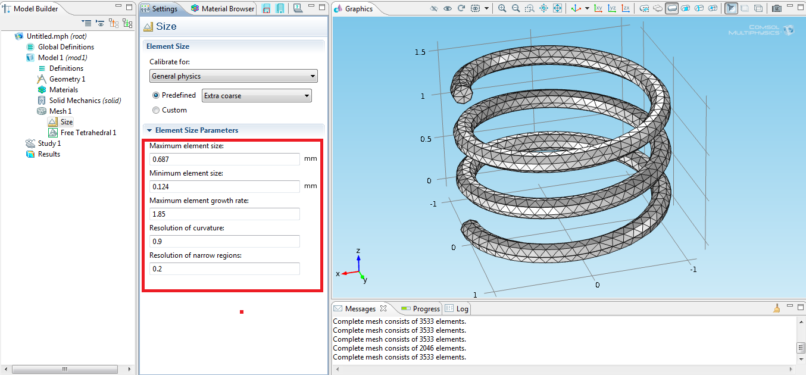

# Funny Name

I struggled a little for all the terms in Topology meaning "equivalence" (with their even messier Chinese translations:  homomorphism(同态), isomorphism(同构), homeomorphism(同胚), homotopy(同伦), homology(同调), isotopy(同痕). Well, Zexian Cao wrote an [article](http://www.wuli.ac.cn/fileup/PDF/2014-43-08-010.pdf) in Chinese acclimating the strange names, and here's a explanation from [Wiktionary](https://en.wiktionary.org/wiki/homology).

Guess I will write an article once I have understood these concepts. 

# Euler characteristic

The Homology is very similar to the Euler characteristic, which is a topological invarirant. Many of Chinese students encounter this concept around primary school or middle school, as a interesting excerise to develop a sense of space. Nevertheless, it's probably the most famous topological invariant. The law is somethings stated as Eular's rule, it states:

>Let $V, E,F$ denote respectively the numbers of vertices (corners), edges and faces of a polyhedron, then
>$$
>V-E+F=2
>$$
>

Most of the students will draw a few polyhedrons, a cube or a tetrahedron, count these numbers can get the number $2$ and call it a day. But that is only part of the story. If you really try to break the rules, you can come up with at least two more "polyhedrons" to prove your teacher wrong.

| Name                                                     | Image                                                        | Vertices $V$ | Edges $E$ | Faces $F$ | Euler characteristic: $V-E+F$ |
| -------------------------------------------------------- | ------------------------------------------------------------ | ------------ | --------- | --------- | ------------------------------------- |
| Tetrahedron |  | 4    | 6    | 4    | **2** |
| Cube        |  | 8    | 12   | 6    | **2** |
| Cube with a hole |  |  |  |  |  |
| Hollow cube |  |  |  |  |  |

# Homology

## Triangulation of objects

Triangulation is again no stranger for anyone who ever took part in IYPT, CUPT, or any PTs, and had some experience with COMSOL®. The following is a triangulation, or a "meshing" as in COMSOL®, of a spring, from [Nishant Nath](https://nishantnath.wordpress.com/2012/06/21/comsol-tutorials-meshing/)

It's also very commonly seen at 3D modeling (image from [freepik](https://www.freepik.com/blog/10-free-low-poly-animal-vector-images/)), see also [here](https://poly.google.com/view/46bXrRt8pFF).

It's self-evident that this technique is very useful as it converts a smooth object to a "discrete" one, while maintaining its most important traits. 

Similar techniques can be adopted to topology spaces. We can use "triangles" to mesh out any oddly shaped topological space, turning it into a "polyhedron". From this polyhedron, we can calculate the Euler characteristic of the space, telling us how many "holes" are in this topological space.

## Simplexes

## Simple complexes

 

# De Rham Cohomology

