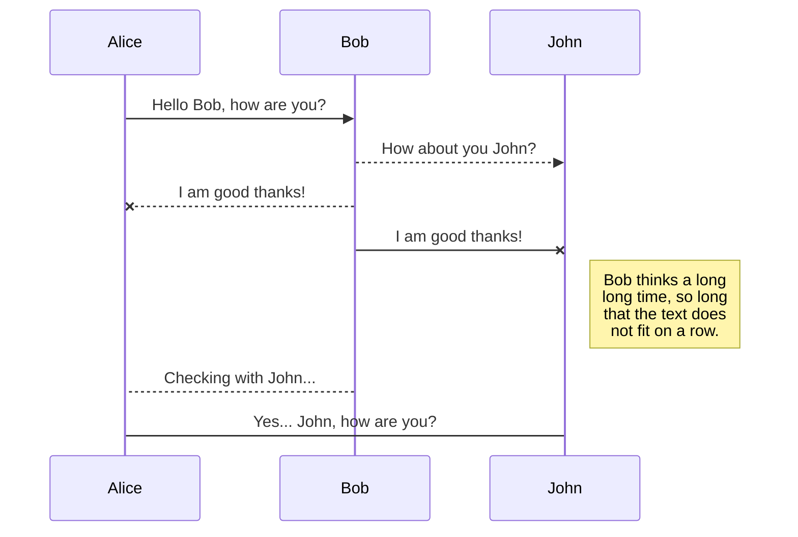
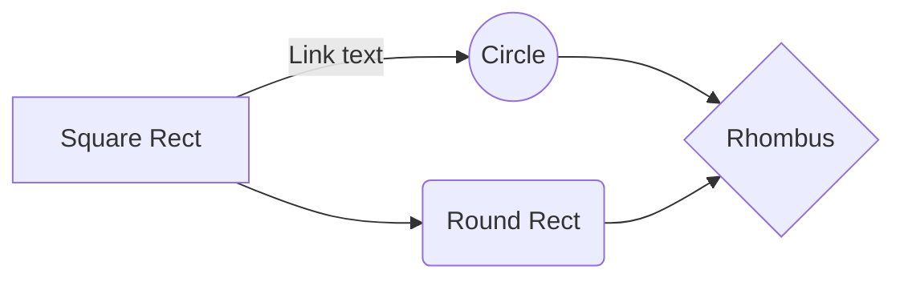
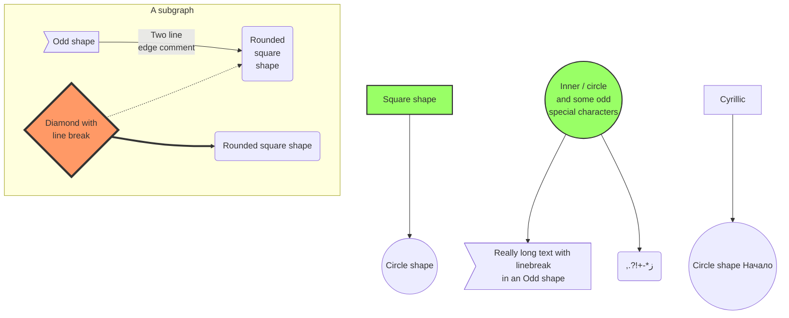
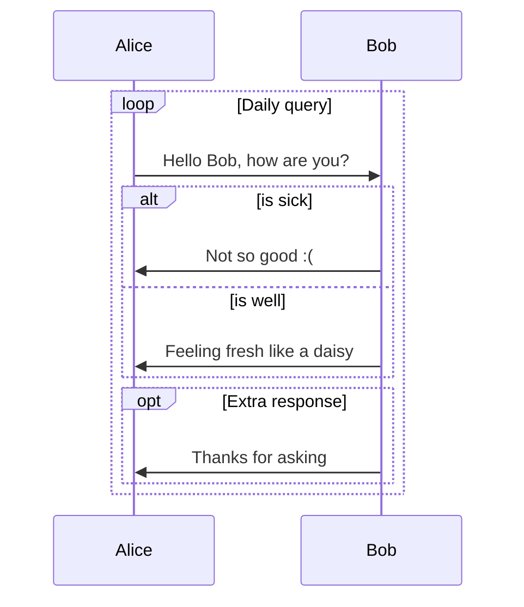

This page's comment is disabled, scroll down to see.

# Careful!

Don't use `[]` in YAML front matter. 

Use `\newline` instead of `\\` in inline math. 

`\substack` is a very useful command.

`` will be rendered by typora but Jekyll only renders ``

Display math must have extra black lines above and below like this.

```markdown
some normal text

$$
E=mc^2
$$

Some more text
```



do not use `{{` anywhere in your math. use `{ {` instead. Jekyll will parse that as liquid tags

do not use `x_1` in inline math, write that as `x _ 1`. Jekyll will parse that as italic.



# Highlights

*This is italic.* **This is Bold**. * If asterisk is surrounded by spaces, it is not parsed. *

_This is also italic._ __This is also Bold__. _ If underscore is surrounded by spaces, it is not parsed. _

~~This is strike through~~. 

There is no underline in markdown. You can use html tags <u>like this to underline.</u>

`This is a code block`. 

[This is an external link](https://bit.ly). "https://" is important. This is an internal [link](#this-is-a-h2). Internal links are all lowercase with space replaced by hyphens "-". 

You can mix them like [*this*](https://bit.ly), [`this`](https://bit.ly), **[this](https://bit.ly)**, but not like `[this](https://bit.ly)`.

# Blocks

> This is a quote block
>
> > This is a quote block in side another

```python
 import numpy as np
 print("""This is a python code fence""")
```

```fortran
 "This is a fortran code fence"
 implicit none
```

```
 This is a simple code fence. You can use it to display text. The fonts are mono spaced.
```

You can mix them as well, like 

> ```
>  This
> ```

# Other Elements

This is horizontal line

------

# Math Blocks

This is inline math $\sum_{i=1}^{N} i $. This is display math.
$$
\sum_{i=1}^{N} i 
$$
The extra empty line matters, or you will end up with
$$
\sum_{i=1}^{N} i
$$
[Mathjax](http://docs.mathjax.org/en/latest/tex.html) syntax is like latex. You cannot use `\usepackge`, but you can use `\newcommand` like this 
$$
\newcommand{\NewOp}[2]{\lbrace{#1}\mid \otimes{#2}\rbrace}
$$
And `\NewOp` will be available in all later math blocks, whether inline $\NewOp{x}{y}$ or display
$$
\NewOp{x}{y}
$$
Be **very careful** with the vertical bar symbol and underscore in math. If you use it like $|x|\ge 0$, $|0|=0$, or like $\lbrace x | x\gt 0\rbrace$, you will get a bunch of gibberish.

Use `\vert` in $\vert x\vert\ge 0$, $\vert 0\vert=0$. Use `\mid` in $\lbrace x \mid x\gt 0$ instead.

Also using underscores like this $x_1$, $x_2$, $x_{c_2}^{c_3}$, with $y_{c_2}^{c_3}$, will be processed as _this_.

Wrap underscores with whitespaces like this $x _ 1$, $x _ 2$, $x _ {c _ 2}^{c _ 3}$, with $y _ {c _ 2}^{c _ 3 }$.

# Images

Markdown uses `` to reference pictures, caption is optional. You cannot control the size. 


So I prefer using HTML tags like this:


# Lists

- This is unordered list
  - sub item
    - subsub item
      - subsubsub item
        - subsubsubsub ...

------

- List can have multiple lines

  like this.

------

1. This ordered list
   1. sub item
2. This is as well
3. It can keep going

------

1. You can avoid numbers like this
   1. sub item
1. It keeps going
1. Blah Blah


# mermaid










# Tables

| This column is left aligned | This column is centered | This column is right aligned |
| :-------------------------- | :---------------------: | ---------------------------: |
| 1                           |            4            |                            7 |
| 2                           |            5            |                            8 |
| 3                           |            6            |                            9 |

| You can use `` in tables.                    | You can use Math in tables. | You can use `` in tables.               |
| ------------------------------------------------------------ | --------------------------- | ------------------------------------------------------------ |
|  | $1+1=2$                     |  |

# Foot Notes

This is a note[^1]. Footnotes can have captions like[^this]. You can reference to the same note multiple times like[^this]. Foot notes can have many other options like[^this-one]. Or just like [^that]. This is a [reference style link][linkid] to a page. And [this][linkid] is also a link. As is [this][] and [that].

# Titles

# This is  h1

## This is  h2

### This is  h3

#### This is  h4

##### This is h5

###### This is h6

# Foot Notes

The Foot notes are like this

[^1]: https://yk-liu.github.io
[^this]: https://yk-liu.github.io
[^this-one]: 

```
> Blockquotes can be in a footnote.
```

```
    as well as code blocks
```

[^that]: or, naturally, simple paragraphs.

[linkid]: https://yk-liu.github.io	"Optional Title"