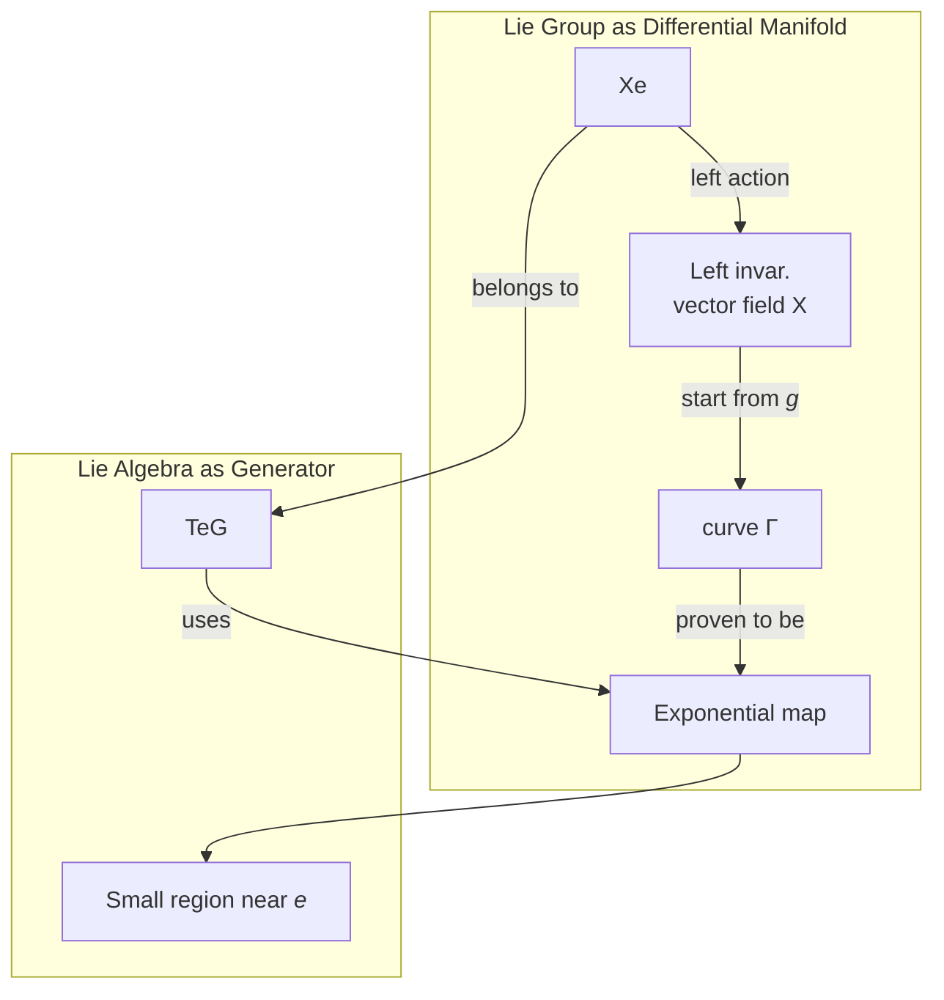

$$
\newcommand{\inner}[2]{\left\langle{#1,#2}\right\rangle}
\newcommand{\form}{\tilde}
\newcommand{\mfd}{\mathcal}
%\renewcommand{\vec}{\mathbf}
\newcommand{\bra}[1]{\left\langle{#1}\right\vert }
\newcommand{\ket}[1]{\left\vert {#1}\right\rangle}
\newcommand{\braket}[2]{\left\langle {#1} \, \middle\vert \,{#2} \right\rangle }
\newcommand{\mani}{\mathcal}
\newcommand{\field}{\mathscr}
\newcommand{\Tspace}[1]{T\! {#1}}
\newcommand{\d}{\mathrm{d}}
\newcommand{\R}{\mathbb{R}}
\newcommand{\C}{\mathbb{C}}
\newcommand{\K}{\mathbb{K}}
\newcommand{\D}[2]{\frac{\d {#1}}{\d {#2} }}
\newcommand{\Partial}[2]{\frac{\partial {#1} }{\partial {#2} }}
\newcommand{\op}{\hat}
\newcommand{\uvec}{\hat}
\newcommand{\dfdas}{:=}
\newcommand{\Eqn}[1]{\text{(Eqn. }\ref{#1}\text{)}}
\newcommand{\dual}{\tilde}
\newcommand{\vard}{\mathfrak{d}}
\newcommand{\vare}{\mathfrak{e}}
\newcommand{\e}{\mathrm{e}}
\newcommand{\i}{\mathrm{i}}
\newcommand{\blue}{\color{blue}}
\newcommand{\red}{\color{red}}
\newcommand{\norm}[1]{\left\vert{#1}\right\vert}
\newcommand{\set}[1]{\left\lbrace {#1}\right\rbrace}
\newcommand{\lb}[2]{\left \lbrack \! \left \lbrack {#1} , {#2}\right\rbrack\!\right\rbrack}
\newcommand{\pb}[2]{\left\lbrace {#1} , {#2} \right\rbrace}
\newcommand{\slot}{\,\cdot\,}
\newcommand{\L}{\mathsf{L}}
\newcommand{\lact}{\triangleright}
\newcommand{\ract}{\triangleleft}
\newcommand{\id}{1\!\!\!\mathsf{\phantom{I}I}}
\notag
$$

> This post requires some level of understanding of Lie groups. This post is more like a proposal of reorganized material for learning Lie group and Lie algebra, rather than a detailed study note. 
>
> For self-studying, I recommend [[**Bohm** et al.](https://www.springer.com/us/book/9783540000310)], [[Sudarshan et al.](https://www.worldscientific.com/worldscibooks/10.1142/9751)] and a YouTube open course [[Frederic Schuller's Lectures on Geometrical Anatomy of Theoretical Physics](https://www.youtube.com/playlist?list=PLPH7f_7ZlzxTi6kS4vCmv4ZKm9u8g5yic)] for Physics students, and for those who want more mathematical insights, I recommend [[Michael L. Geis](http://scholar.rose-hulman.edu/rhumj/vol15/iss2/5/)] (for undergrads), [[Brian C Hall](https://www.springer.com/us/book/9783319134666)] and [[Alexander Kirillov, Jr](https://www.cambridge.org/core/books/an-introduction-to-lie-groups-and-lie-algebras/98E68056F3EE57686421863E2B0B5DF4)] (this book requires some understanding of topology). 
>
> This post is based on sources listed above. Some of the proofs also come from [[Solutions for Nakahara](https://github.com/ernestyalumni/mathphysics/blob/master/LaTeX_and_pdfs/Nakahara_GTP-solutions.tex)].

# Lie Groups and Its "Actions"

## Lie Group

Roughly speaking, a Lie group is a continuous group. The elements in this group are continuous and the group operations are continuous.

Formally, a Lie group $(G,\cdot)​$ is a differentiable manifold with a group structure such that the operations

1. $\cdot : G\times G \rightarrow G,\, (g_1,g_2)\mapsto g_1\cdot g_2​$
2. $^{-1}: G\rightarrow G,\, g\mapsto g^{-1}$.

are differentiable.

## Lie Groups' Actions

### Back Story

> After writing down this subsection, I realized that I could have summarized the entirety of it as "A group element's action needs to be properly defined to avoid such confusions as '*A group element can act on other elements in the group, but an element should be an action on external entities*' like I had for a long time."

A group is interpreted in an introductory level, a collection of actions that preserve symmetries. This action is often defined via an external imaginary object, such as a cube or a sphere. Multiplication of group elements is interpreted as a consecutive application of these actions on the aforementioned object, which is considered a rigid body and can have coordinates in Euclidean space. The group elements are now considered as actions on coordinates, which is conveniently represented by matrices. Such is the linear representation of groups. So far so good.

When the cyclic group was introduced, so was the left or right translation, defined as taking one element out and multiply it with every element of the group. This operation when viewed (and called) as a translation. Considering that cyclic groups often represent "rotations", the translation is often depicted as follow. The fact that an element (which is a rotation) acting on the group "rotates" the group, is often neglected, or considered as a trivial coincidence. Since there is no "action on a group" defined. So far so good.

Then a more mathematical way of defining a group is introduced. Multiplication with a bunch of properties (namely closure, associativity, identity and invertibility) is defined on a set, making it a group. There is really not much to say about what is in this set. For all one knows, it's like a point set, with each point representing "something" like an action. This point of view is validified when one learned that $\set{ \e^{\i 2\pi j/ N} \mid j=1,2,3,\cdots, N}$ is a perfect cyclic group under multiplication of numbers. So far so good.

By taking the mathematical highroad, the external "rigid body" is removed. Previously we need two parts to define a group, one is the set of "actions", the other is something "to be acted". The former can be represented as matrices, the latter a set of coordinates. It makes no sense saying that a matrix "rotates another matrix $\frac{\pi}{6}$ around $x$-axis". When faced with such discrepancy, I thought that the naïve view of groups as point sets must be wrong. Groups must be made of something much more complicated than matrices, let along points. Since the group elements can somehow act on each other as well as on other entities. 

Thing got out of hand when I encountered Lie group. Similar to discrete groups, I first learned that continuous operations such a translation and rotations are represented by Lie groups. So a Lie group is made of continuous operations (often considered acting on a sphere). Then I learned formally, a Lie group is defined as a smooth manifold equipped with smooth group operations, which clearly means that a Lie group is made of points! Then there is the concept of left and right translations, depicted as magical translations along the one-parameter subgroups. $g(s)\circ g(t)$ is understood as $g(s)$ as a action acting on the point $g(t)$, moving it to a new point $g(s+t)=g(s)\circ g(t)​$. 

The confusing property that a group element can act on the group itself is caused by lack of proper definition of "action" of a group element. This chapter is often organized at the end of Lie group, but I think that early exposure to this concept helps to reduce the aforementioned confusion.

### Lie Groups' Actions on Manifold

A **left $G$-action** of a Lie group $(G,\cdot)$ on a manifold $\mfd M$ is a binary operation $(\slot,\slot)$ sometimes denoted as $\triangleright$.

$$
G\times \mfd M \rightarrow \mfd M: (g,p)\mapsto g\lact p
$$

such that

$$
\begin{align*}
e\lact p &= p,\\
g_1 \lact \left(g_2 \lact p\right) &= \left(g_2\cdot g_1\right)\lact p.
\end{align*}
$$

Sometimes a dot "$\,\cdot\,$" is abused to denote this left action as $g\cdot p$ when there is no ambiguity about which operation to be used.

In a similar fashion, a **right $G$-action** $\ract$ is defined as

$$
\mfd M \times G \rightarrow \mfd M : (p,g)\mapsto p\ract g
$$

such that 

$$
\begin{align*}
p\ract e &= p,\\
\left(p \ract g_2\right)\ract g_1  &= p \ract \left(g_1 \cdot g_2\right) .
\end{align*}
$$

### Lie Group's Actions on Itself

Notice that Lie group itself is a manifold, on which Lie group can thus "act". The **left action** or **left translation**: $L_g: G\rightarrow G​$ is defined by $L_g(h)=g\cdot h​$. Written in the form of **left $G​$-action** on itself, it reads:

$$
\begin{align*}
&G \times G \rightarrow G:
&L_g(h) \mapsto g \lact h \dfdas g\cdot h \in G
\end{align*}
$$

Similarly, **Right action** or **right translation** $R_g : G\rightarrow G$ is defined by $R_g(h) = h\cdot g$. 

### Lie Group's Actions: Pushed Forward

#### Vectors Are Pushed Forward

This section follows [[**Bohm**, A. et al](https://www.springer.com/us/book/9783540000310)].

Left $M_1$ and $M_2$ be smooth manifolds, $p\in M_1$ and $\varphi: M_1\rightarrow M_2$ be a smooth function. Then $\varphi$ induces a *linear* map 

$$
\varphi _ * : T_p M_1 \rightarrow T_{\varphi(p)}M_2
$$

celled the **pushforward** or the **differential map**. This map is described by considering an arbitrary tangent vector $v_p\in T_p M$ to a curve $C_1:[0,1]\rightarrow M_1$, i.e., $v_p = \Big.\D{C_1}{t}\Big\vert_{t=0}$. The image of $C_1$ is a smooth curve in $M_2$ under $\varphi$:

$$
C_2\dfdas\varphi\circ C_1: [0,1]\rightarrow M_2
$$

The push forward of a vector is then

$$
\varphi_* (v_p)=v_{*p} \dfdas \Big.\D{C_2}{t}\Big\vert_{t=0}
$$

#### \*Differential Forms Are Pulled Back

This section follows [[**Bohm**, A. et al](https://www.springer.com/us/book/9783540000310)].

Left $M_1​$ and $M_2​$ be smooth manifolds, $p\in M_1​$ and $\varphi: M_1\rightarrow M_2​$ be a smooth function. Then $\varphi​$ induces a *linear* map between cotangent spaces,

$$
\varphi ^ * : T_p^* M_1 \leftarrow T_{\varphi(p)}^*M_2
$$

called the **pullback map**. This map is described by considering an arbitrary cotangent vector $\omega_{\varphi(p)}​$ at $T_{\varphi(p)}^*M​$. The pullback is defined as its action on an arbitrary element $u_p​$ of $T_pM​$. We have

$$
\big[\varphi^*(\omega_{\varphi(p)})\big](v_p)=\omega^*_{\varphi(p)}(u_p)\dfdas \omega_{\varphi(p)}(v_{*p})
$$

where the RHS only contains quantities we have defined.

#### Push Forward of Left and Right Actions

each of these actions also defines the action of $G$ on vector fields as well as differential forms on $G$ (as a manifold). For a tangent vector $v ∈ T _ hG$ at $h\in G$, the push forward of left action $(L _ g) _ ∗$ will move the vector to $T _ {g\cdot h} G$. This map is denoted as

$$
(L_g)_*: T_gG\ni v\mapsto (L_g)_* v\in T_{g\cdot m}.
$$

Sometimes the notion of dot "$\,\cdot\,$" is again abused to denoted such action as $g\cdot v = (L_g)_*v$.

In short, **the left action $L _ g$ carries everything defined on $h$ to $g\cdot h$ like a simple translation**.

## Lie Group's Matrix Representations

The idea of relating a Lie group to a set of action is closely related to the notion of representation. When we choose to make Lie group act on a Euclidean space, the transformation can be described by a matrix. In other words, a one-to-one correspondence can be established between a Lie group and a set of matrices.

# Lie Group as A Differential Manifold

A nice thing about a manifold is that it can be treated as a usual Euclidean space locally. Most importantly, calculus structures can be introduced on a manifold, and all the related theorems will hold.

## From Lie Groups to Coordinates

Consider a Lie group $G$ with coordinates introduced in some neighborhood $N_0$ of the identity $e$. Thus any element $g\in N_0$ has a coordinate in $\R^n$ such that:
$$
g\rightarrow \left( g^1,g^2,\cdots, g^n\right).
$$
For convenience, the coordinate of identity $e$ is set to be the origin $(0,0,\cdots,0)$ without loss of generality. 

Inside this neighborhood $N_0$,  we can always find a subset $N^\prime$ that preserves the structure of Lie group. 

## Left Invariant Vector Fields

Let $(G,\cdot )$ be a Lie group. A **left translation** $L_g$ is defined as
$$
L_g:G\rightarrow G\\
h\mapsto L_g(h)\dfdas g\cdot h
$$
Each $L _ g$ is an isomorphism and a diffeomorphism on $G​$. 

Since this $L _ g​$ is a diffeomorphism (namely bijective and smooth), we can push forward the vector field $X​$ on $G​$ to another vector field ${L _ g}^* X​$:
$$
({L _ g}^* X) _ {gh}\dfdas {L _ g}^* (X _ h)
$$
Let $(G \cdot)​$ be a Lie group, and $X​$ a vector field on $G​$ then $X​$ is called left invariant if for any $g\in G​$,
$$
{L_g}^* X = X.
$$
Alternatively, one can write this as a point wise vector equation:
$$
l_g^* (X_h) = X_{gh}
$$
This abstract left invariant vector field satisfies the requirements of a Lie algebra.

or, $\forall g \in G, \forall f \in C^\infty(G)$
$$
\begin{align*}
(l_g^*X_h)f &= X_{gh} f\\
X_h (f\circ l_g)&= (Xf )(gh)\\
[X(f\circ l_g)] (h)&=[(Xf)\circ l_g ] (h)\\
X(f\circ l_g)&=(Xf)\circ l_g \\
\end{align*}
$$
Def. The set of all left-invariant vector fields on a Lie group $G$ be denoted $\L (G)\subset \Gamma(TG)$.

###  bracket of vector fields

This section follows [[**Bohm**, A. et al](https://www.springer.com/us/book/9783540000310)].

If we have two vector fields $V=V^i(x)\Partial{}{x^i}$ and $W=W^j(x)\Partial{}{x^j}$, we first define the composite of vectors $V \circ W$ as their actions on function $f(x)$ , notice that
$$
W_p(f) =W^j(x_p)\Partial{f}{x^j} \in \R
$$
can be seen as a function $W(f): M\rightarrow \R,  p \mapsto W^j(x_p)\Partial{f}{x^j}$. Thus we can apply another vector filed to this function as:
$$
\begin{align*}
\Big[V\circ W \Big](f) &= V\Big(W(f)\Big)\\
&=V^i(x) \cdot \Partial{}{x^i}\bigg(W^j(x_p)\Partial{f}{x^j}\bigg)\\
\end{align*}
$$
Notice that both $W^j(x_p)$ and $\Partial{f(x)}{x^j}$ are merely functions $M\rightarrow \R$, thus the Leibnitz rule applies,
$$
\begin{align*}
\Big[V\circ W \Big](f) &=V^i(x) \cdot \Partial{}{x^i}\bigg(W^j(x_p)\Partial{f}{x^j}\bigg)\\
&=V^i(x) \cdot \left(\Partial{W^j(x_p)}{x^i}\cdot\Partial{f}{x^j}\right) +V^i(x) \cdot \left(W^j(x_p)\cdot \Partial{\Partial{f}{x^j}}{x^i}\right)
\end{align*}
$$
notice from basic calculus
$$
\Partial{}{x^i}(\Partial{f}{x^j}) = \Partial{^2}{x^i\partial{x^j}} f = \Partial{}{x^j}(\Partial{f}{x^i})
$$
Write that in operator form, we have
$$
V\circ W  =V^i(x) \cdot \left(\Partial{W^j(x_p)}{x^i}\cdot\Partial{}{x^j}\right) +V^i(x) \cdot \left(W^j(x_p)\cdot \Partial{^2}{x^i\partial x^j}\right)
$$
Now we can define the **commutator**:
$$
\begin{align*}
[V,W] &=V \circ W - W\circ V\\
&=V^i(x) \cdot \left(\Partial{W^j(x_p)}{x^i}\cdot\Partial{}{x^j}\right) +V^i(x) \cdot \left(W^j(x_p)\cdot \Partial{^2}{x^i\partial x^j}\right) - \\ 
&\qquad W^j(x) \cdot \left(\Partial{V^i(x_p)}{x^j}\cdot\Partial{}{x^i}\right) +W^i(x) \cdot \left(V^j(x_p)\cdot \Partial{^2}{x^j\partial x^i}\right)\\
& = V^i(x) \cdot \left(\Partial{W^j(x_p)}{x^i}\cdot\Partial{}{x^j}\right)- W^j(x) \cdot \left(\Partial{V^i(x_p)}{x^j}\cdot\Partial{}{x^i}\right)
\end{align*}
$$
notice that the indices $i, j $ are summed over, so it's okay to change the latter dummy indices in both terms so we can collect them.
$$
\begin{align*}
[V,W]  & = V^i(x) \cdot \left(\Partial{W^k(x_p)}{x^i}\cdot\Partial{}{x^k}\right)- W^j(x) \cdot \left(\Partial{V^k(x_p)}{x^j}\cdot\Partial{}{x^k}\right)\\
&= \underbrace{\left(V^i(x) \cdot \Partial{W^k(x_p)}{x^i}- W^j(x) \cdot \Partial{V^k(x_p)}{x^j}\right)}_{U^k}\cdot\Partial{}{x^k}\\
\end{align*}
$$

### Left Invariant Vector Fields' commutator

> Theorem : $[\slot,\slot]: \L(G)\times \L(G)\rightarrow \L(G)$ is a Lie algebra. (i.e., $[x,y]$ is left invar.)
>
> Proof: 
> $$
> \begin{align*}
> [X,Y](f\circ l_g)&= X(Y(f\circ l_g))-Y(X(f\circ l_g))\\
> &=X((Yf)\circ l_g)-Y((Xf)\circ l_g)\\
> &=X(Yf)\circ l_g-Y(Xf)\circ l_g\\
> &=([X,Y]f)\circ l_g \\
> \text{thus it is left invar.}
> \end{align*}
> $$

## Lie Algebra of a Lie Group

## Matrix Exponentials

A good place to start learning Lie groups is matrix lie groups. In matrix Lie groups, one important notion is matrix exponential. In this section, proofs are omitted and can be found on books listed in the beginning.

To avoid confusion with identity element $e$, the exponential is denoted as $\exp(X)​$, defined by the usual power series
$$
\exp (X) = \sum_{n=0}^{\infty}\frac{X^n}{n!},
$$
where $X^0$ is defined to be the identity $\id$. This series converges for all $M_n(\C)$. The symbol $M_n(\K)$ stands for all $n\times n$ matrices whose entries are in $\K=\C \text{ or } \R$. 

The function $\exp(tX)$ define a smooth curve in $M_n(\C)​$.

