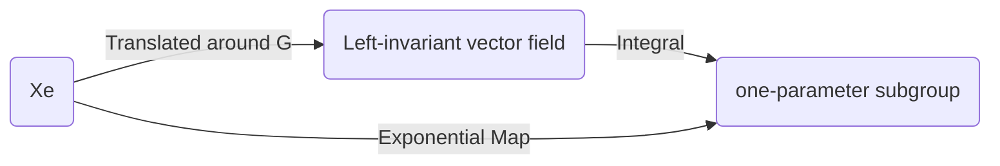

$$
\newcommand{\bra}[1]{\left\langle{#1}\right\vert }
\newcommand{\ket}[1]{\left\vert {#1}\right\rangle}
\newcommand{\braket}[2]{\left\langle {#1} \, \middle\vert \,{#2} \right\rangle }
\newcommand{\d}{\mathrm{d}}
\newcommand{\R}{\mathbb{R}}
\newcommand{\C}{\mathbb{C}}
\newcommand{\K}{\mathbb{K}}
\newcommand{\D}[2]{\frac{\d {#1}}{\d {#2} }}
\newcommand{\Partial}[2]{\frac{\partial {#1} }{\partial {#2} }}
\newcommand{\op}{\hat}
\newcommand{\uvec}{\hat}
\newcommand{\dfdas}{:=}
\newcommand{\Eqn}[1]{\text{(Eqn. }\ref{#1}\text{)}}
\newcommand{\vard}{\mathfrak{d}}
\newcommand{\vare}{\mathfrak{e}}
\newcommand{\e}{\mathrm{e}}
\newcommand{\i}{\mathrm{i}}
\newcommand{\norm}[1]{\left\vert{#1}\right\vert}
\newcommand{\set}[1]{\left\lbrace {#1}\right\rbrace}
\newcommand{\comm}[2]{\left[ #1 , \, #2 \right]}
\newcommand{\slot}{\,\cdot\,}
\newcommand{\lact}{\triangleright}
\newcommand{\ract}{\triangleleft}
\newcommand{\id}{1\!\!\!\mathsf{\phantom{I}I}}
\newcommand{\la}{\mathfrak}
\notag
$$

# Generators in Mathematics

From the last post, a one-to-one correspondence between three entities has been established, namely

- Left-invariant vector field $X$, such $X$ is sometimes called the **infinitesimal generator** of the one-parameter group $t \rightarrow \exp(tX)$.
- Tangent vector at identity $X_e\in T_eG$,
- One-parameter subgroup $\gamma_X(t)$.

The relationship between them can be summarized as

## Lie Group's Generator

A connected Lie group is generated by any neighborhood of identity.

> Proof: (from [G Bellam](https://www.maths.gla.ac.uk/~gbellamy/lie.pdf))
>
> 1. Recall that $G$ is connected implies that the only non-empty closed and open subset of $G$ is $G$ itself. The proof is done by showing the neighborhood generates a set $H$ that is both open and closed.
> 2. Since the inversion map $i:g\mapsto g^{-1}$ is smooth, for an open set $U$, the inverse $U^{-1}\dfdas \set{g^{-1}\mid g\in U}$ is open in $G$. The intersection $U\cap U^{-1}$ is also open. It's non-empty since $e\in U\cap U^{-1}$. Take $V=U \cap U^{-1}$.
> 3. If $g\in V$ then $gV=\set{gh\mid h\in U}$ is also open in $G$. Thus the set $V\cdot V \dfdas \bigcup_{g\in V} gV$ is also open in $G$. By induction, $H=V^n\dfdas\set{\prod_{i=1}^n g_i\mid g_i\in V}$ is open. $H$ is s subgroup of $G$ since it satisfies the four group multiplication rules. Moreover,  $V$ is a subset of $H$.
> 4. We now show that $H$ is closed by contradiction.
> 5. Suppose $H$ is not closed, then there is a nonempty boundary of $H$, namely there exists $g\in \partial H \dfdas \overline H\backslash H$, $g\notin H$. Since $gV$ contains $g$, $gV\cap\partial H\neq\varnothing$. $V$ is also open, and when an open set intersect with a boundary $\partial H$, it must intersect with the interior (open set has no boundary to be "tangent to $\partial H$"). Thus $gV \cap H \neq \varnothing$.
> 7. Choose $h\in gV\cap H$. Since $h\in gV$, $h$ can be expressed as $h=gu, \ u\in V \subset H$. For $V\subset H$, $h=gu\in H$. Since the inverse map is closed in $V$, $u^{-1} \in V \subset H$. Since $H$ is closed, $h, u^{-1} \in H$, $hu^{-1} = g \in H$. But we assumed $g\notin H$, a contradiction. 
> 7. 
>   Thus $H$ is both open and closed. $H=G$. Since $H$ is generated by the neighborhood of $e$, so is $G$.
>

This theorem can be understood as generating the real number $(\R,+)$. Take an arbitrarily small open neighborhood $(-\varepsilon, \varepsilon)$ of identity $0$, the entire $\R$ can be generated by adding $\varepsilon$ to itself to get $2\varepsilon$ and to $\infty$, or to add $-\varepsilon$ to $-\varepsilon$ to get $-2\varepsilon$ and to $-\infty$. But if the neighborhood does not contain both positive and negative numbers, say $(\varepsilon ,2\varepsilon), \ \varepsilon >0$, then you cannot get to $-\infty$. Therefore we require the set to not only contain $0$ but to be open, so there is always a negative number sitting next to $0$.

One important observation is that such neighborhood does not have any limitation on size. It can be arbitrarily small. How small can this neighborhood be? 

## Tangent Space and Neighborhood Diffeomorphism

Taking smaller and smaller neighborhoods of e, one eventually "arrives" at the tangent space of $G$ at $e$. Namely, the tangent space $T_eG$ generates the entire Lie group.

To prove the above statement, we can prove that there is a diffeomorphism between an open neighborhood of tangent space and an open neighborhood near the identity.

Proposition: The exponential map $\exp : T_e G \rightarrow G$ is smooth, and it is a local diffeomorphism at $0$.

> Proof:
>
> 1. **Inverse Function Theorem**: Let $f : M \rightarrow N$ be a smooth map between two smooth manifolds $M$, $N$, and let $p \in M$ and $q = f(p)$. If $\d f_p : T_pM \rightarrow T_qN$ is an isomorphism, then there exists an open neighborhood $W$ of $p$ such that $f(W)$ is an open neighborhood of $q$ and $f$ restricts to a diffeomorphism from $W$ onto $f(W)$.
> In other words, a function is invertible in a neighborhood of a point in its domain as long as its derivative is continuous and non-zero at the point. Thus this function induces a diffeomorphism.
>
> 
>
> 2. Since $\exp(tX) = \phi_X(t)$ is a curve on $G$, it's tangent vector at $t=0$ is $X$, we have $\left.\D{}{t} \exp(tX) \right\vert_{t=0}=X$. This means that the map $\d \exp$ at $t=0$ is just identity map, which clearly has inverse. By the Inverse function theorem, $\exp$ is a local diffeomorphism.

## Tangent Space Encodes (Generates) the Lie Group

From the last two sections, the tangent space at $e$ is diffeomorphic to an open set $U_e$ of identity, which generates the entire Lie group. In this sense, the tangent space does generate the entire Lie group (that is compact and connected). 

I like to think it as tangent vectors dictates different one-parameter subgroups which in turn "covers" the entire Lie group. Since the tangent space is in general uncountable, such is "cover" on a higher dimensional "surface" (or "volume") using a lower dimensional "line".

# Associated Lie Algebra of Lie Group

Lie algebra should "know" everything about $G$, then it should know about the group operation, which leads to the Campbell-Baker-Hausdorff formula.  ([Tony Feng](http://web.stanford.edu/~tonyfeng/222.pdf)) The formula can be better understood with the "bracket" in Lie algebra is introduced as a measure of non-commutativity.

> Lie published an article titled "*Über Gruppen von Transformationen*" in 1874. As early as 1871, the idea of an infinitesimal generator of a one-parameter group of transformations had already appeared in his work.
>
> This point of view was essential to Emmy Noether’s 1918 article in the *Göttinger Nachrichten* establishing the relationship between symmetries of a variational problem and conservation laws. About ten years later, Noether published a very important article situating the representation theory of finite groups and of algebras in the context of noncommutative rings 
>
> The set of infinitesimal generators of one-parameter subgroups of a continuous group forms what today is called
> a “Lie algebra.”(This name was suggested much later by Weyl in his 1933–1934 lectures at the Institute for Advanced Study in Princeton.)
>
> (from [[Yvette](https://www.springer.com/us/book/9780387788654)])

## General Lie Algebra

A **Lie Algebra** $\la g$ over a field $\K$ is a vector space over $\K$ (usually $\R$ or $\C$) equipped with a bilinear map called the **Lie bracket**:

$$
\la g \times \la g \rightarrow \la g, \ \ (a,b)\mapsto \comm{a}{b}
$$

such that

1. Skew-symmetric $[a, a] = 0$ for all $a \in \la g$.
2. Jacobian Identity $[a, [b, c]] + [b, [c, a]] + [c, [a, b]] = 0, \forall  a, b, c \in\la g$.

## Associated Lie Algebra

In the [last post]({{ site.baseurl }}#four-properties-of-brackets), the bracket of left invariant vector fields are defined. The brackets satisfies all the requirements of a Lie algebra. Hence, **All left-invariant vector fields form a Lie algebra**.

## $\log$ Map, BCH formula

With $\exp$ map defined, $\log$ map arises naturally. Such $\log$ map is often described in the form of [BCH formula](https://en.wikipedia.org/wiki/Baker–Campbell–Hausdorff_formula).

$$
\begin{align*}
&e^X e^Y=e^Z\\
&Z=X+Y+\tfrac{1}{2}\comm{X}{Y},\quad \comm{X}{\comm{X}{Y}}=\comm{Y}{\comm{X}{Y}}=0\\
&\Rightarrow Z=\log (e^X e^Y)
\end{align*}
$$

Proof: see [Math SO](https://mathoverflow.net/questions/99230/modern-proof-for-the-baker-campbell-hausdorff-formula/99251#99251). 