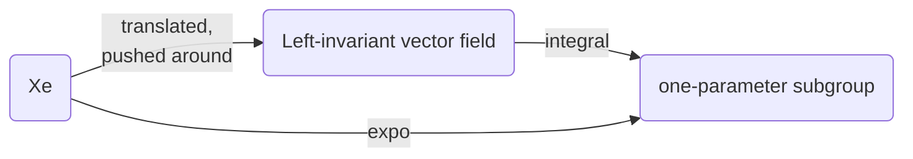

$$
\newcommand{\inner}[2]{\left\langle{#1,#2}\right\rangle}
\newcommand{\form}{\tilde}
\newcommand{\bra}[1]{\left\langle{#1}\right\vert }
\newcommand{\ket}[1]{\left\vert {#1}\right\rangle}
\newcommand{\braket}[2]{\left\langle {#1} \, \middle\vert \,{#2} \right\rangle }
\newcommand{\field}{\mathscr}
\newcommand{\Tspace}[1]{T\! {#1}}
\newcommand{\d}{\mathrm{d}}
\newcommand{\R}{\mathbb{R}}
\newcommand{\C}{\mathbb{C}}
\newcommand{\D}[2]{\frac{\d {#1}}{\d {#2} }}
\newcommand{\Partial}[2]{\frac{\partial {#1} }{\partial {#2} }}
\newcommand{\op}{\hat}
\newcommand{\uvec}{\hat}
\newcommand{\dfdas}{:=}
\newcommand{\Eqn}[1]{\text{(Eqn. }\ref{#1}\text{)}}
\newcommand{\dual}{\tilde}
\newcommand{\vard}{\mathfrak{d}}
\newcommand{\vare}{\mathfrak{e}}
\newcommand{\e}{\mathrm{e}}
\newcommand{\i}{\mathrm{i}}
\newcommand{\norm}[1]{\left\vert{#1}\right\vert}
\newcommand{\set}[1]{\left\lbrace {#1}\right\rbrace}
\newcommand{\slot}{\,\cdot\,}
\newcommand{\lact}{\triangleright}
\newcommand{\ract}{\triangleleft}
\newcommand{\id}{1\!\!\!\mathsf{\phantom{I}I}}
\notag
$$

# Generator in Mathematical View

From last post, a one-to-one correspondence between three entities has been established, namely

- Left-invariant vector field $X$,
- Tangent vector at identity $X_e\in T_eG$,
- One-parameter subgroup $\gamma_X(t)$.

The relationship between them can be summarized as




TeG -push-> left-invar -intgral-> one parm. subgroup


lie group is generated by a neighborhood. How small? as small as a "point" : A tangent space "\cup" Manifold small.


# SOurces

probably the best

```
Proposition 0.1 If G is a topological group which is connected then any open set containing the identity element
generates G as a group, i.e. every element of G is a finite product of elements of the open set.
Lemma 0.2 If G is a topological group and g ∈ G then Lg(h) = gh = m(g, h) defines a continuous map G → G.
In fact Lg is a homeomorphism.
```

https://warwick.ac.uk/fac/sci/masdoc/people/studentpages/students2013/egginton/lg_lecture_notes.pdf

```
As early as
1871, the idea of an infinitesimal generator of a one-parameter group of transformations had already appeared in his work;5 the set of infinitesimal generators
of one-parameter subgroups of a continuous gro
```

```
good on generator 
```

file:///C:/Users/water/Desktop/Groups-and-Symmetries-From-Finite-Groups-to-Lie-Groups.pdf/ 

moved to dropbox


**defnition of infintestmal operators**

```
Infinitesimal Group Actions
Just as a one-parameter group of transformations is generated as the flow of a vector
field, so a general Lie group of transformations G acting on a manifold M will be generated
by a set of vector fields on M, known as the infinitesimal generators of the group action.
Each infinitesimal generator’s flow coin
```

http://www-users.math.umn.edu/~olver/sm_/l.pdf


```
Let G be a connected topological group, U ⊆ G a neigborhood
of 1. Then U generates G.
Proof. For a subset W ⊆ G, write W−1 =

g
−1 ∈ G | g ∈ W
	
. Also, if k
is a positive integer, we set Wk = {a1 . . . ak | ai ∈ W}. Let U be as above,
and V = U ∩ U
−1
. Then, V is open and v ∈ V implies that v
−1 ∈ V . Let
H = ∪∞
n=1V
n
. Then, H is a subgroup and we claim that H is open. Notice
that H is precisely the subgroup generated by U, so if we prove that H is
open, then H = G and the Lemma is proved.
If V
k
is open, then V
k+1 = ∪a∈V (aV k
) is open since left multiplication
is a homeomorhism. By induction, V
n
is open for every n. Thus H is
open
```

https://faculty.math.illinois.edu/~lerman/519/s12/427notes.pdf

```
Theorem 2.3.9. Let G be a Lie group with Lie algebra g.
21
(i) exp(g) generates the identity component of G in the algebraic sense.
(ii) Let F : G → H be a Lie group homomorphism. Then the restriction of F to
G0
is completely determined by F∗ : g → h.
Proof. (i) follows from the fact that exp is a local diffeomorphism from g to G,
hence contains a neighborhood of e ∈ G. (ii) follows from the preceding observation
and the universality of the exponential map, which tells us that knowledge of F∗
completely determines F restricted to the image of the exponential map
```

http://web.stanford.edu/~tonyfeng/222.pdf


would be good to read

```
Proposition 2.4. An action of a connected Lie group on a manifold M is uniquely
determined by its infinitesimal action

A natural question is, which Lie algebra anti-homomorphism can be integrate to Lie
group actions? Suppose the Lie algebra anti-homomorphism is induced by a G-action
on M, then G × M decompose into submanifolds
Lm = f(g; g · m) j g 2 Gg;
and each Lm projects diffeomorphically to G. So if we let Lm be the \leaf" containing
(e; m), then the point on Lm that projects to g must be (g; g · m). In other words, the
\leaves" determine the Lie group action
```

utsc


```
3.2.5 Proposition G◦
is generated as a group by any neighborhood U of 1 in G◦
,
namely,
G
◦ =
[
n≥1
U
n
,
where U
n denotes the set of n-fold products of elements in U. In particular, G◦
is
generated by exp[g].
```

https://www.ime.usp.br/~gorodski/teaching/mat5799-2013/ch3.pdf


spin and genreator 

```
https://www.ks.uiuc.edu/Services/Class/PHYS480/qm_PDF/chp5.pdf
```

