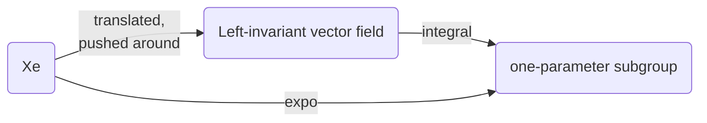

$$
\newcommand{\bra}[1]{\left\langle{#1}\right\vert }
\newcommand{\ket}[1]{\left\vert {#1}\right\rangle}
\newcommand{\braket}[2]{\left\langle {#1} \, \middle\vert \,{#2} \right\rangle }
\newcommand{\d}{\mathrm{d}}
\newcommand{\R}{\mathbb{R}}
\newcommand{\C}{\mathbb{C}}
\newcommand{\D}[2]{\frac{\d {#1}}{\d {#2} }}
\newcommand{\Partial}[2]{\frac{\partial {#1} }{\partial {#2} }}
\newcommand{\op}{\hat}
\newcommand{\uvec}{\hat}
\newcommand{\dfdas}{:=}
\newcommand{\Eqn}[1]{\text{(Eqn. }\ref{#1}\text{)}}
\newcommand{\vard}{\mathfrak{d}}
\newcommand{\vare}{\mathfrak{e}}
\newcommand{\e}{\mathrm{e}}
\newcommand{\i}{\mathrm{i}}
\newcommand{\norm}[1]{\left\vert{#1}\right\vert}
\newcommand{\set}[1]{\left\lbrace {#1}\right\rbrace}
\newcommand{\slot}{\,\cdot\,}
\newcommand{\lact}{\triangleright}
\newcommand{\ract}{\triangleleft}
\newcommand{\id}{1\!\!\!\mathsf{\phantom{I}I}}
\notag
$$

# Generator in Mathematical View

From last post, a one-to-one correspondence between three entities has been established, namely

- Left-invariant vector field $X$,
- Tangent vector at identity $X_e\in T_eG$,
- One-parameter subgroup $\gamma_X(t)$.

The relationship between them can be summarized as



## Lie Group's Generator

A connected Lie group is generated by any neighborhood of identity.

> Proof: (from [G Bellam](https://www.maths.gla.ac.uk/~gbellamy/lie.pdf))
>
> 1. Recall that $G$ is connected implies that the only non-empty closed and open subset of $G$ is $G$ itself. The proof is done by showing the neighborhood generates a set $H$ that is both open and closed.
> 2. Since the inversion map $i:g\mapsto g^{-1}$ is smooth, for an open set $U$, the inverse $U^{-1}\dfdas \set{g^{-1}\mid g\in U}$ is open in $G$. The intersection $U\cap U^{-1}$ is also open. It's non-empty since $e\in U\cap U^{-1}$. Take $V=U \cap U^{-1}$.
> 3. If $g\in V$ then $gV=\set{gh\mid h\in U}$ is also open in $G$. Thus the set $V\cdot V \dfdas \bigcup_{g\in V} gV$ is also open in $G$. By induction, $H=V^n\dfdas\set{\prod_{i=1}^n g_i\mid g_i\in V}$ is open. $H$ is s subgroup of $G$ since it satisfies the four group multiplication rules. Moreover,  $V$ is a subset of $H$.
> 4. We now show that $H$ is closed by contradiction.
> 5. Suppose $H$ is not closed, then there is a nonempty boundary of $H$, namely there exists $g\in \partial H \dfdas \overline H\backslash H$, $g\notin H$. Since $gV$ contains $g$, $gV\cap\partial H\neq\varnothing$. $V$ is also open, and when an open set intersect with a boundary $\partial H$, it must intersect with the interior (open set has no boundary to be "tangent to $\partial H$"). Thus $gV \cap H \neq \varnothing$.
> 7. Choose $h\in gV\cap H$. Since $h\in gV$, $h$ can be expressed as $h=gu, \ u\in V \subset H$. For $V\subset H$, $h=gu\in H$. Since the inverse map is closed in $V$, $u^{-1} \in V \subset H$. Since $H$ is closed, $h, u^{-1} \in H$, $hu^{-1} = g \in H$. But we assumed $g\notin H$, a contradiction. 
> 7. 
>   Thus $H$ is both open and closed. $H=G$. Since $H$ is generated by the neighborhood of $e$, so is $G$.
>

This theorem can be understood as generating the real number $(\R,+)$. Take an arbitrarily small open neighborhood $(-\varepsilon, \varepsilon)$ of identity $0$, the entire $\R$ can be generated by adding $\varepsilon$ to itself to get $2\varepsilon$ and to $\infty$, or to add $-\varepsilon$ to $-\varepsilon$ to get $-2\varepsilon$ and to $-\infty$. But if the neighborhood does not contain both positive and negative numbers, say $(\varepsilon ,2\varepsilon), \ \varepsilon >0$, then you cannot get to $-\infty$. Therefore we require the set to not only contain $0$ but to be open so there is always a negative number sitting next to $0$.

One important observation is that such neighborhood does not have any limitation on size. It can be arbitrarily small. How small can this neighborhood be? 

## Tangent Space and Neighborhood Diffeomorphism

Taking smaller and smaller neighborhoods of e, one eventually "arrives" at the tangent space of $G$ at $e$. Namely, the tangent space $T_eG$ generates the entire Lie group.

To prove that, we can proof that there is a diffeomorphism between the tangent space and an open neighborhood near the identity.


# Sources

probably the best

```
Proposition 0.1 If G is a topological group which is connected then any open set containing the identity element
generates G as a group, i.e. every element of G is a finite product of elements of the open set.
Lemma 0.2 If G is a topological group and g ∈ G then Lg(h) = gh = m(g, h) defines a continuous map G → G.
In fact Lg is a homeomorphism.
```

https://warwick.ac.uk/fac/sci/masdoc/people/studentpages/students2013/egginton/lg_lecture_notes.pdf

```
As early as
1871, the idea of an infinitesimal generator of a one-parameter group of transformations had already appeared in his work;5 the set of infinitesimal generators
of one-parameter subgroups of a continuous gro
```

```
good on generator 
```

file:///C:/Users/water/Desktop/Groups-and-Symmetries-From-Finite-Groups-to-Lie-Groups.pdf/ 

moved to dropbox


**defnition of infintestmal operators**

```
Infinitesimal Group Actions
Just as a one-parameter group of transformations is generated as the flow of a vector
field, so a general Lie group of transformations G acting on a manifold M will be generated
by a set of vector fields on M, known as the infinitesimal generators of the group action.
Each infinitesimal generator’s flow coin
```

http://www-users.math.umn.edu/~olver/sm_/l.pdf

```
Theorem 2.3.9. Let G be a Lie group with Lie algebra g.
21
(i) exp(g) generates the identity component of G in the algebraic sense.
(ii) Let F : G → H be a Lie group homomorphism. Then the restriction of F to
G0
is completely determined by F∗ : g → h.
Proof. (i) follows from the fact that exp is a local diffeomorphism from g to G,
hence contains a neighborhood of e ∈ G. (ii) follows from the preceding observation
and the universality of the exponential map, which tells us that knowledge of F∗
completely determines F restricted to the image of the exponential map
```

http://web.stanford.edu/~tonyfeng/222.pdf


would be good to read

```
Proposition 2.4. An action of a connected Lie group on a manifold M is uniquely
determined by its infinitesimal action

A natural question is, which Lie algebra anti-homomorphism can be integrate to Lie
group actions? Suppose the Lie algebra anti-homomorphism is induced by a G-action
on M, then G × M decompose into submanifolds
Lm = f(g; g · m) j g 2 Gg;
and each Lm projects diffeomorphically to G. So if we let Lm be the \leaf" containing
(e; m), then the point on Lm that projects to g must be (g; g · m). In other words, the
\leaves" determine the Lie group action
```

utsc


```
3.2.5 Proposition G◦
is generated as a group by any neighborhood U of 1 in G◦
,
namely,
G
◦ =
[
n≥1
U
n
,
where U
n denotes the set of n-fold products of elements in U. In particular, G◦
is
generated by exp[g].
```

https://www.ime.usp.br/~gorodski/teaching/mat5799-2013/ch3.pdf


spin and genreator 

```
https://www.ks.uiuc.edu/Services/Class/PHYS480/qm_PDF/chp5.pdf
```

