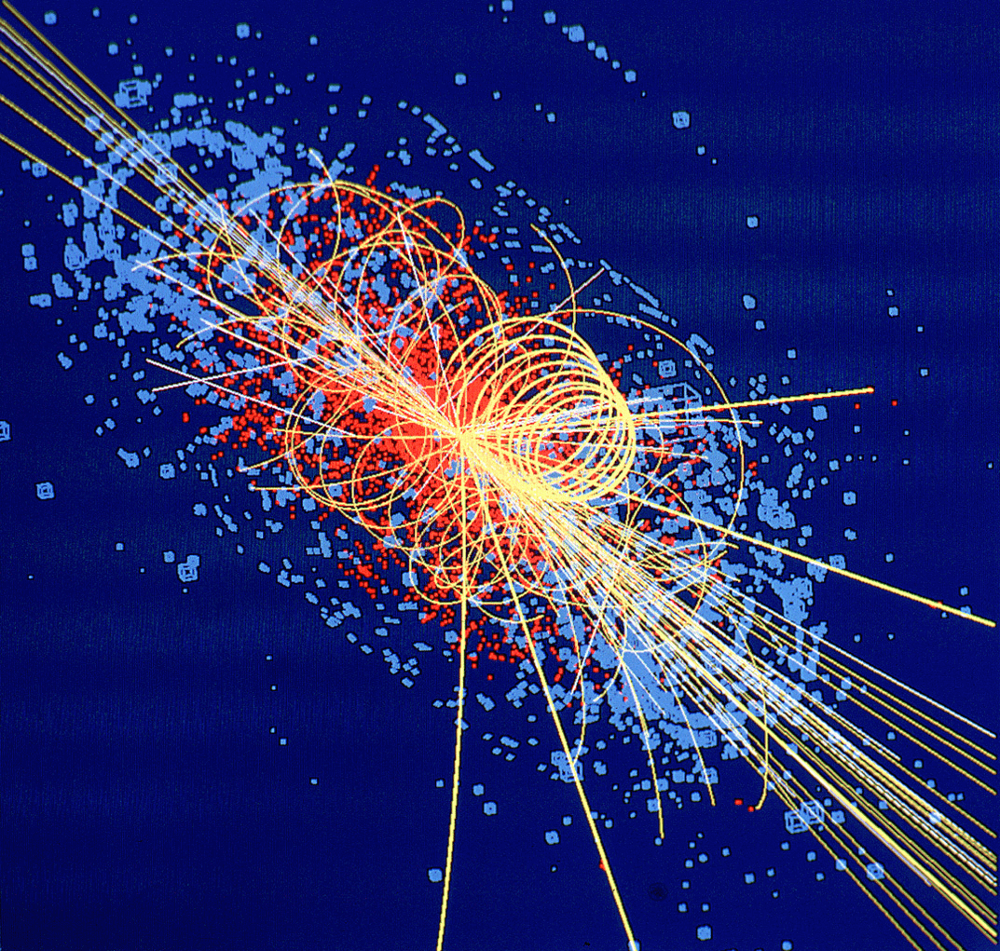

$$
\newcommand{\bra}[1]{\left\langle{#1}\right\vert }
\newcommand{\ket}[1]{\left\vert {#1}\right\rangle}
\newcommand{\braket}[2]{\left\langle {#1} \, \middle\vert \,{#2} \right\rangle }
\newcommand{\d}{\mathrm{d}}
\newcommand{\R}{\mathbb{R}}
\newcommand{\C}{\mathbb{C}}
\newcommand{\K}{\mathbb{K}}
\newcommand{\D}[2]{\frac{\d {#1}}{\d {#2} }}
\newcommand{\Partial}[2]{\frac{\partial {#1} }{\partial {#2} }}
\newcommand{\op}{\hat}
\newcommand{\uvec}{\hat}
\newcommand{\dfdas}{:=}
\newcommand{\Eqn}[1]{\text{(Eqn. }\ref{#1}\text{)}}
\newcommand{\vard}{\mathfrak{d}}
\newcommand{\vare}{\mathfrak{e}}
\newcommand{\e}{\mathrm{e}}
\newcommand{\i}{\mathrm{i}}
\newcommand{\norm}[1]{\left\vert{#1}\right\vert}
\newcommand{\set}[1]{\left\lbrace {#1}\right\rbrace}
\newcommand{\comm}[2]{\left[ #1 , \, #2 \right]}
\newcommand{\slot}{\,\cdot\,}
\newcommand{\lact}{\triangleright}
\newcommand{\ract}{\triangleleft}
\newcommand{\vac}{1\!\!\!\mathsf{\phantom{I}I}}
\newcommand{\la}{\mathfrak}
\newcommand{\anti}{\overline}
\notag
$$

# Properties of Anyons

## Fermions and Bosons

Fermions and Bosons are familiar concepts in statistics. Statistics means that more than one particle is present in the system. When exchanged, Bosonic system's wavefunction remains unchanged while Fermionic system's wavefunction gains an additional minus sign. The above results are the solutions of the equation $\lambda^2=1$. Because obviously, exchange two particles twice are equivalent to no exchange.

## Anyons' Statistical Property

When we consider particles on $2+1$ dimension, we find that things are quite different. 

Twice exchange of two particles is equivalent to circling one particle around another. When space is $3$-dimensional, the path can shrink to a single point as is shown below. That gives the equation $\lambda^2=1$, which is the case of Fermions and Bosons. While on $2$-dimensional space, the light-blue path cannot shrink to the dark-blue path since they are topologically inequivalent. That means $\lambda^2\neq1$. Such encircling can result in a complex phase factor[^7] rather than simply $\pm 1$.

## A Note on the Lattice

To make the braiding topological rather than a simple permutation, the lattice need to have a non-trivial topological characteristic. In my understanding, such connection is made by Witten’s work which connected Chern Simons theory with the knot and link invariants of Jones and Kauffman (from[^3] in Section II.A.1).

#  General Settings of Anyons Braiding

From now on, the existence of anyons are assumed, experimental detail of anyons ignored. This post will focus on how these anyons can be manipulated and give desired results as a useful topological quantum computer. Anyons in our model permits the following manipulations.

1. Anyons can be created or annihilated in pairwise fashion. (Initialization and measurement)
2. Anyons can be fused to form other types of anyons. (manipulation and measurement)
3. Anyons can be exchanged adiabatically. (manipulation)

In short, anyons are just like a "real world particle" such as electrons and positrons that can undergo creation, annihilation, and are free to move around each other. 

> Anyons do not decay, but the reverse process of fusion, called "fission" can be thought as decay of anyons.

## Properties of Anyons

To define an anyon model, the types of anyons must be listed. Anyons are characterized by there **topological charges**, sometimes this charge is simply called the label. There will always be a trivial particle called the vacuum, labeled as $\vac$. Notice that $\vac$ does not necessarily correspond to actual vacuum (as in "vacuum without anyons"). $\vac$ can represent a trivial particle such as a boson which is topologically trivial. 

The anyon model is denoted by a set of particles as
$$
M=\set{\vac,a,b,c,\cdots},\quad \text{$a,b,c,\cdots\,$ are distinct particles}.
$$
Sometimes the antiparticle of particle $a$ will be denoted as $\anti a$.

## Fusion Channels

Two anyons can fuse together, just like particles in a collider can violently collide and shatter into other particles, and possible results can arise. For example, two protons might collide to two $K^+$ particles, or two $\pi^+$ particles, denoted as $pp\rightarrow K^+K^+$, $pp\rightarrow \pi^+\pi^+$ respectively, along with many other possibilities. In high energy physics, a particular result is called a decay channel. To find out about a fusion channel, you can go to [PDG](http://pdg.lbl.gov) (thanks [Yifei](yf-liu.github.io) for teaching me that).

<figure>

    <figcaption>
    Simulated data of two protons at 14 TeV "fused" to (eventually and mainly) four muons. The tracks of the other products of the collision are shown by lines and the energy deposited in the detector is shown in blue. Image creator: Lucas Taylor.
     <small>The Higgs boson is produced in the collision. For the orginal picture and description, see <a href="https://cds.cern.ch/record/39444">image source</a>. </small></figcaption>
</figure>

Two anyons can also gently fuse together to give birth to new particle(s). Like in the case of LHC, there could be several possible outcomes for two fused particles. denoted as
$$
a\times b = \sum N_{ab}^c c.
$$

Adopting the term "decay channel" in high energy physics, a particular result of fusion is called a "fusion channel". 

For example, $\sigma\times \sigma = \vac + \psi$ means that two $\sigma$ anyons can be fused together, the result is either a $\psi$ particle, **or** (not **and**) a $\vac$ vacuum. 

Notice that $N_{ab}^c$ is not necessarily $1$. Like in for two particles might fuse into more particles, for example, $\alpha \times \beta = 2\theta + 3\gamma$. 

> $\alpha \times \beta = 2\theta + 3\gamma$ means an $\alpha$ anyon can fuse with a $\beta$ anyon, the result is either two $\theta$ anyons, <u>or</u> 3 $\gamma$ anyons. The result is **NOT** two $\theta$ anyons, <u>and</u> 3 $\gamma$ anyons. 
>
> The notation of $\otimes$ and $\oplus$ is sometimes used to make such distinction, as is in [^6]. To make my life easier, I am going to stick to $\times$ and $+$. Just bear it in mind that $\times$ means fusion, not "times"; $+$ is a notation to list possible channels, not "plus".

We can think of fusion as a measurement in the sense that 

1. Fusion channels are mutually exclusive in the sense that you can only fuse to either one of the channel. There is no superposition in the expression $\sigma\times \sigma=\vac+\psi$. 
2. Repeated fusions of the same two anyons do not necessarily result in an anyon of the same type: the resulting anyons may be of several different types each with certain probabilities (determined by the theory). (See Sec. 2.2 of [^6])

## Braiding Rules

Below is a schematic diagram of three anyons (quasiparticles) braided on a $2$D lattice. To maintain consistency with Pachos' book[^4], evolution starts from the top.[^5] 

A more abstract and simpler diagram is often used as below. A $\scriptsize\boxed{\substack{\nwarrow\,\,\, \nearrow \newline \diagup \newline \diagup\,\,\,  \diagdown }  }$ diagram represents a anticlockwise exchange, while a $\scriptsize\boxed{\substack{\nwarrow\,\,\,  \nearrow \newline \diagdown \newline \diagup\,\,\,  \diagdown }  }$ represents a counter-clockwise exchange. When two lines meet together, two particles are fused together. The height indicates the order of fusion like in (a), $a$ and $b$ are fused first. Sometimes fusion are omitted to emphasize on the braiding, as is in (c). Since an antiparticle travelling forwards in time is indistinguishable from the corresponding particle travelling backwards in time, diagram as (e) is possible. However, I am not going to concern such situation in the near future.

# Braiding as Quantum Computation

We need to create a Hilbert space in which quantum gates will act. 

# Acknowledgement

This series is made possible by Dr. Emil Prodan's kind mentorship.

---

All rights reserved for this post.

---
[^1]: Alicea, J., Oreg, Y., Refael, G., Von Oppen, F., & Fisher, M. P. (2011). Non-Abelian statistics and topological quantum information processing in 1D wire networks. *Nature Physics*, *7*(5), 412.
[^2]: Kitaev, A. Y. (2001). Unpaired Majorana fermions in quantum wires. *Physics-Uspekhi*, *44*(10S), 131.
[^3]: Nayak, C., Simon, S. H., Stern, A., Freedman, M., & Sarma, S. D. (2008). Non-Abelian anyons and topological quantum computation. *Reviews of Modern Physics*, *80*(3), 1083.
[^4]: Pachos, J. K. (2012). *Introduction to topological quantum computation*. Cambridge University Press.
[^5]: Liu, Y., Liu, Y., & Prodan, E. (2019). Braiding Flux-Tubes in a Topological Lattice Model from Class-D. *arXiv e-prints* *64*(2), p. arXiv:1905.02457.
[^6]: Trebst, S., Troyer, M., Wang, Z., & Ludwig, A. W. (2008). A short introduction to Fibonacci anyon models. *Progress of Theoretical Physics Supplement*, *176*, 384-407.
[^7]: Nayak, C., Simon, S. H., Stern, A., Freedman, M., & Sarma, S. D. (2008). Non-Abelian anyons and topological quantum computation. *Reviews of Modern Physics*, *80*(3), 1083.