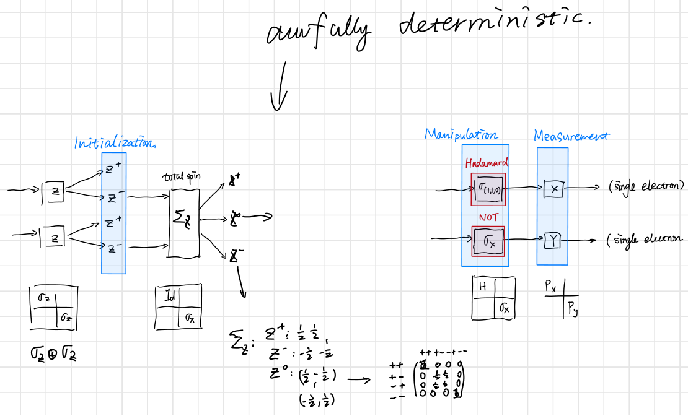

$$
\newcommand{\bra}[1]{\left\langle{#1}\right\vert }
\newcommand{\ket}[1]{\left\vert {#1}\right\rangle}
\newcommand{\braket}[2]{\left\langle {#1} \, \middle\vert \,{#2} \right\rangle }
\newcommand{\d}{\mathrm{d}}
\newcommand{\R}{\mathbb{R}}
\newcommand{\C}{\mathbb{C}}
\newcommand{\K}{\mathbb{K}}
\newcommand{\D}[2]{\frac{\d {#1}}{\d {#2} }}
\newcommand{\Partial}[2]{\frac{\partial {#1} }{\partial {#2} }}
\newcommand{\op}{\hat}
\newcommand{\uvec}{\hat}
\newcommand{\dfdas}{:=}
\newcommand{\Eqn}[1]{\text{(Eqn. }\ref{#1}\text{)}}
\newcommand{\vard}{\mathfrak{d}}
\newcommand{\vare}{\mathfrak{e}}
\newcommand{\e}{\mathrm{e}}
\newcommand{\i}{\mathrm{i}}
\newcommand{\norm}[1]{\left\vert{#1}\right\vert}
\newcommand{\set}[1]{\left\lbrace {#1}\right\rbrace}
\newcommand{\comm}[2]{\left[ #1 , \, #2 \right]}
\newcommand{\slot}{\,\cdot\,}
\newcommand{\lact}{\triangleright}
\newcommand{\ract}{\triangleleft}
\newcommand{\vac}{1\!\!\!\mathsf{\phantom{I}I}}
\newcommand{\la}{\mathfrak}
\notag
$$

# A novice Pitfall

When I was writing on the first post of this series, I was planning to use electrons in Stern-Gerlach experiment as qubits and gates. I initially prepared a diagram like this:

Then I sensed something was off. 

The CNOT gate do not flip the second spin with respect to the first spin's orientation. Aha! that's because a CU gate ([controlled gate](https://en.wikipedia.org/wiki/Quantum_logic_gate#Controlled_(cX_cY_cZ)_gates)) is meant for creating entanglement. That's easy. I'll just measure the total spin of two spins. That should create a maximally-entangled state. So I started drawing the following diagram.

I ended up with a matrix which I called $\Sigma_Z$:
$$
\Sigma_Z=\begin{pmatrix}
1 &&&\\
& \tfrac{1}{2} & \tfrac{1}{2} & \\
& \tfrac{1}{2} & \tfrac{1}{2} & \\
&&& 1
\end{pmatrix}
$$
But that's not even an unitary matrix! 

So I realized that the apparatuses used in Stern-Gerlach is in fact apparatuses for measurement. A measurement is in no way represented by a unitary matrix. Thus my attempt to build a quantum computer using Stern-Gerlach experiment is bound to fail. Besides, there is no paper on building quantum computers using Stern-Gerlach experiments.

> I found an implementation using Mach Zehnder Interferometer in[^1] (see table 3. in paper).

# A merit in failure

# Simulation of TQC

Code in [^2]. The claim: 

> QTop allows for the simulation of topologies with arbitrary code depth, qudit dimension, and error models. Currently, QTop features Kitaev quantum double models, as well as color codes in 3-regular planar tilings.

Zhenhan wa: 4.3. Clifford Operators. in paper[^3]

a simulator[^4]

SE posts[^5]

# Acknowledgement

This series is made possible by Dr. Emil Prodan's kind mentorship.

---
[^1]: ASarkar, Angik, T. K. Bhattacharyya, and Ajay Patwardhan. "Quantum Logic Processor: A Mach Zehnder Interferometer based Approach." *arXiv preprint cond-mat/0603695* (2006).
[^2]: <https://github.com/jacobmarks/QTop>
[^3]: Bloomquist, Wade, and Zhenghan Wang. "On topological quantum computing with mapping class group representations." *Journal of Physics A: Mathematical and Theoretical* 52.1 (2018): 015301.

[^4]: <http://www.quantumplayground.net/#/home>
[^5]: 
>  - list of code for QC:
>
>    <https://quantumcomputing.stackexchange.com/questions/12/are-there-emulators-for-quantum-computers>
>
>  - Turing machine and QC:
>
>    <https://quantumcomputing.stackexchange.com/questions/1/can-a-turing-machine-simulate-a-quantum-computer>
>
>  - intuitive numbers why it's hard tosimulate
>
>  - <https://quantumcomputing.stackexchange.com/questions/5005/why-it-is-hard-to-simulate-a-quantum-device-by-a-classical-devices>
>
>  - 
>
>  