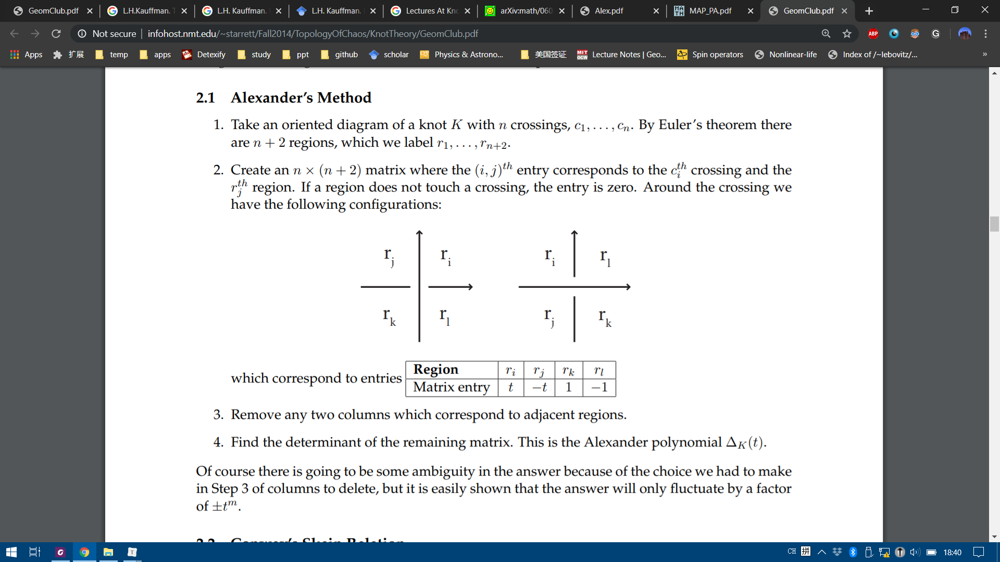

$$
\newcommand{\bra}[1]{\left\langle{#1}\right\vert }
\newcommand{\ket}[1]{\left\vert {#1}\right\rangle}
\newcommand{\braket}[2]{\left\langle {#1} \, \middle\vert \,{#2} \right\rangle }
\newcommand{\uvec}{\hat}
\newcommand{\dfdas}{:=}
\newcommand{\Eqn}[1]{\text{Eqn. (}\ref{#1}\text{)}}
\newcommand{\set}[1]{\left\lbrace {#1}\right\rbrace}
\newcommand{\vac}{ {1\!\!1}}
\newcommand{\la}{\mathfrak}
\newcommand{\anti}{\overline}
\newcommand{\Id}{\mathbb I}
\newcommand{\e}{\mathrm{e}}
\newcommand{\xeq}[1]{\substack{\text{#1}\newline =}}
\notag
\require{cancel}
$$

This post mostly follows [^Kauffman-knots].

# Overview of the Strangeness of Knots Theory

Knots are simple and mundane objects everyone knows from their daily life. Tying is easy and untying a knot can be challenging. What is more challenging is to tell if a knot is "the same" as another one, namely the classification of knots. As is shown by the magic tricks in the beginning of Dr. Kauffman's lecture at KITP titled [Revolutions in Knots, Braids and Physics, Louis Kauffman](http://online.kitp.ucsb.edu/online/friends/kauffman/), our intuition can not be trusted. Below is an example of a nasty unknot (Example taken from[^knotbook]).

The first thing is the introduction of polynomials to the knots. Since the study of knots and its deformations are clearly in the realm of topology, we seek topological invariance to characterize knots. In other words, we assign an *entity* (not necessarily a *quantity*) to each knot. If two knots are assigned to different entities, then they are not the same. As some might have known, such entities can emerge in the form of a simple number (Chern number), or a group (Homology groups), which are quite straight forward to understand. I mean, topology is about deformation and transformation, and I understand that you can assign a group to a manifold to characterize its symmetry etc. But what does a polynomial - not a polynomial appeared in an equation such as $x^2-2x+1=0$, but a dangling, lonely polynomial $x^2-2x+1$ - has to do with knots?

The second thing, which is even weirder, is that to calculate (some) polynomials, equations looks like doodles are introduced. Such equations are "defined", as is pointed out by a good number of textbooks, which is simply beyond me. First of all, how am I supposed to read the equation? Two crossing arcs is the sum of two different configurations of non-intersecting arcs? Second of all, what does the bracket doing in the equation? Should I interpret the equation as some sort of superposition? Is a knot a quantum state that can be superposed or is it an observable that can be sandwiched by state vectors? What are these state vectors?

Such questions haunts me when I was reading Pachos' book of TQC, and other books in TQC doesn't seem to be of much help either. "This is the definition", as is always the case when something is hard to explain. I spent a good half of a day trawling the introductory materials in mathematics departments I could find on Google, and I think I have a good answer to the questions above.

# Naïve Knot Theory

## "Strings" Theory in 1867

In 1860s, Lord Kelvin, like all giants in science, was pondering about a theory that could explain

- The stability of atoms.
- The variety of atoms, as shown by the periodic table of elements.
- The vibrational properties of atoms, as shown by their spectral lines.

One day he saw smoke rings of his physicist friend P.G. Tait[^smoke-rings], and was impressed by their stability, and vibrational properties of the smoke rings. He noticed how knots resembles atoms in many ways. In 1867, He presented a paper to the Royal Society of Edinburgh, in which he wrote:

> Models of knotted and linked vortex atoms were presented to the Society, the infinite variety of which is more than sufficient to explain the allotropies and affinities of all known matter.

Lord Kelvin's envision of atoms as tiny knots vortices of ether (like a knotted smoke ring, which has only been recently realized in lab[^knot-vortex]) is a very insightful discovery, since it's not that far from what we call string theory today, which envisions fundamental particles as vibrating strings.

> **Definition**:
>
> A **knot** is an entangled string with no open ends. A knot consists of a single string. A **link** consists of multiple strings. In this post these two words may be used interchangeably since how many strings are there is rarely our concern. A **strand** is a piece of the link that goes from one <u>undercrossing</u> to another with *only* (zero or more) <u>overcrossings</u> in between. The word "**string**" is reserved as a general pronoun for the mathematical abstraction of a rope.
>
> 
>
> A knot is drawn on a $2$ dimensional paper as a projection of a $3$ dimensional objects. In such projections, a crossing can only be produced from two strands, since we can always move away strands in a crossing with three or more strands. 

So Tait decided to find a "table of knots" and compare to Mendeleev's "table of elements". So he did. He made little progress with the enumeration problem until the start of a happy collaboration with Little and Kirkman. Tait spent 10 years of work on his list of knots and got up to 10 crossings. The work gets increasingly hard as there are more and more "crossings" on a knot. It's hard to tell if two knots are the same. He came up with a crossing index, which is the **minimal** crossings of a knot's planar projection. The crossing index is by definition a knot invariant. If two knots have different crossing number they are not the same.

History from[^ytb-alge-topo],[^ytb-David],[^Conway].

## Reidemeister's Play

The vortex theory of the atom soon disappeared, and physicians lost interests in the mathematical theory of knots, but mathematicians found the knots intrinsically beautiful objects to study and continued develop the theory independent of physical interest.

> Now it's interesting that the circle closes in the last decades for knots theory become very important in physics again due to it connection with QFT and string theory.

In 1920s, Reidemeister started to take a more formal path to tackle the problem of classifying the knots. He came up with the Reidemeister theorem [^Reidemeister-theorem] as a natural abstraction of "untying the knots", stating that two knots are topologically equivalent if and only if their projections may be deformed into each other by a sequence of the three moves shown below.

This theorem is the foundation of all knot theory. It has become the touchstone for all knot invariants, and has been the philosopher's stone in the conception of many knot invariants. Here is an example of two knots undergoing the Reidemeister moves ([Image source](http://math.oregonstate.edu/~garity/333S13/Notes/04_Section1_3.pdf)).

Although the Reidemeister theorem is a huge success in telling us how to deform a knot step by step, the theorem itself contains no information of how to simplify a certain knot. Making matters worse, given a diagram of an unknot to be unknotted, it might be necessary to make the diagram more complicated before it can be simplified. We call such a diagram a **hard unknot diagram**. A nice example of this is the Culprit. If you look closely, you’ll find that no simplifying type I or type II Reidemeister moves and no type III moves are available.[^Culprit]

A natural question arises: "Is the trefoil knotted at all?" Since we cannot exhaust the infinite moves on a knot, we are unable to make the conclusion that the trefoil is knotted simply because *we can't find* a series of Reidemeister moves. For all we know, there might be a way to deform a trefoil to a unknot, we just didn't know yet. Of course a trefoil is knotted, the question is how to ***prove*** it. To prove trefoil is knotted, mathematicians came up with a knot invariant called the tri-colorability.

# Search for Simple Invariants of Knots

## Tri-colorability

The most intuitive knot invariant is tri-colorability [^knotbook], which maps knots into the set $\set{\text{True}, \text{False}}$. 

A knot (or a link) is tri-colorable if each strand can be colored in one of three colors with the following rules:

1. At least two colors are used.
2. At each crossing, either all three colors are present or only one color is present.

Here are tricolorings of a few knots ([Examples source 1](http://web.math.ucsb.edu/~padraic/ucsb_2014_15/ccs_problem_solving_w2015/Tricolorability.pdf), [Example source 2](https://apurvnakade.github.io/courses/2017AlgTop/docs/Knot Colorability.pdf)).

You can try it yourself, but you can never tri-color a figure 8 knot. It can be shown that all four strings labeled from $1$ to $4 $ need to be in different colors. Although it might not be easy to show that all tri-colorings of some other knot is illegal, it's very easy to show that **the unknot is not tri-colorable**, while the trefoil is tri-colorable. We found from deforming the tricolored trefoil that tri-colorability is unaffected by a deformation. If we can show that tri-colorability is a knot invariant, we will be able to prove that there are at least two types of knots, one of them is tri-colorable, the other is not. The unknot and the trefoil belongs to different types.

### Proof of Tri-colorability is a Knot Invariant

To prove that tri-colorability is a Knot Invariant, all we need to do is to prove that tri-colorability is unaffected by the three Reidemeister's moves. 

The first Reidemeister's move is the straightening of a twisted string. Since the twisted string self-intersecting, it can only be in one color.

The second Reidemeister's move's tri-coloring has two cases drawn below. Either the two strings are of the same color, which is the trivial case, or the two strings contains all three colors.

The third Reidemeister's move's tri-coloring has three nontrivial cases as is shown below. The trivial case is omitted since all three stings has the same color. The cases are classified by the color ordering of the vertical string as is indicated on the right of each case. Notice that colors at end of each string (circled in black) is un changed. The second scenario of the third Reidemeister's move is merely a $60^\circ$ rotation of the first scenario.

Thus we have proven that the three Reidemeister's move preserves tri-colorability. In other words, tri-colorability is not affected by continuous deformations or "un-tying of the knots", and hence a knot invariant.

### Consequences if Tri-colorability

Since a trefoil can be tri-colored and a unknot can't, and tricolorability being a knot invariant, we have proven that the trefoil is indeed knotted. Which is the perfect example of how mathematicians go out of their ways to prove things that does not require proving. However, such tri-colorability can be generalized to $N$-colorability.

## $N$-colorability and "Quandle"

Remember the figure 8 knot. It cannot be tri-colored, but can be quad-colored. Is quad-colorability a knot invariant? It is also natural to ask if $N$-colorability is a knot invariant. To study $N$-colorability, clearly we cannot rely on drawing colorful diagrams of knots. For we will soon run out of distinguishable colors, and even coloring Reidemeister's moves will become impossible.

Instead of colors we will use labels such as $a.b.c.\cdots$ on the diagram and replace the coloring rule by a method for combining these labels. Let's see can we deduce from the tri-coloring scheme. 

### Tri-coloring Revisited

We use $\set{a,b,c}$ to denote three colors. Recall the definition of tri-colorability:

> A knot (or a link) is tri-colorable if each strand can be colored in one of three colors with the following rules:
>
> 1. At least two colors are used.
> 2. At each crossing, either all three colors are present or only one color is present.

We can translate the first requirement as there are at least two elements in the set $\set{a,b,c}$. The second requirement can be translated as 

$$
\begin{cases}
a\times a=a, \quad \text{only one color is present} \newline 
a\times b=c, \quad \text{all three colors are present}\newline  
a\times c=b, \quad \text{all three colors are present}
\end{cases}
$$

where $\times$ is read as "cross", as the string of color $a$ crosses string of color $b$. 

A careful inspection on the following diagram reveals that we need to make a further distinction between an over-crossing and an under-crossing, since the two $a\times b$ are in different colors and cannot be the same, as is illustrated below. 

Also to spare ourselves from writing redundant equations as "$a$ goes over $b$ does not change color" such as $a\boxed{\text{cross over}} b=a$, we will only make distinction between a left-handed or a right-handed crossing, and leave the upper string unchanged. 

We assign to each string in a knot an arrow in a self-consistent way. If the cross product of the directional vector of the upper string and that lower string is **outward**-perpendicular to the page, we call the crossing right-handed, otherwise it's left-handed. Or you can orient the lower string upward and the direction of the upper string determines it's handedness. We use $a∗b$ to denote that string $a$ is right-handed crossed by $b$; and $a\#b$ to denoted the other case as in [^Kauffman-knots]. 

We can test out our labeling system in tri-color examples. All the crossing of the trefoil shown below are left-handed, hence

$$
\begin{array}{}
\enclose{circle}{1}: c\#a=b,\quad \text{$c$ goes under $a$, turns into $b$.}\\
\enclose{circle}{2}: a\#b=c,\quad \text{$a$ goes under $b$, turns into $c$.}\\
\enclose{circle}{3}: b\#c=a,\quad \text{$b$ goes under $c$, turns into $a$.}\\
\end{array}\\
$$

A further look at the trefoil soon reveals that $\#$ is not associative. The same is true for $*$.

$$
a\#(c\#b) = a\#a = a \\
(a\#c)\#b = b\#b = b
$$

Now let's translate the color rules to label rules using the Reidemeister's Theorem. 

### Obtain the $N$-colorability

In this section, we are using $N$ colors (labels), denoted as $\set{a,b,c,d,\cdots}$. Although there are only $26$ letters, we imagine that we will never run out of characters, also because $a,b,c$ is always nicer to read than $a_1,a_2,a_3$. Of course once we have generalized to $N$ colorability, we don't have $a\times b=c$ or $a\#b=c$ as in the last section any more, instead we have $a \# b = x$. To avoid loss of generality, $a\# b $ is often left un-evaluated as a "color" as a whole.

The first Reidemeister's move is evident. 

We have 
$$
a\#a =a , \quad a* a = a
$$
---

The second Reidemeister's move is a little complicated. I used more than three colors to color code it to avoid confusion (since $b\#a\neq a*b$). The Reidemeister's theorem requires that the corresponding ends have the same color.

$$
(b\#a)*a = b \\
(a*b)\#b = b
$$

From these equations, $\#$ and $*$ looks like inverse operations to each other, which is discussed in detail in Chapter 3 in [^Alge-Knots].

---

In the same manner we can get results form the third Reidemeister's move. We require again that corresponding ends have the same color. The arrows on the diagram were carefully chose to obtain 

From the above diagram, we have

$$
(a\#b)\#c = (a\#c)\#(b\#c)
$$

and the mirror diagram would give the equation

$$
(a*b)*c = (a*c)*(b*c)
$$

---

Summarizing, we have an algebraic system satisfying these rules is called a quandle:

1. $a*a=a$ and $a\#a=a$ for any $a$
2. $(a * b)\#b = a$ and $(a\#b) * b = a$ for any labels $a$ and $b$.
3.  $(a * b) * c = (a * c) * (b * c)$ and $(a\#b)\#c = (a\#c)\#(b\#c)$ for any labels $a$, $b$, and $c$. 

### Example of a Quandle [TO BE CONT'D]

To give an example of such quandle, consider color rules as numbers: $a ∗ b = a\#b = 2b - a $.

It's easy to check that this relation agrees with the above definition, with some help from **modular number system**, since we need the color to "circle around" with additions. 

On the trefoil, we have $a*b=c,c*a=b,b*c=a$, Hence we have $2b-a=c,2a-c=b,2c-b=a$. if $a = 0$ and $b = 1$, then
$c = 2b - a = 2$ and $a = 2c - b = 4 - 1 = 3$. We need $3 = 0$. Hence this system of equations will be satisfied for appropriate labelings in $\mathbb{Z}/\mathbb{3Z}$, which reproduces exactly the three coloring of the trefoil, and we see that the number 3 emerges as a characteristic of the equations associated with the knot.  

For the figure eight knot E, we have that the modulus is 5. This shows that E is indeed knotted and that it is distinct from the trefoil. We can color (label) the figure eight knot with five \colors"0; 1; 2; 3; 4 with the rules: a ∗ b = 2b - a(mod5). See Figure 18. [^Kauffman-knots]

# Polynomials as Knot Invariants

## Alexander Polynomials

### Alexander Polynomials as Generalized Quandle

The modular labelling method has a marvelous generalization to the Alexander
polynomial of the knot. This comes about through generalized coloring rules
a ∗ b = ta + (1 − t)b
and
a#b = t−1a + (1 − t−1)b;
where t is an indeterminate. It is a nice exercise to verify that these rules satisfy
the axioms for the quandle. This algebraic structure is called the **Alexander Module.**

The case t = -1 gives the rule 2b - a that we have already considered [^Kauffman-knots]

### Original Alexander Polynomials

1920 Alexander[^AP-intro] discovered a polynomial that is also a knot invariant. His idea was pretty straight forward: You can layout a knot like a square. What's better in characterizing a square than a matrix! A matrix can store $2$ dimensional data that contains how lines are intersected, which in turn is vital to the characterization of knots. 

From such matrices, we need to find an invariant. What invariants does a matrix have? That depends on the transformation, but naturally the determinant of the matrix is invariant in many cases and is complicated enough to cover "all elements" or all crossings, (unlike the trace only concerns the diagonal crossings).

  

### 1970 Skein Relations discovered by Conway

> Fun fact: [Conway](https://en.wikipedia.org/wiki/John_Horton_Conway) is the designer of the [game of life](https://en.wikipedia.org/wiki/Conway%27s_Game_of_Life).
>
> 

This is an axiomatic approach ... It seems nothing short of miraculous that such a scheme should produce good invariants!  <https://arxiv.org/pdf/math/0605622.pdf>

The calculation seems awfully complicated, but Conway came up with a way to calculate it. And I think it's better understood this way: 

Since the matrix Alexander used was constructed by the crossings, what kind of modifications one could make to a crossing? Of course changing a crossing to a different type will potentially change the "type" of a knot and hence it's polynomial. The problem is how drastic such change is? 

Alexander found this and listed in the mis. part. COnway rediscovered it 30 years later. 

## Jone's Polynomial: Knots are Back in Physics

### discovery of Jone's Polynomial

In the summer of 1982, Vaughan Jones was presenting a lecture on von Neumann algebras in Geneva. At the end of his talk Didier Hatt-Arnold, a graduate student in the audience, suggested that the relations in his algebraic structures were similar to those in the braid groups. Soon afterwards, Jones worked out how to construct representations of the braid groups into his algebras, but he did not immediately recognize their significance. The following summer, Jones realized that the image of B5 under one of the representations was the projective symplectic group PSp(4, Z3), the finite simple group of order 25 920. Thinking that this might be of some interest, Jones arranged to discuss his representations with Joan Birman\

Jones travelled to New York in May 1984. He and Birman soon showed that this was not just another technique for deriving the Alexander polynomial. One simple test proved that this invariant was new: it could distinguish the left-handed and right-handed trefoils! Jones later established that his polynomial also satisfies a skein relation: 

>  From 9.2 of[^knots-and-links] which took a definitive approach.

What we need to know now is that this was a highly complicated history and an accidental discovery. However, such polynomial can be found by defining a new set of skein relations.

(You might ask, are there any other skein relations that gives rise to new polynomials? Yes, the HOMPFLY-polynomial.) 

The theory was complicated, but the simplest way to define the Jones polynomial is a recursive definition due to Louis Kauffman using the Kauffman bracket skein relation.

Let's take a hypothetically route of history: how would the Jone's polynomial be discovered if not by Jone himself?

### Strand and spin

First let's see Pachos: braiding and bands and spins.

### Knots and spin

See Chapter 6 of [^knots-twist], which did not gave explanation of the coefficients.

### How did Kauffman do it?

Instead Kauffman [^Kauffman-knots] did gave a detailed explanation in `8 Knot Amplitudes` of [^Kauffman-knots] on how he obtained such coefficients.

# Further Readings

Time-line of history: Collberg, E. (2017). A brief history of knot theory. *Página consultada a*, *8*.

[Daniel Moskovich](https://mathoverflow.net/users/2051/daniel-moskovich), How to motivate the skein relations?, URL (version: 2010-04-06): https://mathoverflow.net/q/20505

Fun tricks with knots. Plus a history Kauffman's lecture at KITP: [Revolutions in Knots, Braids and Physics, Louis Kauffman](http://online.kitp.ucsb.edu/online/friends/kauffman/).

NJ's brief history of knots: <https://www.youtube.com/watch?v=KYddgeiyLJ8

YouTube Video [Tying Things Together: Knots in Maths, Physics and Biology' - Dr David Skinner](https://www.youtube.com/watch?v=uvsQUANjHB8). factorizing and knot: jones polynomial similarity: 21:36

Witten's talk <https://www.youtube.com/watch?v=cuJY14BYac4>

Knot theory and CHern simons, probably not very useful later. https://www.youtube.com/watch?v=8wWvUJ6qJx0

Jones's intro to Jones Polynomials. <https://math.berkeley.edu/~vfr/jones.pdf> Jones, V. F. (2005). The Jones polynomial. *Discrete Math*, *294*, 275-277.

A very mathematical way of introducing the tri-colorability as quandles, keis, etc. : Quandles: An Introduction to the Algebra of Knots

Nice intro but lacks explannation of Jones: [^knotbook]

<big>**Knots on a Torus**</big> Kauffman, L. H. (1998). Virtual knot theory. *arXiv preprint math/9811028*.<http://homepages.math.uic.edu/~kauffman/VKT.pdf> 

>  Might be important when calculating braiding on PBC

# Acknowledgment

---

[^knotbook]:  Adams, C. C. (2004). *The knot book: an elementary introduction to the mathematical theory of knots*. American Mathematical Soc..
[^smoke-rings]: <https://www.popmath.org.uk/exhib/pagesexhib/aether.html>
[^ytb-David]: [Tying Things Together: Knots in Maths, Physics and Biology' - Dr David Skinner](https://www.youtube.com/watch?v=uvsQUANjHB8)
[^ytb-alge-topo]: [Knots and surfaces I - Algebraic Topology - NJ Wildberger](https://www.youtube.com/watch?v=KYddgeiyLJ8)
[^Conway]:  Conway, J. H. (1970, January). An enumeration of knots and links, and some of their algebraic properties. In *Computational problems in abstract algebra* (pp. 329-358). Pergamon. [Retriving link](https://www.maths.ed.ac.uk/~v1ranick/papers/conway.pdf).
[^Alexander]: Alexander, J. W. (1928). Topological invariants of knots and links. *Transactions of the American Mathematical Society*, *30*(2), 275-306. [Retriving link](https://www.ams.org/journals/tran/1928-030-02/S0002-9947-1928-1501429-1/S0002-9947-1928-1501429-1.pdf).
[^Kauffman-knots]: Kauffman, L. H. (2005). Knots. *Geometries of Nature, Living Systems and Human Cognition,* 131-202. doi:10.1142/9789812700889_0003. [A better typeset version](http://homepages.math.uic.edu/~kauffman/Knots.pdf).
[^Reidemeister-theorem]: <https://www.encyclopediaofmath.org/index.php/Reidemeister_theorem>
[^Culprit]: Henrich, A., & Kauffman, L. H. (2010). Unknotting unknots. *arXiv preprint arXiv:1006.4176*.
[^Alge-Knots]: Elhamdadi, M., & Nelson, S. (2015). *Quandles* (Vol. 74). American Mathematical Soc..
[^Ap-intro]: Collins, J. (2007). The Alexander Polynomial The woefully overlooked granddaddy of knot polynomials. [Retrieving link](http://infohost.nmt.edu/~starrett/Fall2014/TopologyOfChaos/KnotTheory/GeomClub.pdf)
[^knots-twist]:Sossinsky, A. B. (2002). *Knots: mathematics with a twist*. Harvard University Press.
[^knots-and-links]: Cromwell, P. R. (2004). *Knots and links*. Cambridge university press.

[^knot-vortex]: Kleckner, D., & Irvine, W. T. (2013). Creation and dynamics of knotted vortices. *Nature physics*, *9*(4), 253.

