$$
\newcommand{\bra}[1]{\left\langle{#1}\right\vert }
\newcommand{\ket}[1]{\left\vert {#1}\right\rangle}
\newcommand{\braket}[2]{\left\langle {#1} \, \middle\vert \,{#2} \right\rangle }
\newcommand{\uvec}{\hat}
\newcommand{\dfdas}{:=}
\newcommand{\Eqn}[1]{\text{Eqn. (}\ref{#1}\text{)}}
\newcommand{\set}[1]{\left\lbrace {#1}\right\rbrace}
\newcommand{\vac}{ {1\!\!1}}
\newcommand{\la}{\mathfrak}
\newcommand{\anti}{\overline}
\newcommand{\Id}{\mathbb I}
\newcommand{\e}{\mathrm{e}}
\newcommand{\xeq}[1]{\substack{\text{#1}\newline =}}
\notag
\require{cancel}
$$

This post mostly follows [^Kauffmanknots]

# Overview of the Strangeness of Knots Theory

Knots are simple and mundane objects everyone knows from their daily life. Tying is easy and untying a knot can be challenging. What is more challenging is to tell if a knot is "the same" as another one, namely the classification of knots. As is shown by the magic tricks in the beginning of Dr. Kauffman's lecture at KITP titled [Revolutions in Knots, Braids and Physics, Louis Kauffman](http://online.kitp.ucsb.edu/online/friends/kauffman/), our intuition can not be trusted. Below is an example of a nasty un-knot (Example taken from[^knotbook]).

The first thing is the introduction of polynomials to the knots. Since the study of knots and its deformations are clearly in the realm of topology, we seek topological invariance to characterize knots. In other words, we assign an *entity* (not necessarily a *quantity*) to each knot. If two knots are assigned to different entities, then they are not the same. As some might have known, such entities can emerge in the form of a simple number (Chern number), or a group (Homology groups), which are quite straight forward to understand. I mean, topology is about deformation and transformation, and I understand that you can assign a group to a manifold to characterize its symmetry etc. But what does a polynomial - not a polynomial appeared in an equation such as $x^2-2x+1=0$, but a dangling, lonely polynomial $x^2-2x+1$ - has to do with knots?

The second thing, which is even weirder, is that to calculate (some) polynomials, equations looks like doodles are introduced. Such equations are "defined", as is pointed out by a good number of textbooks, which is simply beyond me. First of all, how am I supposed to read the equation? Two crossing arcs is the sum of two different configurations of non-intersecting arcs? Second of all, what does the bracket doing in the equation? Should I interpret the equation as some sort of superposition? Is a knot a quantum state that can be superposed or is it an observable that can be sandwiched by state vectors? What are these state vectors?

 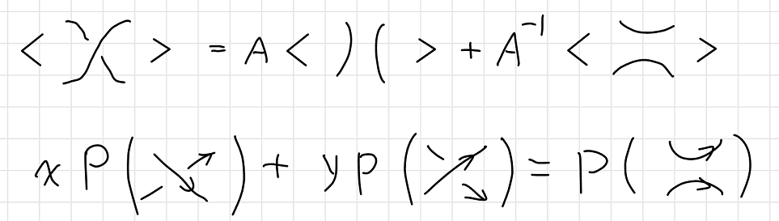

Such questions haunts me when I was reading Pachos' book of TQC, and other books in TQC doesn't seem to be of much help either. "This is the definition", as is always the case when something is hard to explain. I spent a good half of a day trawling the introductory materials in mathematics departments I could find on Google, and I think I have a good answer to the questions above.

# Naïve Knot Theory

## "Strings" Theory in 1867

In 1860s, Lord Kelvin, like all giants in science, was pondering about a theory that could explain

- The stability of atoms.
- The variety of atoms, as shown by the periodic table of elements.
- The vibrational properties of atoms, as shown by their spectral lines.

One day he saw smoke rings of his physicist friend P.G. Tait[^smokerings], and was impressed by their stability, and vibrational properties of the smoke rings. He noticed how knots resembles atoms in many ways. In 1867, He presented a paper to the Royal Society of Edinburgh, in which he wrote:

> Models of knotted and linked vortex atoms were presented to the Society, the infinite variety of which is more than sufficient to explain the allotropies and affinities of all known matter.

Lord Kelvin's envision of atoms as tiny knots of ether is a very insightful discovery, since it's not that far from what we call string theory today, which envisions fundamental particles as vibrating strings.

> **Definition**:
>
> A **knot** is an entangled string with no open ends. A knot consists of a single string. A **link** consists of multiple strings. In this post these two words may be used interchangeably since how many strings are there is rarely our concern. A **strand** is a piece of the link that goes from one <u>undercrossing</u> to another with *only* (zero or more) <u>overcrossings</u> in between. The word "**string**" is reserved as a general pronoun for the mathematical abstraction of a rope.
>
> 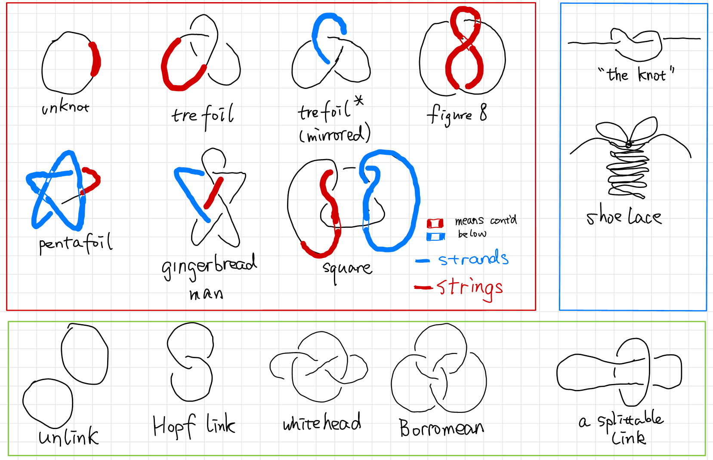
>
> A knot is drawn on a $2$ dimensional paper as a projection of a $3$ dimensional objects. In such projections, a crossing can only be produced from two strands, since we can always move away strands in a crossing with three or more strands. 

So Tait decided to find a "table of knots" and compare to Mendeleev's "table of elements". So he did. He made little progress with the enumeration problem until the start of a happy collaboration with Little and Kirkman. Tait spent 10 years of work on his list of knots and got up to 10 crossings. The work gets increasingly hard as there are more and more "crossings" on a knot. It's hard to tell if two knots are the same. He came up with a crossing index, which is the **minimal** crossings of a knot's planar projection. The crossing index is by definition a knot invariant. If two knots have different crossing number they are not the same.

History from[^ytb-alge-topo],[^ytb-David],[^Conway].

## Reidemeister's Play

The vortex theory of the atom soon disappeared, and physicians lost interests in the mathematical theory of knots, but mathematicians found the knots intrinsically beautiful objects to study and continued develop the theory independent of physical interest.

> Now it's interesting that the circle closes in the last decades for knots theory become very important in physics again due to it connection with QFT and string theory.

In 1920s, Reidemeister started to take a more formal path to tackle the problem of classifying the knots. He came up with the Reidemeister theorem [^Reidemeister-theorem] as a natural abstraction of "untying the knots", stating that two knots are topologically equivalent if and only if their projections may be deformed into each other by a sequence of the three moves shown below.

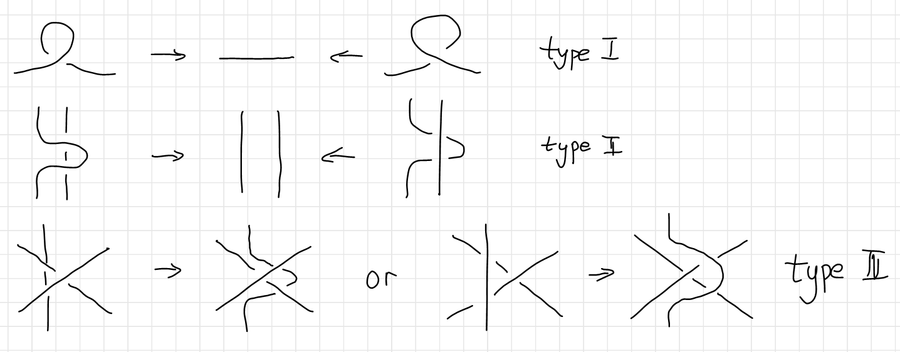

This theorem is the foundation of all knot theory. It has become the touchstone for all knot invariants, and has been the philosopher's stone in the conception of many knot invariants. Here is an example of two knots undergoing the Reidemeister moves ([Image source](http://math.oregonstate.edu/~garity/333S13/Notes/04_Section1_3.pdf)).

Although the Reidemeister theorem is a huge success in telling us how to deform a knot step by step, the theorem itself contains no information of how to simplify a certain knot. Making matters worse, given a diagram of an unknot to be unknotted, it might be necessary to make the diagram more complicated before it can be simplified. We call such a diagram a **hard unknot diagram**. A nice example of this is the Culprit. If you look closely, you’ll find that no simplifying type I or type II Reidemeister moves and no type III moves are available.[^Culprit]

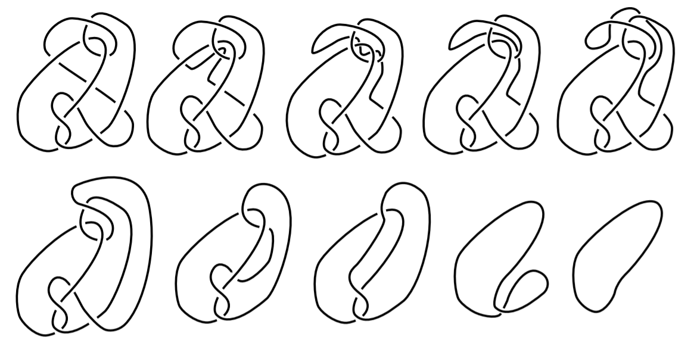

A natural question arises: "Is the trefoil knotted at all?" Since we cannot exhaust the infinite moves on a knot, we are unable to make the conclusion that the trefoil is knotted simply because *we can't find* a series of Reidemeister moves. For all we know, there might be a way to deform a trefoil to a unknot, we just didn't know yet. Of course a trefoil is knotted, the question is how to ***prove*** it. To prove trefoil is knotted, mathematicians came up with a knot invariant called the tri-colorability.

## Search of Invariants of Knots:

The most intuitive knot invariant is tri-colorability [^knotbook], which maps knots into the set $\set{\text{True}, \text{False}}$. 

A knot (or a link) is tri-colorable if each strand can be colored in one of three colors with the following rules:

1. At least two colors are used.
2. At each crossing, either all three colors are present or only one color is present.

Here are tricolorings of a few knots ([Examples source 1](http://web.math.ucsb.edu/~padraic/ucsb_2014_15/ccs_problem_solving_w2015/Tricolorability.pdf), [Example source 2](https://apurvnakade.github.io/courses/2017AlgTop/docs/Knot Colorability.pdf)).

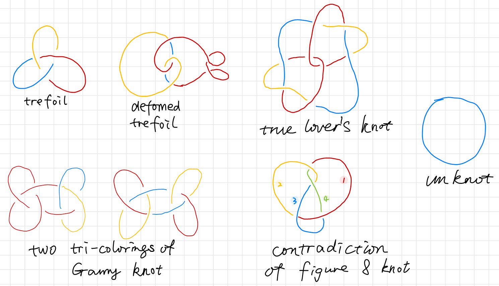

You can try it yourself, but you can never tri-color a figure 8 knot. It can be shown that all four strings labeled from $1$ to $4 $ need to be in different colors. Although it might not be easy to show that all tri-colorings of some other knot is illegal, it's very easy to show that **the unknot is not tri-colorable**, while the trefoil is tri-colorable. We found from deforming the tricolored trefoil that tri-colorability is unaffected by a deformation. If we can show that tri-colorability is a knot invariant, we will be able to prove that there are at least two types of knots, one of them is tri-colorable, the other is not. The unknot and the trefoil belongs to different types.

### Proof of Tri-colorability is a Knot Invariant

To prove that tri-colorability is a Knot Invariant, all we need to do is to prove that tri-colorability is unaffected by the three Reidemeister's moves. 

The first Reidemeister's move is the straightening of a twisted string. Since the twisted string self-intersecting, it can only be in one color.

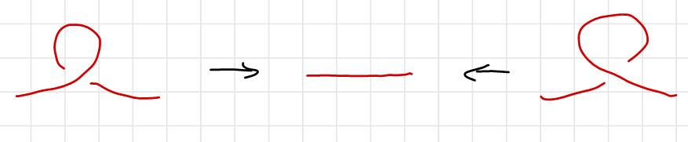

The second Reidemeister's move's tri-coloring has two cases drawn below. Either the two strings are of the same color, which is the trivial case, or the two strings contains all three colors.

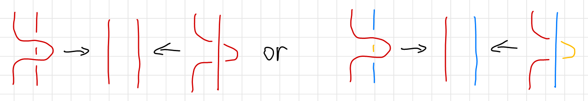

The third Reidemeister's move's tri-coloring has three nontrivial cases as is shown below. The trivial case is omitted since all three stings has the same color. The cases are classified by the color ordering of the vertical string as is indicated on the right of each case. Notice that colors at end of each string (circled in black) is un changed. The second scenario of the third Reidemeister's move is merely a $60^\circ$ rotation of the first scenario.

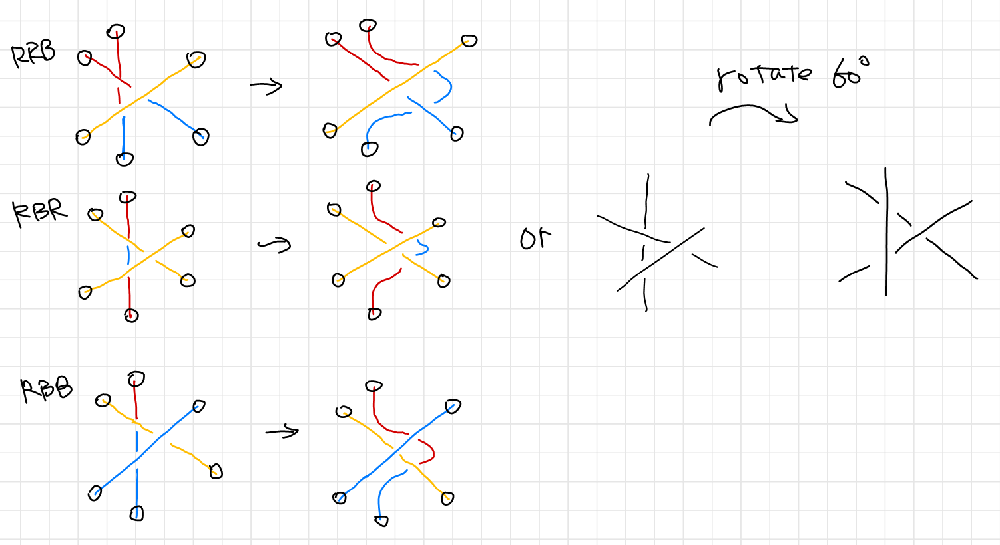

Thus we have proven that the three Reidemeister's move preserves tri-colorability. In other words, tri-colorability is not affected by continuous deformations or "un-tying of the knots", and hence a knot invariant.

### Consequences if Tri-colorability

Since a trefoil can be tri-colored and a unknot can't, and tricolorability being a knot invariant, we have proven that the trefoil is indeed knotted. Which is the perfect example of how mathematicians go out of their ways to prove things that does not require proving. However, such tri-colorability can be generalized to $N$-colorability.

## $N$-colorability: Quandle

Remember the figure 8 knot. It cannot be tri-colored, but can be quad-colored. Is quad-colorability a knot invariant? It is also natural to ask if $N$-colorability is a knot invariant. To study $N$-colorability, clearly we cannot rely on drawing colorful diagrams of knots. For we will soon run out of distinguishable colors, and even coloring Reidemeister's moves will become impossible.

Instead of colors we will use labels such as $a.b.c.\cdots$ on the diagram and replace the coloring rule by a method for combining these labels. Let's see can we deduce from the tri-coloring scheme. 

### Tri-coloring Revisited

We use $\set{a,b,c}$ to denote three colors. Recall the definition of tri-colorability:

> A knot (or a link) is tri-colorable if each strand can be colored in one of three colors with the following rules:
>
> 1. At least two colors are used.
> 2. At each crossing, either all three colors are present or only one color is present.

We can translate the first requirement as there are at least two elements in the set $\set{a,b,c}$. The second requirement can be translated as 
$$
\begin{cases}
a\times a=a, \quad \text{only one color is present} \newline 
a\times b=c, \quad \text{all three colors are present}\newline  
a\times c=b, \quad \text{all three colors are present}
\end{cases}
$$
where $\times$ is read as "cross", as the string of color $a$ crosses string of color $b$. Of course once we have generalized to $N$ colorability, we don't have $a\times b=c$ any more, instead we will have $a \times b = x$. To avoid loss of generality, $a\times b $ is often left un-evaluated as a "color" as a whole.

A careful inspection on the following diagram reveals that we need to make a further distinction between an over-crossing and an under-crossing, denoted respectively as $a\#b$ and $a*b$  as in [^Kauffmanknots], since the two $a\times b$ are in different colors. 

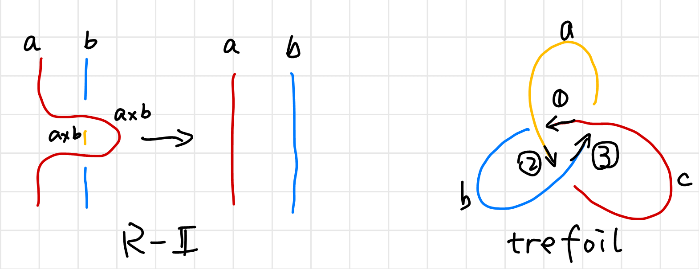

A further look at the trefoil reveals that $*$ is not associative. The same is true for $\#$.
$$
\begin{array}{}
\enclose{circle}{1}: c*a=b,\quad \text{$c$ goes under $a$, turns into $b$.}\\
\enclose{circle}{2}: a*b=c,\quad \text{$a$ goes under $b$, turns into $c$.}\\
\enclose{circle}{3}: b*c=a,\quad \text{$b$ goes under $c$, turns into $a$.}\\
\end{array}\\
a*(b*c) = a*a =a \\
(a*b)*c = c*c = c
$$
In order to make such distinction on orders, we can introduce a direction to stings. We are going to use arrows  consistently mark the direction to travel trough a certain link. And now let's translate the color rules to label rules using the Reidemeister's Theorem. 

The first Reidemeister's move is evident. 

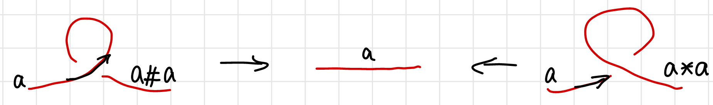

We have 
$$
a\#a =a , \quad a* a = a
$$
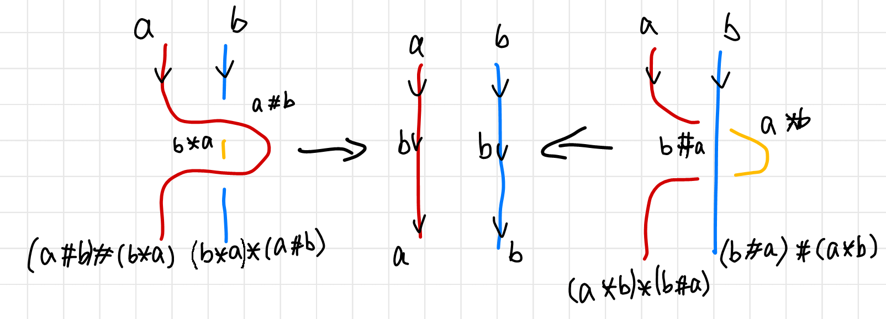

The second Reidemeister's move is a little bit complicated, but we can simplify many expressions from the previous equations. Note that we still want to preserve the definition of a "strand", thus although there are many four-term operations, we can simplify the final terms using $a\#b=b, b\#a=b$ as intermediate results. 
$$
(a\#b)\#(b*a) \substack{\text{simplify}\newline =} a\#(b*a)
$$

>  An algebra is a linear vector space with vector product defined.

It turns out that a good way to articulate such a rule of combination is to make the label on one of the undercrossing arcs at a crossing a product (in the sense of this new mode of (combination) of the labels of the other two arcs. In fact, we shall assume that this product operation depends upon the orientation of the arcs as shown below.[^Kauffmanknots]

we show how a label a on an undercrossing arc combines with a label b on an overcrossing arc to form c = a ∗ b or c = a#b depending upon whether the overcrossing arc is oriented to the left or to the right for an observer facing the overcrossing line and standing on the arc labelled a: 

An 

We can use the Reidemeister's theorem to find out the algebraic system satisfying these rules is called a quandle [35].

1. a ∗ a = a and a#a = a for any label a:
2. (a ∗ b)#b = a and (a#b) ∗ b = a for any labels a and b:
3. (a ∗ b) ∗ c = (a ∗ c) ∗ (b ∗ c) and (a#b)#c = (a#c)#(b#c) for any labels
a,b,c. 

## Generalized Quandle: Polynomials

1920 Alexander

## 1970 Skein Relations discovered by Conway

[Conway](https://en.wikipedia.org/wiki/John_Horton_Conway) is the designer of the [game of life](https://en.wikipedia.org/wiki/Conway%27s_Game_of_Life).

## Kauffman brackets

### Stand and spin

### Calculation by Kauffman

---

[^knotbook]:  Adams, C. C. (2004). *The knot book: an elementary introduction to the mathematical theory of knots*. American Mathematical Soc..
[^smokerings]: <https://www.popmath.org.uk/exhib/pagesexhib/aether.html>
[^ytb-David]: [Tying Things Together: Knots in Maths, Physics and Biology' - Dr David Skinner](https://www.youtube.com/watch?v=uvsQUANjHB8)
[^ytb-alge-topo]: [Knots and surfaces I - Algebraic Topology - NJ Wildberger](https://www.youtube.com/watch?v=KYddgeiyLJ8)
[^Conway]:  Conway, J. H. (1970, January). An enumeration of knots and links, and some of their algebraic properties. In *Computational problems in abstract algebra* (pp. 329-358). Pergamon. [Retriving link](https://www.maths.ed.ac.uk/~v1ranick/papers/conway.pdf).
[^Alexander]: Alexander, J. W. (1928). Topological invariants of knots and links. *Transactions of the American Mathematical Society*, *30*(2), 275-306. [Retriving link](https://www.ams.org/journals/tran/1928-030-02/S0002-9947-1928-1501429-1/S0002-9947-1928-1501429-1.pdf).
[^Kauffmanknots]: Kauffman, L. H. (2005). Knots. *Geometries of Nature, Living Systems and Human Cognition,* 131-202. doi:10.1142/9789812700889_0003. [A better typeset version](http://homepages.math.uic.edu/~kauffman/Knots.pdf).
[^Reidemeister-theorem]: <https://www.encyclopediaofmath.org/index.php/Reidemeister_theorem>
[^Culprit]: Henrich, A., & Kauffman, L. H. (2010). Unknotting unknots. *arXiv preprint arXiv:1006.4176*.