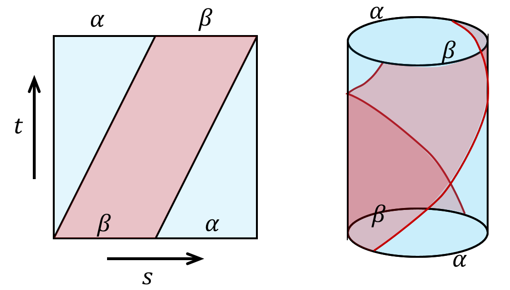

$$
\newcommand{\ket}[1]{\vert {#1} \rangle}
\newcommand{\bra}[1]{\langle {#1} \vert}
\newcommand{\braket}[2]{\left\langle {#1}\! \mid \!{#2} \right\rangle}
\newcommand{\Partial}[2]{\frac{\partial {#1}}{\partial{#2}}}
\newcommand{\emath}{\mathrm e}
$$

This post mainly follows [Nakahara](https://cds.cern.ch/record/640926/files/0750306068_TOC.pdf).

# Motivations

I might have stated this in a few other notes but I will state here again. There are many topological invariants which gives different insights to the property of a manifold. One of the most famous topological invariants is probably the genus which is a number usually associated with holes of the surface. A student in the field of condensed matter physics probably have heard the Chern number. 

But a topological invariant can also be an algebraic entity instead of a number, such as a group. If we associate a manifold a group and the group is invariant against local deformations, we can call this group a topological invariant as well. 

We can imagine that saying a group as a topological invariant of a manifold is going to reveal far more properties than just a number. That's what we are going to do in this post.

# Path and Loops

## Circles and Holes

We have already encountered the genus which is closely related to the number of holes of a surface. To find a genus of a surface we can first triangulate it and calculate the Euler's number of the surface. Or by 

==[????what was the cohomology group doing? I forgot]==

There is another way to detect holes of a surface. To do that, look at the torus below. 

There are at least three types of circles on the surface. By types we mean topologically inequivalent, i.e., cannot deform into each other. We can deform the red one and shrink it as much as we want and eventually we can shrink it to a point. So the read circle is topologically equivalent to a point where as the blue circle does not. You cannot shrink the blue circle any more. So is the yellow one. Moreover, you cannot deform the blue circle to the yellow one. So there are at least three types of circles on the surface of a torus.

On the other hand, all circles on a sphere is contractible, meaning they are all topologically equivalent to a point. Circles on a two-holed torus is more complicated but the results is shown above as well. 

Obviously the above results is topological, as we can deform the manifold smoothly but the conclusion remains the same. So in some sense, the number of inequivalent circles can be used as a topological invariant. Mathematically it's hard to prove that "there is no way to deform the circles into one another", or to prove "there are only these types of circles on the surface". To do that, we are going to use some definitions.

## Mathematical Structures among Paths and Loops

A path on a manifold can be seen as a map from an interval in real axis $I=[0,1]\in\R^1$ to a (smooth) line on the manifold $\mathcal M$. We denote the map as
$$
\alpha: I\rightarrow \mathcal M,
$$
where $\alpha(0)=x_0$ and $\alpha(1)=x_1$ are considered the beginning and the end of the line. We will from now on use the map $\alpha$ to indicate the path on the manifold.

[[PIC]]

If $x_0=x_1$, naturally we call $\alpha$ a loop that start at $x_0$.

What's interesting about the path and circles defined about is paths as a set behave like a group.

First we can define a multiplication between a path $\alpha$ and a path $\beta$ as $\alpha * \beta$, where
$$
\alpha * \beta(s) = 
\cases{
\alpha(2s),\quad  0\le s \le 1/2\\
\beta(2s-1),\quad  1/2\le s \le 1
}
$$
Intuitively the operation is defined as moving along the first path and smoothly transit to another with equal time spend on either of the path. Hence we require that for our multiplication to give a smooth path, the second path must start where the first path ends. 

[[PIC]]

Note that the coefficients in the map can be defined in other ways as well, say
$$
\alpha * \beta(s) = 
\cases{
\alpha(8s^2),\quad  0\le s \le 1/8\\
\beta((8s-1)/7),\quad  1/8\le s \le 1
}
$$
is the same path on the manifold. We made our choice but you can make yours. From now on we will use the former one. 

The identity we choose here is going to be a constant map $c$ which correspond to a point in the manifold, 
$$
c_{x_0} : I \rightarrow x_0\in \mathcal M
$$
Obviously the identity here is not unique and we will address that in a minute.

The inverse of a path is defined as travelling along the path reversely. The inverse is denoted as $\alpha^{-1}$,
$$
\alpha^{-1}(s) =\alpha(1-s), s\in I
$$
[[PIC]]

When a path is multiplied with its inverse it does **NOT** gives us the identity, 
$$
\alpha * \alpha^{-1}(s) =
\cases{
\alpha(2s),\quad  0\le s \le 1/2\\
\alpha^{-1}(2s-1),\quad  1/2\le s \le 1
}
$$
as travelling back along a path does not erase the path at all.

And now all that's left is closure. We can see that the results of the above operations are still paths. So we have an algebraic structure among the paths. 

The operations defined above can be a bit awkward, as the inverse and identity's definition does not fully match, and the multiplication only between the elements that have a least one common end. 

Things do look better if we look at only loops that starts from a certain point. That way the multiplication do make more sense, but the inverse is still odd.

## Making a Group

As is stated before, paths does not form a group under operations defined above. As definitions related to an identity in a group is that 

> Identity $e$ is the **unique** element from group $G$ such that for all $g\in G$,
> $$
> eg=ge=g, \\
> gg^{-1} = e.  
> $$

Luckily, mathematicians know what to do with this type of situation. To make the set of loops with the aforementioned operations a group, we can treat a few elements as a same elements, as dividing the elements into different classes. And if we do that in a clever way for other elements in the set as well and look at the multiplication between classes, we might be able to define a group.

> Mathematically the "classes" are called equivalence classes, defined by [equivalence relations](https://en.wikipedia.org/wiki/Equivalence_relation)

From the topology point of view, this "division by class" is natural as we do not care about the actual shape of loops, but their topology. We can smoothly deform them on the manifold as much as we want but this will not alter the topological property of the paths. So we might as well pick one path from each "topological type" and study them. 

Mathematically, we state the equivalent relation defined as **homotopic relation**: 

Let $\alpha, \beta$ be loops at $x_0$, if there exists a continuous map $F: I\times T\rightarrow \mathcal M$  such that
$$
F(s,0)=\alpha(s)\quad \text{start from $\alpha$ at $t=0$}\\
F(s,1)=\beta(s)\quad \text{end at $\beta$ at $t=1$}\\
F(0,t)= F(1,t)\quad \text{the base point is still at all $t$},
$$
we call $\alpha$ and $\beta$ to be homotopic, denoted as $\alpha\sim \beta$.

There is a nice way to visualize the idea. Plot the $t$ on the third axis of the surface we can see. The requirement of smoothness is made clear by requiring that the surfaces that the paths trace is smooth. 

  

  

This concept will become more concrete once we go to the next chapters.

### Proof of Equivalent Relations

There are three requirement for a relation to be an equivalent relation, namely reflectivity, symmetry, transitivity. We will proof the one by one.

### Proof of Group

There are four requirement for a set equipped with an operation to be a group, namely closedness, associativity, unique unit and inverse. We will proof the one by one.

closedness:

associativity:

Very tricky and long to prove.
$$
([\alpha]*[\beta])*[\gamma]=[\alpha]*([\beta]*[\gamma])
$$
Proof:
$$
\begin{align}
(\alpha*\beta)(s) =
\cases{
\alpha(2s), \quad s\in(0,\tfrac{1}{2})\\
\beta(2s-1), \quad  s \in(\tfrac{1}{2},1)
},\quad 
\big((\alpha*\beta)*\gamma \big)(s) =
\cases{
\alpha(4s), \quad s\in(0,\tfrac{1}{4})\\
\beta(4s-1), \quad s\in(\tfrac{1}{4},\tfrac{1}{2})\\
\gamma(2s-1), \quad s\in(\tfrac{1}{2},1)\\
} 
\\
(\beta*\gamma)(s) =
\cases{
\beta(2s), \quad s\in(0,\tfrac{1}{2})\\
\gamma(2s-1), \quad s \in(\tfrac{1}{2},1)
}, \quad
\big(\alpha*(\beta*\gamma) \big)(s) =
\cases{
\alpha(2s), \quad s\in(0,\tfrac{1}{2})\\
\beta(4s-2), \quad s\in(\tfrac{1}{2},\tfrac{3}{4})\\
\gamma(4s-3), \quad s\in(\tfrac{3}{4},1)\\
} 
\end{align}
$$
Our mission is to find a smooth map $F$ that maps from $\big((\alpha*\beta)*\gamma \big)$ to $\big(\alpha*(\beta*\gamma) \big)$. One easy way to do this is to find the following $F$ with the mapping characterized by (monotonically increasing w.r.t. $s$ for simplicity) $f_1$, $f_2$ and $f_3$. Note the range of the parameters of the paths are determined by the maximal of $f$s which conveniently locate at $s=1$.
$$
\begin{align*}
F(s,t) =\cases{
\alpha(f_1(s,t)), \quad s\in(0,g_1(1,t))\\
\beta(f_2(s,t)), \quad s\in(g_1(1,t),g_2(2,t))\\
\gamma(f_3(s,t)), \quad s\in(g_2(1,t),1)\\
} 
\end{align*}
$$
The constraints on the $f$'s are defined by the the "partitions" of $\alpha$, $\beta$ and $\gamma$ at $t=0$ and $t=1$. Namely 
$$
\begin{array}{ll}
f_1(s,0) = 4s, & f_1(s,1) = 2s.\\
f_2(s,0) = 4s-1, & f_2(s,1) = 4s-2.\\
f_3(s,0) = 2s-1, & f_3(s,1) = 4s-3.\\
\end{array}
$$
There are obviously many choices of $f$'s that gives the above result, you can fit a exponential function if you want. This freedom of choice correspond to the freedom of choices of smoothly deforming the paths. For simplicity, we choose linear functions (and there is still freedom to choose. You can check that we here got different results than the results on Nakahara.)

The $g$ functions are chosen once $f$ is set. Or we can fit them the same way we fit $f$.

The result we have is 
$$
\begin{align*}
F(s,t) =\cases{
\alpha((4-2t)s), \quad s\in(0,\tfrac{t+1}{4})\\
\beta(4s-1-t), \quad s\in(\tfrac{t+1}{4},\tfrac{t+2}{4})\\
\gamma(4s-2-t), \quad s\in(\tfrac{t+2}{4},1)\\
} 
\end{align*}
$$
This map $F$ is smooth, and is often represented as the following:

Be very careful with what this sketch represents. There is absolutely no deformation if we take $\alpha$, $\beta$ and $\gamma$ as path and multiply them. You can see it without the mathematical proof. The "tilted deformation" is actually the deformation of speed distribution. 

> I spent 2 hours trying to visualize this deformation while writing this note. I could not wrap it around my head how every time I get a constant map instead of a nice deformation as is shown above. Then I realized that that's exactly what we are trying to proof: geometrically the map $([\alpha]*[\beta])*[\gamma]=[\alpha]*([\beta]*[\gamma])$ is identity map. 

Graphically, 

unique unit:

inverse:

> This group is abelian:
>
> 

