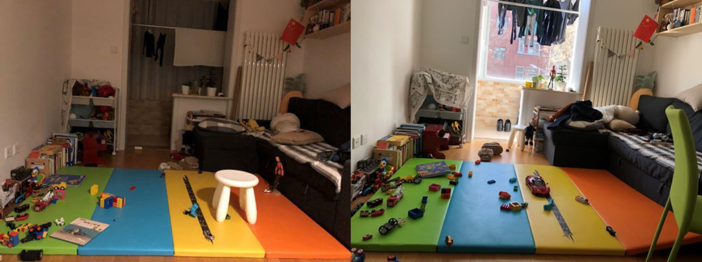

# Lifelong SLAM Challenge

> Please fill [the registration form](http://sv.mikecrm.com/jTS0wi7) to get the dataset for the competition.

In most real-world robotic scenarios, robots should be able to long-termly operate in dynamic and daily changing environments, and SLAM should be one of their most fundemental capabilities. However, most existing SLAM frameworks are evaluated in static environments, or in scenes containing some apparent dynamics such as moving people and objects. This competition brings new challenges by introducing *out-of-sight scene changes*. For example, in home scenarios, most objects may be movable or deformable, and the visual features of the same place may be significantly different in some successive days. Such out-of-sight dynamics pose challenges to the robustness of (re-)localization and the reusability of mapping, which to our knowledge have not been well studied. We use the term *Lifelong SLAM* to emphasize the capability of long-term mapping and robust localization.

[{:width="640px"}](home.png)

The dataset for this competition is collected in homes, offices, and other indoor places. Data are collected for multiple times in each place, to get scene changes in real life. Ground-truth trajectories are acquired by a motion capture system and other auxiliary means. Benchmarking tools will be released to evaluate SLAM algorithms in the lifelong setting.

Though the problem of *Lifelong SLAM* may be bit different from conventional SLAM, we will do our best to provide user-frinedly data format and evaluation tools to ensure minimum overhead of participating this competition.

## Data

The competition will use a subset of [the OpenLORIS-Scene Dataset](https://lifelong-robotic-vision.github.io/dataset/scene.html). The data are from a university building (office and corridor), a home, a supermarket, and a café. There are 2 to 7 trajectories in each scene, recorded at different times. For each scene, all the trajectories shall be feed to the SLAM algorithm in a predefined order. The algorithm will get a notification when loading a new sequence, and shall re-estimate its state since the robot may have been moved from the last location of the previous trajectory. However, participants may choose to get a pseudo-ground-truth starting state for each trajectory if re-localization is not supported by their SLAM algorithm. In this way their algorithm will get no score for re-localization.

Participants may choose from monocular, depth-only, RGB-D, or stereo fisheye as visual input of their algorithm, and use IMU or odometry data as they wish. The algorithm shall be evaluated in a real-time way, i.e., the data shall be feed to the algorithm at their original rate, and the immediate output of the algorithm shall be evaluated (rather than a trajectory after offline optimization). The participants shall either play ROS bags without changing the publish rate, or run their algorithm with [SLAMBench](https://github.com/lifelong-robotic-vision/slambench2). We will provide benchmarking tools for both methods.

For more details of the data, please visit [the OpenLORIS-Scene Dataset](https://lifelong-robotic-vision.github.io/dataset/scene.html).

## Task and Rules

- Participants should build a visual or visual-inertial SLAM system to join the competition.
- Participants can choose a subset of sensor data for their algorithm, e.g. monocular or RGB-D, with IMU or without.
- Participants should feed their SLAM algorithm with given data in real time, record the results with given tools (will be released later), and submit the results to an evaluation server (will be announced later).
- Finalists will be invited to give a 10-min talk about their techniques at IROS 2019 on Nov 4. The presentation quality will be scored together with algorithm performance in the final ranking, and winners will be awarded at IROS 2019 Award Luncheon.
- The SLAM system is encouraged to have re-localization capability to deal with kidnapped robot issue and to recover from tracking failures.
- The SLAM system is encouraged to make use of semantic information for robust localization in changed scenes.
- The SLAM system is encouraged to be power efficient (i.e. being able to run on an edge device instead of servers).
- Manual or hardcoded adaption to the evaluation data is prohibited and might be considered as cheating, including
    - any kind of manual input at runtime
    - any kind of hardcoded states or features
    - loading extra data that are strongly correlated with the evaluation data
    - training a neural network or other machine learning models with the evaluation data (this can be controversial; please send an email to the organizers or open a github issue to discuss about your training method if you believe it is moral)

## Evaluation Metrics

We will introduce some new metrics for this competition, as traditional SLAM evaluation (e.g. ATE, RPE) measures mostly the accuracy of pose tracking. We will evaluate the robustness of localization. Specifically, success rate of re-localization for each trajectory and success rate of tracking for each frame will be scored. Please refer to [this paper](https://drive.google.com/file/d/10EBSxett6dFhl-6QJ0PW30c6RsSU_ZZu/view?usp=sharing) for more details.

## Timeline

* First Round - now to Sept 30, 2019
* Final Round - Oct, 2019
* Workshop - Nov 4, 2019

## Registration

**[Register now](http://sv.mikecrm.com/jTS0wi7) to get email instructions of dataset downloading.**
