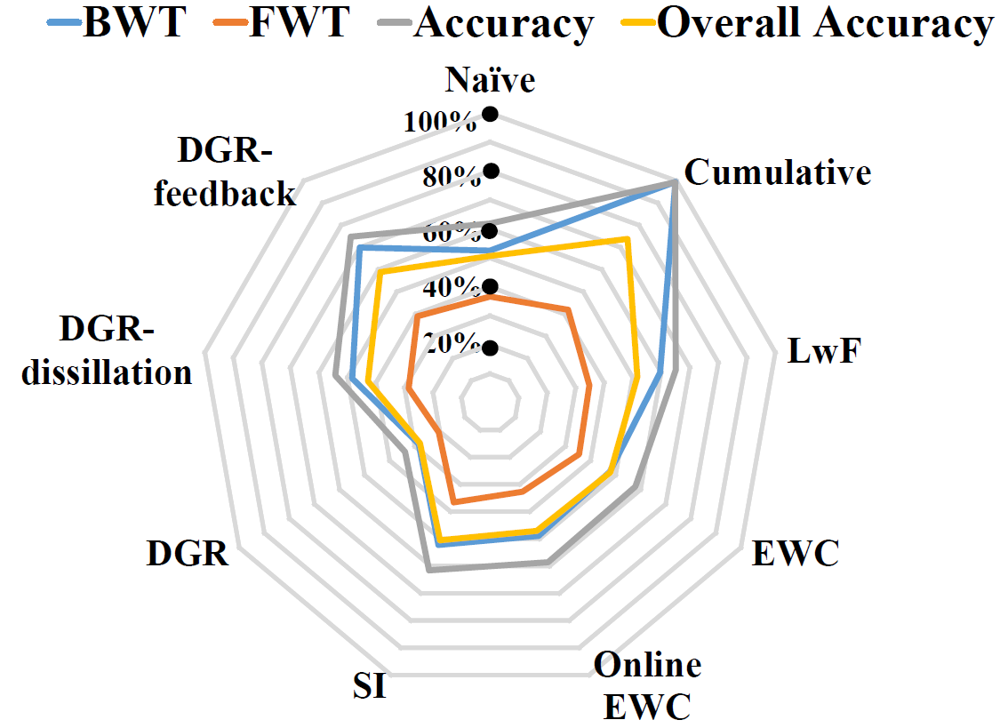
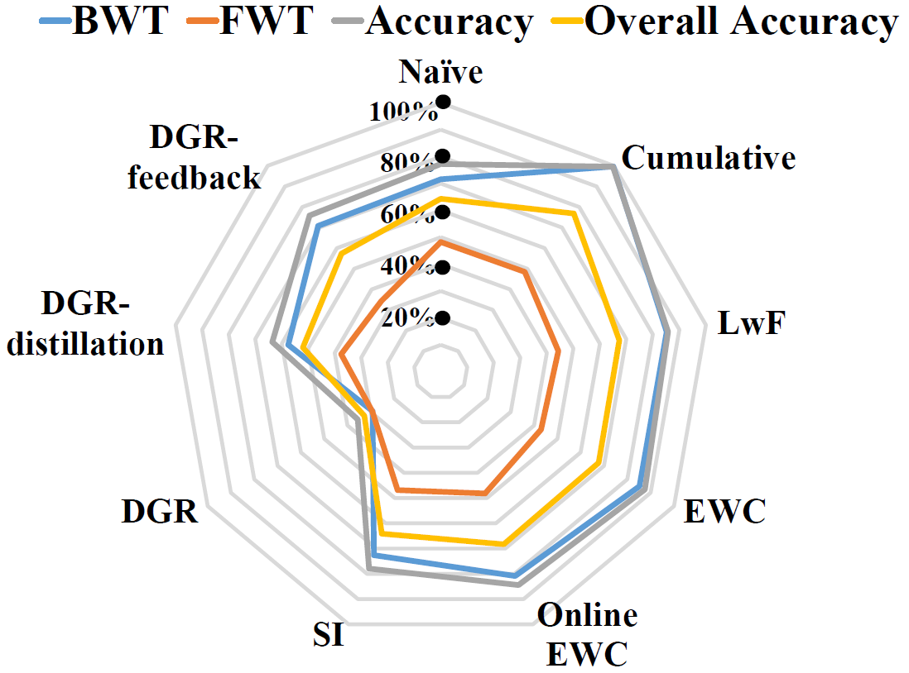
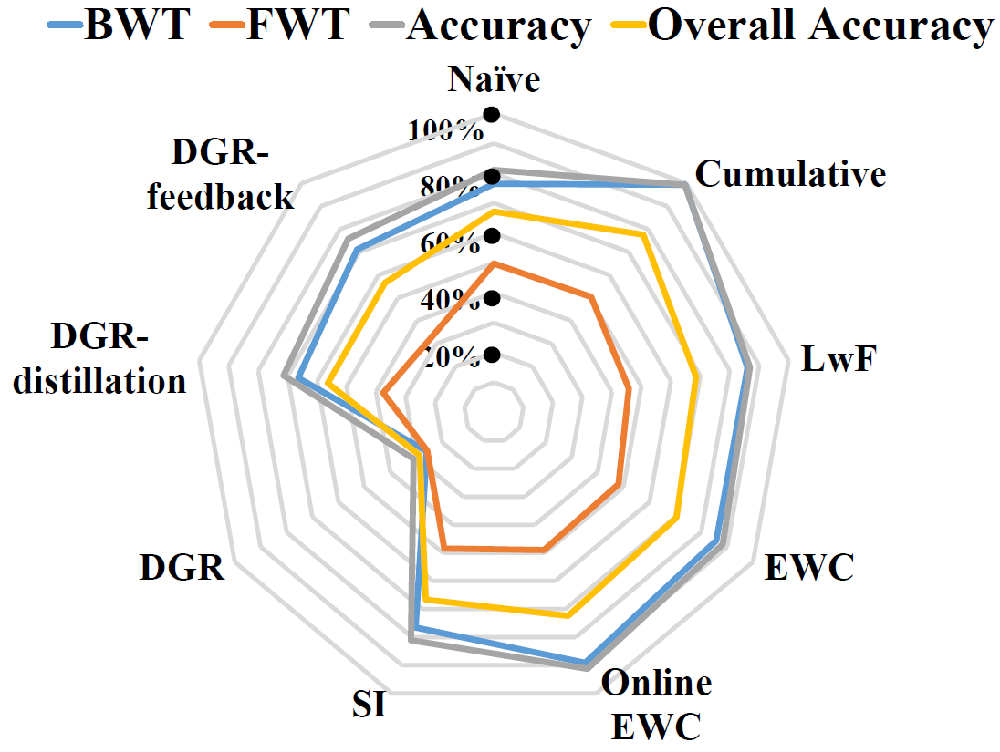

# OpenLORIS-object Dataset 

>(L)ifel(O)ng (R)obotic V(IS)ion (**OpenLORIS**) - Object Recognition Dataset (**OpenLORIS-object**) is designed for accelerating the lifelong/continual/incremental learning research and application，currently focusing on improving the continuous learning capbility of the common objects in the home scenario. 

## Data collection
Data is obtained in the office and home environments. Several grounded robots mounted by Intel RealSense D435i and T265 camera is used for data collection. The D435i camera provides aligned color images and depth images, and IMU measurements. The T265 camera provides stereo fisheye images and aligned IMU measurements. 

>The robot is actively recording the videos of targeted objects under multiple illuminations, occlusions, camera-object distances/angles, and context information (clutters). We do include the common challenges that the robot is usually faced with. For example,

- **Illumination**. In real-world applications, the illumination can vary significantly across time, e.g. day and night differences. Our dataset is mainly collected from normal daylight and include weak and strong lights, each accounts for $10\%$ of objects under each scene. The task becomes challenging with lights to be weaker.
- **Occlusion**. Occlusion happens when a part of an object is hidden by one or more objects, or only a portion of the object is shown in the field of view. Since distinctive characteristics of the object might be hidden, occlusion makes the classification task considerably more challenging.  
- **Camera-object angles/distances**. The angles of the cameras affect the attributes detected from the object. 
- **Clutter**. Clutter refers to the presence of other objects in the vicinity of the considered object. The simultaneous presence of multiple objects may interfere with the classification task.
- **Context information**. The environment information should be another factor during learning, such as the kitten scene should be an enhancement for the objects like the knife, cooker to be recognized. Most of the previous studies ignore the context information for object recognition.

## Data description
>The dataset is collected under multiple scenes, such as living room, kitchen, and bedroom (objects located on the desk, floor, bed, and wall), which explicitly incorporates the context information into object recognition tasks. 

Our released dataset is a collection of $69$ instances including $19$ categories daily necessities objects under $7$ scenes. For each instance, a $17$ seconds video (at $30$ fps) has been recorded with a Realsense D435i camera delivering ～$500$ RGB-D frames. $4$ environment factors, each has $3$ level changes, are considered explicitly in our dataset, including illumination, occlusion, clutter and actual pixel sizes of the object in the images. The defined three difficulty levels for each factor are shown below (thus, totally we have $12$ subcategories w.r.t. the environment factors):

| Level | Illunimation        | Occlusion (percentage)        | Object Pixel Size (pixels)  | Clutter| 
| :-------------: |:-------------:| :-------------:|:-------------:|:-------------:|
| 1| Strong | $0\%$|$> 200 \times 200$ | Simple |
| 2| Normal      | $25\%$ | $30 \times 30-200\times 200$ | Normal
| 3 | Weak      | $50\%$      |   $< 30 \times 30$ | Complex|

For each instance in each level, we provided $260$ samples. That is, for each instance, there are $3120$ samples. The total images provided is around 

- $260$ (samples/intance)$\times$ $69$ (instance) $\times$ $4$ (factors/level) $\times$ $3$ (difficulty levels) = $215，280$ 

## Data visualization

The presence of temporal coherent sessions (i.e., the robot camera gently move around the objects) can provide a temporal smoothness which simplifies the process of object detection, improve classification accuracy and address semi-supervised (or unsupervised) scenarios. Picked samples have been shown below. 

Each column of the figure above shows the clutter (from 1st row to 3rd row, simple, normal, complex), occlusion ($0\%$, $25\%$, $50\%$), object pixels ($< 30 \times 30$, $30 \times 30 - 200 \times 200$, $> 200 \times 200$), and illumination (weak, normal, strong).

## Benchmarks

- **Lifelong learning methods**

  (1) Transfer and multi-task learning: Naive and cumulative methods [1];
  (2) Regularization approaches: Learning without Forgetting (LwF) [2], Elastic Weight Consolidation (EWC) [3], Online EWC [4] and Synaptic Intelligence (SI) [5];
  (3) Generative Replay approaches: Deep Generative Replay (DGR) [6], DGR with distillation [7] [8], and DGR with feedback [9].

- **Evaluation metrics**
  
   We adopt four metrics for evaluating the performances: Accuracy, Backward transfer (BWT), Forward transfer (FWT), and Overall accuracy. The Accuracy metric considers the performance of the model at very timestep i in time that can better characterize the dynamics of the learning algorithms; BWT evaluates the memorization capability of the algorithms, which measures the accuracy over previously encountered tasks; FWT measures the influence that learning the current task on the performance of future tasks; and Over-all accuracy summarizes the performances on all the previous, current, and future tasks, which can be viewed as an overall metric for a specific model. Detailed formulations of these four metrics can be refered in [10].

  
- **Benchmark 1: Single factor analysis with ever-changing difficulty**

  This benchmark is conducted with 4 factors amentioned above, each of which has 3 difficulty levels. We investigate the individual factor, and change the difficulty levels of each continuously. Note that we keep other factors at the level 1 as in table above when investigating each factor, e.g., the levels of the illumination can be weak, normal, and strong, and at the same time, the occlusion is kept at 0%, the object pixel size is larger 200×200, and the clutter is simple. Fig. 1 demonstrates the experimental details of each factor analysis. For example, under illumination variants (shown in yellow bars “factor”), the model should be updated with the data from the difficulty level 1, 2, and 3 (shown in blue bars “level”) for totally 9 tasks (shown in green bars “task”). We separate each difficulty level into 3 tasks (e.g., blue bars we have three 1/2/3 level) with different views. The same experiment has been done on occlusion, object pixel size, and clutter factors. The performances of all 36 tasks (4 factors ×9 tasks/factor) have been evaluated with 4 metrics (Accuracy, BWT, FWT, and Over-all accuracy) are shown in Fig. 2. 

Fig. 1: Four-factor analysis under the sequential learning setting. 

  

   
   
  

  

   
   
  

Fig. 2: The spider chart of 4 evaluation metrics: Accuracy (grey), BWT (blue), FWT (red), and Over-all accuracy (yellow) of 9 lifelong learning algorithms, which are evaluated on illumination, occlusion, object pixel size, and clutter factors (the order in the figure is from upper left to lower right corners). Larger area is better. The maximum value of each evaluation metric is 100%. 

- **Benchmark 2: Sequential factors analysis with ever-changing difficulty**

  This benchmark explores the sequential task learning with four factors together. As shown in Fig. 3, the data from 4 factors with 3 difficulty levels (totally 12 tasks) are learned sequentially with about 14,400 training images and 1,800 testing images (69 objects) for each task. The number of total training and testing images of all the tasks is about 172,800 and 21,600. This benchmark would like to test the robustness and adaptation capabilities of the lifelong learning algorithms for the long sequential tasks with more variants encountered. The performances of all 12 tasks (4 factors ×3 tasks/factor) have been evaluated with 4 metrics (Accuracy, BWT, FWT, and Over-all accuracy) are shown in Fig. 4. 

  

Fig. 3: Sequential factors analysis. 

  

Fig. 4: Evaluation results of Benchmark 2. 

<!--
## Data structure

ourDataset/
  |
  | ------ scene#1/
  | ------ | ------ illumination/
  | ------ | ------ | ------ normal/
  | ------ | ------ | ------ | ------ obj1/
  | ------ | ------ | ------ | ------ frame001.jpg - frame259.jpg
  | ------ | ------ | ------ | ------ obj2/
  | ------ | ------ | ------ | ------ frame001.jpg - frame259.jpg
  | ------ | ------ | ------ | ------ ...
  | ------ | ------ | ------ strong/
  | ------ | ------ | ------ ...
  | ------ | ------ | ------ weak/
  | ------ | ------ | ------ ...
  | ------ | ------ occlusion/
  | ------ | ------ | ------ 0%/
  | ------ | ------ | ------ | ------ obj1/
  | ------ | ------ | ------ | ------ frame001.jpg - frame259.jpg
  | ------ | ------ | ------ | ------ obj2/
  | ------ | ------ | ------ | ------ frame001.jpg - frame259.jpg
  | ------ | ------ | ------ | ------ ...
  | ------ | ------ | ------ 25%/
  | ------ | ------ | ------ ...
  | ------ | ------ | ------ 50%/
  | ------ | ------ | ------ ...
  | ------ | ------ pixel/
  | ------ | ------ | ------ 30/
  | ------ | ------ | ------ | ------ obj1/
  | ------ | ------ | ------ | ------ frame001.jpg - frame259.jpg
  | ------ | ------ | ------ | ------ obj2/
  | ------ | ------ | ------ | ------ frame001.jpg - frame259.jpg
  | ------ | ------ | ------ | ------ ...
  | ------ | ------ | ------ 30-200/
  | ------ | ------ | ------ ...
  | ------ | ------ | ------ 200/
  | ------ | ------ | ------ ...
  | ------ | ------ clutter/
  | ------ | ------ | ------ Complex/
  | ------ | ------ | ------ | ------ obj1/
  | ------ | ------ | ------ | ------ frame001.jpg - frame259.jpg
  | ------ | ------ | ------ | ------ obj1/
  | ------ | ------ | ------ | ------ frame001.jpg - frame259.jpg
  | ------ | ------ | ------ | ------ ...
  | ------ | ------ | ------ Simple/
  | ------ | ------ | ------ ...
  | ------ | ------ | ------ Normal/
  | ------ | ------ | ------ ...
  | ------ scene#2/
  | ------ ...
--->

## Data for IROS 2019 competition 
For competition dataset, we randomly shuffled the dataset with multiple factors. Data is split up to $9$ batches and each batch samples are from two/three subdirectories (there are $12$ subdirectories in total, 4 factors $\times$ 3 level/factor). Each batch includes $51$ instances from $5$ scenes, about $3520$ test samples, $3520$ validation samples and $10000$ training samples. The overview of each batch containing the samples under factors is shown below:

|Batch| Illumination | Occlusion | Pixel | Clutter
| :-------------: |:-------------:| :-------------:|:-------------:|:-------------:|
|1	|		 |	$10\%$ | $< 30 \times 30$| |
|2	|	strong |	 | | complex|
|3	|	normal	 |	| | simple |
|4	|	weak	 |	 | $> 200 \times 200$|  |
|5	|		 |	$0\%$ | | complex|
|6	|		 |	$50\%$ | $> 200 \times 200$ | | 
|7	|		 |	$25\%$ | | simple|
|8	|	strong |	 | $30 \times 30 - 200 \times 200$ | complex | 
|9	|	weak	 |	$50\%$ | $> 200 \times 200$ | |

## Join the IROS2019 lifelong object recognition competition

> Lifelong Object Recognition Challenge starts online now, [please join the competition on Codalab](https://codalab.lri.fr/competitions/581) ! if you encounter any problem, give us feedback via

- [Github for lifelong robotic vision challenge](https://github.com/lifelong-robotic-vision/lifelong-robotic-vision.github.io) or
- Organizer: [Qi She](mailto:qi.she@intel.com)

## References

[1] V. Lomonaco and D. Maltoni, “Core50: a new dataset and benchmark for continuous object recognition,” in Conference on Robot Learning (CoRL), 2017, pp. 17–26.

[2] Z. Li and D. Hoiem, “Learning without forgetting,” IEEE Transactions on Pattern Analysis and Machine Intelligence, vol. 40, no. 12, pp. 2935–2947, 2017.

[3] J. Kirkpatrick, R. Pascanu, N. Rabinowitz, J. Veness, G. Desjardins, A. A. Rusu, K. Milan, J. Quan, T. Ramalho, A. Grabska-Barwinska et al., “Overcoming catastrophic forgetting in neural networks,” Proceedings of the National Academy of Sciences (PNAS), pp. 3521–3526,
2017.

[4] J. Schwarz, W. Czarnecki, J. Luketina, A. Grabska-Barwinska, Y. W.
Teh, R. Pascanu, and R. Hadsell, “Progress & compress: A scalable framework for continual learning,” in Proceedings of the 35th Interna- tional Conference on Machine Learning (ICML), 2018, pp. 4535–4544.

[5] F. Zenke, B. Poole, and S. Ganguli, “Continual learning through synaptic intelligence,” in Proceedings of the 34th International Conference on Machine Learning (ICML), vol. 70, 2017, pp. 3987–3995.

[6] H. Shin, J. K. Lee, J. Kim, and J. Kim, “Continual learning with deep generative replay,” in Advances in Neural Information Processing Systems (NIPS), 2017, pp. 2990–2999.

[7] R. Venkatesan, H. Venkateswara, S. Panchanathan, and B. Li, “A strategy for an uncompromising incremental learner,” arXiv preprint arXiv:1705.00744, 2017.

[8] Y. Wu, Y. Chen, L. Wang, Y. Ye, Z. Liu, Y. Guo, Z. Zhang, and Y. Fu,
“Incremental classifier learning with generative adversarial networks,” arXiv preprint arXiv:1802.00853, 2018.

[9] G. M. van de Ven and A. S. Tolias, “Generative replay with feedback connections as a general strategy for continual learning,” arXiv preprint arXiv:1809.10635, 2018.

[10] N. D ́ıaz-Rodr ́ıguez, V. Lomonaco, D. Filliat, and D. Maltoni, “Don’t forget, there is more than forgetting: new metrics for continual learning,” arXiv preprint arXiv:1810.13166, 2018.

