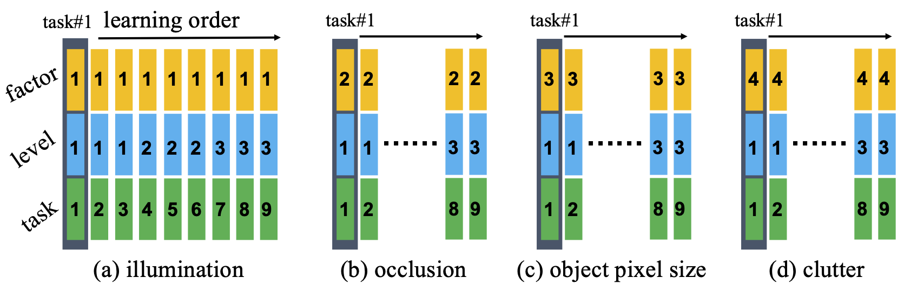
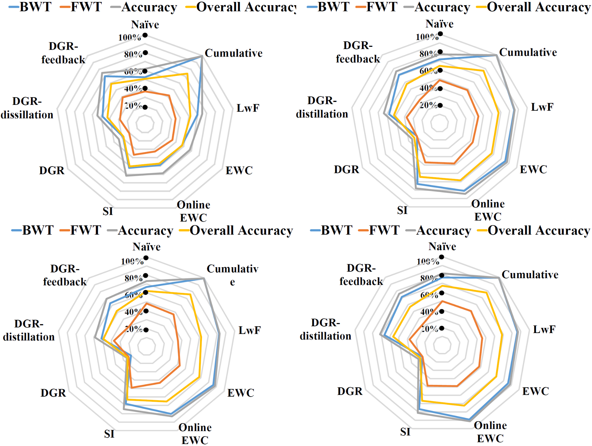
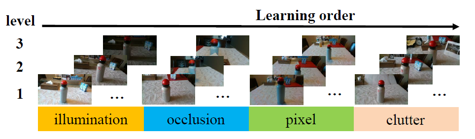
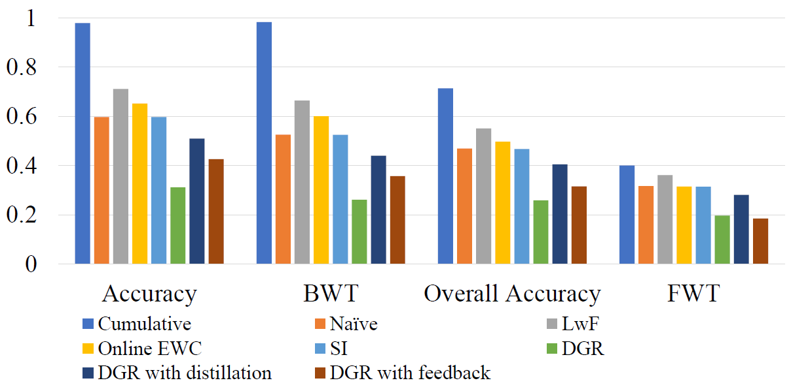

# OpenLORIS-Object Dataset and Benchmark

>(L)ifel(O)ng (R)obotic V(IS)ion (**OpenLORIS**) - Object Recognition Dataset (**OpenLORIS-Object**) is designed for accelerating the lifelong/continual/incremental learning research and application，currently focusing on improving the continuous learning capability of the common objects in the home scenario.

## Dataset download
> Our dataset can be downloaded at [OpenLORIS-Object dataset](http://bit.ly/2RbBBdc).
> Our source codes can be downloaded at [OpenLORIS-Object paper source codes](https://github.com/lifelong-robotic-vision/OpenLORIS-Object)
Please see the details in our paper below. You can also contact with [Qi She](mailto:qi.she@intel.com) for more details.

## Background
The recent breakthroughs in computer vision have benefited from the availability of large representative datasets (e.g. ImageNet and COCO) for training. Yet, robotic vision poses unique challenges for applying visual algorithms developed from these standard computer vision datasets due to their implicit assumption over non-varying distributions for a fixed set of tasks. Fully retraining models each time a new task becomes available is infeasible due to computational, storage and sometimes privacy issues, while naïve incremental strategies have been shown to suffer from catastrophic forgetting. It is crucial for the robots to operate continuously under open-set and detrimental conditions with adaptive visual perceptual systems, where lifelong learning is a fundamental capability. However, very few datasets and benchmarks are available to evaluate and compare emerging techniques.

To fill this gap, we provide a new lifelong robotic vision dataset ("OpenLORIS-Object") collected via RGB-D cameras mounted on mobile robots. The dataset embeds the challenges faced by a robot in the real-life application and provides new benchmarks for validating lifelong object recognition algorithms. Moreover, we have provided a testbed of 9 state-of-the-art lifelong learning algorithms. Each of them involves 48 tasks with 4 evaluation metrics over the OpenLORIS-Object dataset.

More description of the dataset and benchmark can be found in [this paper](https://arxiv.org/abs/1911.06487):

> Qi She et al. "OpenLORIS-Object: A Robotic Vision Dataset and Benchmark for Lifelong Deep Learning."
International Conference on Robotics and Automation (ICRA), Paris, France, 2020, pp.4767-4773.

If you find our dataset and benchmark useful in your research, please consider citing:

    @inproceedings{she2019openlorisobject,
        title={ {OpenLORIS-Object}: A Robotic Vision Dataset and Benchmark for Lifelong Deep Learning},
        author={Qi She and Fan Feng and Xinyue Hao and Qihan Yang and Chuanlin Lan and Vincenzo Lomonaco and Xuesong Shi and Zhengwei Wang and Yao Guo and Yimin Zhang and Fei Qiao and Rosa H. M. Chan},
        booktitle={2020 International Conference on Robotics and Automation (ICRA)},
        year={2020},
        pages={4767-4773},
    }
    }

<iframe src="https://www.youtube.com/embed/p0TYHMWY9Cw" frameborder="0" allow="accelerometer; autoplay; encrypted-media; gyroscope; picture-in-picture" allowfullscreen class="video"></iframe>

## Data collection
Data is obtained in the office and home environments. Several grounded robots mounted by Intel RealSense D435i and T265 camera is used for data collection. The D435i camera provides aligned color images and depth images, and IMU measurements. The T265 camera provides stereo fisheye images and aligned IMU measurements. In the 1st released dataset, we included the RGB and Depth images.  

>The robot is actively recording the videos of targeted objects under multiple illuminations, occlusions, camera-object distances/angles, and context information (clutters). We do include the common challenges that the robot is usually faced with. For example,

- **Illumination**. In a real-world application, the illumination can vary significantly across time, e.g., day and night differences. We repeat the data collection under weak, normal, and strong lighting conditions, respectively. The task becomes challenging with lights to be very weak.
- **Occlusion**. Occlusion happens when a part of an object is hidden by other objects, or only a portion of the object is visible in the field of view. Since distinctive characteristics of the object might be hidden, occlusion significantly increases the difficulty for recognition.
- **Object size**. Small-size or elongated objects make the task challenging, like dry batteries or glue sticks.
- **Camera-object angles/distances**. The angles of the cameras affect the attributes detected from the object.
- **Clutter**. Clutter refers to the presence of other objects in the vicinity of the considered object. The simultaneous presence of multiple objects may interfere with the classification task.

## Data description
>The dataset is collected under multiple scenes, such as living room, kitchen, and bedroom (objects located on the desk, floor, bed, and wall), which explicitly incorporates the context information into object recognition tasks.

Our released dataset is a collection of $69$ instances including $19$ categories daily necessities objects under $7$ scenes. For each instance, a $17$ seconds video (at $30$ fps) has been recorded with a Realsense D435i camera delivering ～$500$ RGB-D frames. $4$ environment factors, each has $3$ level changes, are considered explicitly in our dataset, including illumination, occlusion, clutter and actual pixel sizes of the object in the images. The defined three difficulty levels for each factor are shown below (thus, totally we have $12$ subcategories w.r.t. the environment factors):

| Level | Illunimation        | Occlusion (percentage)        | Object Pixel Size (pixels)  | Clutter|
| :-------------: |:-------------:| :-------------:|:-------------:|:-------------:|
| 1| Strong | $0\%$|$> 200 \times 200$ | Simple |
| 2| Normal      | $25\%$ | $30 \times 30-200\times 200$ | Normal
| 3 | Weak      | $50\%$      |   $< 30 \times 30$ | Complex|

For each instance in each level, we provided $260$ samples. That is, for each instance, there are $3120$ samples. The total images provided is around

- $260$ (samples/intance)$\times$ $69$ (instance) $\times$ $4$ (factors/level) $\times$ $3$ (difficulty levels) = $215，280$

## Data visualization

The presence of temporal coherent sessions (i.e., the robot camera gently move around the objects) can provide a temporal smoothness which simplifies the process of object detection, improve classification accuracy and address semi-supervised (or unsupervised) scenarios. Picked samples have been shown below.

Figure above shows the   illumination (weak, normal, strong), occlusion (0\%, 25\%, 50\%), object pixels ($< 30 \times 30$, $30 \times 30 - 200 \times 200$, $> 200 \times 200$), clutter (simple, normal, complex), occlusion ($0\%$, $25\%$, $50\%$) and different object views.

## Baselines

- **Lifelong learning methods**

  (1) Transfer and multi-task learning: Naive and cumulative methods [[1](##References)];

  (2) Regularization approaches: Learning without Forgetting (LwF) [[2](##References)], Elastic Weight Consolidation (EWC) [[3](##References)], Online EWC [[4](##References)] and Synaptic Intelligence (SI) [[5](##References)];

  (3) Generative Replay approaches: Deep Generative Replay (DGR) [[6](##References)], DGR with distillation [[7](##References)] [[8](##References)], and DGR with feedback [[9](##References)].

- **Evaluation metrics**

   We adopt four metrics for evaluating the performances: Accuracy, Backward transfer (BWT), Forward transfer (FWT), and Overall accuracy. The Accuracy metric considers the performance of the model at very timestep i in time that can better characterize the dynamics of the learning algorithms; BWT evaluates the memorization capability of the algorithms, which measures the accuracy over previously encountered tasks; FWT measures the influence that learning the current task on the performance of future tasks; and Over-all accuracy summarizes the performances on all the previous, current, and future tasks, which can be viewed as an overall metric for a specific model. Detailed formulations of these four metrics can be refered in [[10](##References)].

## Benchmarks

- **Benchmark #1: Single factor analysis with ever-changing difficulty**

  This benchmark is conducted with 4 factors, each of which has 3 difficulty levels. We investigate the individual factor, and change the difficulty levels of each continuously. We separate each difficulty level into 3 tasks (e.g., blue bars we have three 1/2/3 level) with different views. The same experiment has been done on occlusion, object pixel size, and clutter factors. The performances of all 36 tasks (4 factors ×9 tasks/factor) have been evaluated with 4 metrics (Accuracy, BWT, FWT, and Over-all accuracy) are shown in Fig. 2.

Fig. 1: Four-factor analysis under the sequential learning setting. 

Fig. 2: The spider chart of 4 evaluation metrics: Accuracy (grey), BWT (blue), FWT (red), and Over-all accuracy (yellow) of 9 lifelong learning algorithms, which are evaluated on illumination, occlusion, object pixel size, and clutter factors (the order in the figure is from upper left to lower right corners). Larger area is better. The maximum value of each evaluation metric is 100%. 

- **Benchmark 2: Sequential factors analysis with ever-changing difficulty**

  This benchmark explores the sequential task learning with four factors together. As shown in Fig. 3, the data from 4 factors with 3 difficulty levels (totally 12 tasks) are learned sequentially with about 14,400 training images and 1,800 testing images (69 objects) for each task. The number of total training and testing images of all the tasks is about 172,800 and 21,600. This benchmark would like to test the robustness and adaptation capabilities of the lifelong learning algorithms for the long sequential tasks with more variants encountered. The performances of all 12 tasks (4 factors ×3 tasks/factor) have been evaluated with 4 metrics (Accuracy, BWT, FWT, and Over-all accuracy) are shown in Fig. 4.

Fig. 3: Sequential factors analysis. 

Fig. 4: Evaluation results of Benchmark 2. 

<!--
## Data structure

ourDataset/
  |
  | ------ scene#1/
  | ------ | ------ illumination/
  | ------ | ------ | ------ normal/
  | ------ | ------ | ------ | ------ obj1/
  | ------ | ------ | ------ | ------ frame001.jpg - frame259.jpg
  | ------ | ------ | ------ | ------ obj2/
  | ------ | ------ | ------ | ------ frame001.jpg - frame259.jpg
  | ------ | ------ | ------ | ------ ...
  | ------ | ------ | ------ strong/
  | ------ | ------ | ------ ...
  | ------ | ------ | ------ weak/
  | ------ | ------ | ------ ...
  | ------ | ------ occlusion/
  | ------ | ------ | ------ 0%/
  | ------ | ------ | ------ | ------ obj1/
  | ------ | ------ | ------ | ------ frame001.jpg - frame259.jpg
  | ------ | ------ | ------ | ------ obj2/
  | ------ | ------ | ------ | ------ frame001.jpg - frame259.jpg
  | ------ | ------ | ------ | ------ ...
  | ------ | ------ | ------ 25%/
  | ------ | ------ | ------ ...
  | ------ | ------ | ------ 50%/
  | ------ | ------ | ------ ...
  | ------ | ------ pixel/
  | ------ | ------ | ------ 30/
  | ------ | ------ | ------ | ------ obj1/
  | ------ | ------ | ------ | ------ frame001.jpg - frame259.jpg
  | ------ | ------ | ------ | ------ obj2/
  | ------ | ------ | ------ | ------ frame001.jpg - frame259.jpg
  | ------ | ------ | ------ | ------ ...
  | ------ | ------ | ------ 30-200/
  | ------ | ------ | ------ ...
  | ------ | ------ | ------ 200/
  | ------ | ------ | ------ ...
  | ------ | ------ clutter/
  | ------ | ------ | ------ Complex/
  | ------ | ------ | ------ | ------ obj1/
  | ------ | ------ | ------ | ------ frame001.jpg - frame259.jpg
  | ------ | ------ | ------ | ------ obj1/
  | ------ | ------ | ------ | ------ frame001.jpg - frame259.jpg
  | ------ | ------ | ------ | ------ ...
  | ------ | ------ | ------ Simple/
  | ------ | ------ | ------ ...
  | ------ | ------ | ------ Normal/
  | ------ | ------ | ------ ...
  | ------ scene#2/
  | ------ ...
--->

<!-- ## Data for IROS 2019 competition
For competition dataset, we randomly shuffled the dataset with multiple factors. Data is split up to $9$ batches and each batch samples are from two/three subdirectories (there are $12$ subdirectories in total, 4 factors $\times$ 3 level/factor). Each batch includes $51$ instances from $5$ scenes, about $3520$ test samples, $3520$ validation samples and $10000$ training samples. The overview of each batch containing the samples under factors is shown below:

|Batch| Illumination | Occlusion | Pixel | Clutter
| :-------------: |:-------------:| :-------------:|:-------------:|:-------------:|
|1	|		 |	$10\%$ | $< 30 \times 30$| |
|2	|	strong |	 | | complex|
|3	|	normal	 |	| | simple |
|4	|	weak	 |	 | $> 200 \times 200$|  |
|5	|		 |	$0\%$ | | complex|
|6	|		 |	$50\%$ | $> 200 \times 200$ | |
|7	|		 |	$25\%$ | | simple|
|8	|	strong |	 | $30 \times 30 - 200 \times 200$ | complex |
|9	|	weak	 |	$50\%$ | $> 200 \times 200$ | | -->

## IROS 2019 Lifelong Robotic Vision: Lifelong Object Recognition competition

> Lifelong Object Recognition Challenge ends at 4th November, which attracts 150 registrations, [please refer the finalist of the competition on Codalab](https://codalab.lri.fr/competitions/581) ! The more information is at our github page

- [Github for lifelong robotic vision challenge](https://github.com/lifelong-robotic-vision/lifelong-robotic-vision.github.io) or
- Organizer: [Qi She](mailto:qi.she@intel.com)

## References

[1] V. Lomonaco and D. Maltoni, “Core50: a new dataset and benchmark for continuous object recognition,” in Conference on Robot Learning (CoRL), 2017, pp. 17–26.

[2] Z. Li and D. Hoiem, “Learning without forgetting,” IEEE Transactions on Pattern Analysis and Machine Intelligence, vol. 40, no. 12, pp. 2935–2947, 2017.

[3] J. Kirkpatrick, R. Pascanu, N. Rabinowitz, J. Veness, G. Desjardins, A. A. Rusu, K. Milan, J. Quan, T. Ramalho, A. Grabska-Barwinska et al., “Overcoming catastrophic forgetting in neural networks,” Proceedings of the National Academy of Sciences (PNAS), pp. 3521–3526,
2017.

[4] J. Schwarz, W. Czarnecki, J. Luketina, A. Grabska-Barwinska, Y. W.
Teh, R. Pascanu, and R. Hadsell, “Progress & compress: A scalable framework for continual learning,” in Proceedings of the 35th Interna- tional Conference on Machine Learning (ICML), 2018, pp. 4535–4544.

[5] F. Zenke, B. Poole, and S. Ganguli, “Continual learning through synaptic intelligence,” in Proceedings of the 34th International Conference on Machine Learning (ICML), vol. 70, 2017, pp. 3987–3995.

[6] H. Shin, J. K. Lee, J. Kim, and J. Kim, “Continual learning with deep generative replay,” in Advances in Neural Information Processing Systems (NIPS), 2017, pp. 2990–2999.

[7] R. Venkatesan, H. Venkateswara, S. Panchanathan, and B. Li, “A strategy for an uncompromising incremental learner,” arXiv preprint arXiv:1705.00744, 2017.

[8] Y. Wu, Y. Chen, L. Wang, Y. Ye, Z. Liu, Y. Guo, Z. Zhang, and Y. Fu,
“Incremental classifier learning with generative adversarial networks,” arXiv preprint arXiv:1802.00853, 2018.

[9] G. M. van de Ven and A. S. Tolias, “Generative replay with feedback connections as a general strategy for continual learning,” arXiv preprint arXiv:1809.10635, 2018.

[10] N. D ́ıaz-Rodr ́ıguez, V. Lomonaco, D. Filliat, and D. Maltoni, “Don’t forget, there is more than forgetting: new metrics for continual learning,” arXiv preprint arXiv:1810.13166, 2018.
