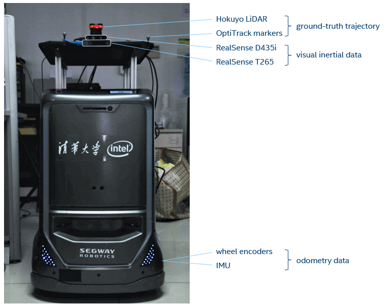
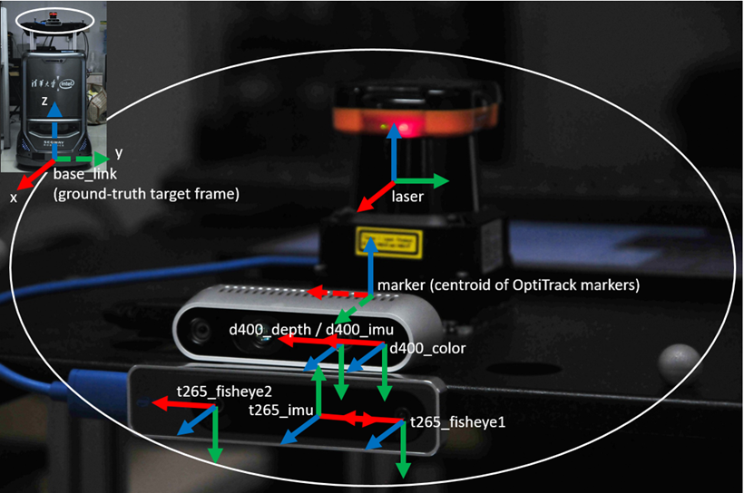

# OpenLORIS-Scene Dataset

The OpenLORIS-Scene dataset aims to help evaluate the maturity of SLAM and scene
understanding algorithms for real-world deployment, by providing *visual*,
*inertial* and *odometry* data recorded with real robots in real scenes, and
ground-truth robot trajectories acquired by motion capture system or
high-resolution LiDARs. Multiple trajectories will be provided for each scene,
to capture natural scene changes in real life.

OpenLORIS is an open dataset. We welcome contribution of data from third
parties. We can help with sensor setup, calibration, data collection and
post-processing. Please contact [Xuesong Shi](mailto:xuesong.shi@intel.com) for
collaboration.

For now the data are available only to competition participants of [Lifelong SLAM
Challenge]({{site.url}}{{site.baseurl}}/competition/SLAM.html) with IROS 2019.
**[Register the competition](http://sv.mikecrm.com/jTS0wi7) to get the dataset at the earliest!**

## Robot and Sensors

The data is collected by a wheeled robot moving at human walking speed or
slower. The primary sensors include a RealSense D435i camera and a RealSense
T265 camera, both mounted at a fixed height of about 1m. The color images and
depth images from D435i are recommended for monocular/RGB-D algorithms, while
the dual fisheye images from T265 are recommended for stereo algorithms. Both
provide IMU measurements with hardware synchronization with corresponding images.
Odometry data from wheel encoders will also be provided.

List of available data:

| device | data          | FPS | resolution |
|--------|---------------|-----|------------|
| D435i  | color         | 30  | 848x480    |
| D435i  | depth         | 30  | 848x480    |
| D435i  | aligned_depth_to_color | 30  | 848x480    |
| D435i  | accel         | 250 |            |
| D435i  | gyro          | 400 |            |
| T265   | fisheye1      | 30  | 848x800    |
| T265   | fisheye2      | 30  | 848x800    |
| T265   | accel         | 62.5|            |
| T265   | gyro          | 200 |            |
| base   | odom          | 20  |            |

## Ground-truth

For SLAM evaluation, the ground-truth trajectory of the robot is obtained by a
motion capture system or a LiDAR, with alignment to either D435i color camera and
T265 left camera.

**[Pre-register the competition](mailto:xuesong.shi@intel.com?subject=Pre-register%20for%20Lifelong%20Robotic%20Vision%20Competition&Body=Dear%20Organizers,%0D%0A) and get the first time notice when the data be available!**

## FAQ

<ul><li>
Where can I download the data?
</li></ul>
<ul>

For now the data are provided only to competition participants. If you have registered the competition, you will get Google Drive / Baidu Pan links of the data by emails.

</ul>

<ul><li>
Are all data synchronized?
</li></ul>
<ul>

Yes. The data from the same RealSense camera are hardware synchronized. Others are synchronized by software with a millisec level accuracy.

</ul>

<ul><li>
Where are the intrinsics and extrinsics?
</li></ul>
<ul>

With the data. In the ROS bags, camera/IMU intrinsics are included in the camera_info/imu_info topics, extrinsics are in the tf_static topic.

</ul>

<ul><li>
Can I assume identical intrinsics and extrinsics for all trajectories of the same scene?
</li></ul>
<ul>

Yes. For each scene the sensor setup are unchanged.

</ul>

<ul><li>
How did you get the intrinsics and extrinsics?
</li></ul>
<ul>

All the intrinsics are from RealSense factory calibration (except for D435i IMU which was from <a href=https://www.intelrealsense.com/wp-content/uploads/2019/07/Intel_RealSense_Depth_D435i_IMU_Calibration.pdf>official calibration procedure</a>). Extrinsics are calibrated with various tools. If you would like to perform your own calibration, please contact us.

</ul>

<ul><li>
Why are there two sets of IMU data?
</li></ul>
<ul>

Both RealSense D435i and RealSense T265 has an integrated IMU (BMI055). Please choose the IMU data from the same device of your primary image source for better synchronization. Note that the two sets of IMU data have different axis directions.

</ul>

<ul><li>
Are the IMU data calibrated?
</li></ul>
<ul>

No. Those are raw data from the sensor. You may want to apply the intrinsic matrix onto the data for better accuracy.

</ul>

<ul><li>
Do the timestamps represent the true time of each recording?
</li></ul>
<ul>

No. Random biases have been added to the stamps.

</ul>

Other questions? Please open an issue [here](https://github.com/lifelong-robotic-vision/lifelong-slam/issues).