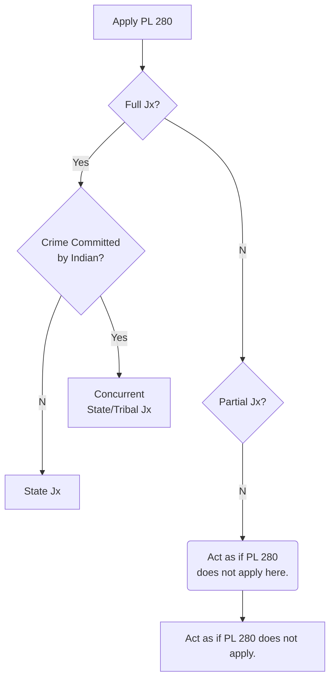

# How to Use this Theme: A Cheat Sheet

Because this theme is aimed to be used in an outline model, that is how my examples will be set up. This does not mean that you cannot use it for something else, just keep it in mind. Below are some good setup/ideas for creating outlines and using this theme to its fullest.


In order to show both how, first I will have the "raw" typing, and then show what it looks like using the theme. This is aimed to show you how I got there. Luckily, Typora usually handles most of the formatting, so most of the time you should just have to type like normal.

----------

## Basics

If you are using Typora, you are using Markdown (.md)! It's awesome to use, and it's pretty straight forward. Most of your shortcuts that you are used to (`Ctrl + B` for bold, `Ctrl + I` for Italic, etc) work just the same, but it's good to know how they work if you need to work with the raw code.

If it's not covered here, there are excellent resources available online. However, if you truly feel like this is something that should be covered here as well, feel free to submit a request under Issues on GitHub.

```md
**Bold**

*Italic*

<u>Underline</u>

~~Strikethrough~~

==Highlight==

~Sub~script

^Super^script

<!--Comment-->

# Heading 1

## Heading 2

### Heading 3

#### Heading 4

##### Heading 5
```

**Bold**

*Italic*

<u>Underline</u>

~~Strikethrough~~

==Highlight==

~Sub~script

^Super^script

<!--Comment-->

# Heading 1

## Heading 2

### Heading 3

#### Heading 4

##### Heading 5

-----

## Ordered Lists

This theme is set up to create ordered lists in a standard outlining theme - just start off your list with the a number. *As a tip, if you want to go backwards, you can use either* `Enter x2` *or* `Shift + Tab`.

```md
1. First Level
   1. Second Level
      1. Third Level
         1. Fourth Level
            1. Fifth Level
               1. Sixth Level
                  1. Seventh Level
                     1. *There is nothing planned past here, as you shouldn't need more than this.*
```

1. First Level
   1. Second Level
      1. Third Level
         1. Fourth Level
            1. Fifth Level
               1. Sixth Level
                  1. Seventh Level
                     1. *There is nothing planned past here, as you shouldn't need more than this.*

--------------

## Blockquotes, Tables, and Code

While often used for other things, I themed this to create a good visual approach to viewing specific content. Below is how I use it:


- **Blockquotes**: When putting in details of a Case, through brief or simple content, I use a blockquote. This allows me to differentiate the case from the rest of the notes. Summon a blockquote by `>` followed by a space.

   ```md
   > **United States v. Virginia**, 518 US 515 (1996): Basic summary of the case. **Rule**: This is the rule(s) used to analyze. **Holding:**  Put the holding here to explain the findings.
   
   > **Reed v. Reed**: Simple note about the case.
   ```

   > **United States v. Virginia**, 518 US 515 (1996): Basic summary of the case. **Rule**: This is the rule(s) used to analyze. **Holding:**  Put the holding here to explain the findings.

   > **Reed v. Reed**: Simple note about the case.


- **Tables**: I find tables work best for statutes (especially for areas like Tax or Business Associations, where you have to keep track of lots of them.) Tables *can* be done manually, but it's significantly easier to let Typora handle it for you by using `Ctrl + T`.

  ```md
  | UPA '97 | Description                                                  |
  | ------- | ------------------------------------------------------------ |
  | §103    | Effect of Partnership Agreement; Nonwaivable Provisions      |
  | §401    | (f): Each partner has equal rights in management and conduct of the business. <br />(j): Difference for ordinary course of business decided by majority vote. Act outside of amendment to ordinary course requires consent of all partners. |
  | §403    | Partner's Rights and Duties with Respect to Information      |
  | §404    | General Standards of Partner's Conduct                       |
  ```

  | UPA '97 | Description                                                  |
  | ------- | ------------------------------------------------------------ |
  | §103    | Effect of Partnership Agreement; Nonwaivable Provisions      |
  | §401    | (f): Each partner has equal rights in management and conduct of the business. <br />(j): Difference for ordinary course of business decided by majority vote. Act outside of amendment to ordinary course requires consent of all partners. |
  | §403    | Partner's Rights and Duties with Respect to Information      |
  | §404    | General Standards of Partner's Conduct                       |


- **Code**: If you're writing a Law outline, you likely aren't using code. Still, you can use code fences for specific things such as outlining a word, or putting in a practice problem. You can also create flowcharts through the use of mermaid!

  ```
  `Code to specific words.`
  
  or
  
  ​```
  A large code fence for something like a problem.
  ​```
  
  And of course, mermaid:
  
  ​```mermaid
  graph LR;
    
  A[Hello!] --> B{This}
  B --> C(is a)
  C --> D((Flowchart!))
  ​```
  ```

  `Code to specific words.`

  or

  ```
  A large code fence for something like a problem.
  ```

  And of course, mermaid:

  ```mermaid
  graph LR;
  
  A[Hello!] --> B{This}
  B --> C(is a)
  C --> D((Flowchart!))
  ```

----

#### Surely there's other stuff, right? 

Absolutely! But I don't have all the time in the world. I'm a law student you know! :wink:

Lucky for you, there's tons of resources online that can help you out. And if you have specific questions, feature requests, or something else, you're always welcome to ask. I will do my best with what knowledge I have, but... school also comes first. After all, that's what we're paying for, right?

-----------------

# Examples Out Class Outline Styling

Below are portions of early outlines for three of my classes - note that they are not fully filled in, but do provide a good example of how to use this theme.

-------------

### Con Law II

##### American Constitutional Law: Powers and Liberties, *Massey*

1. **Due Process**

   1. <u>Procedural Due Process</u>

      1. **Main Rule:**  When the government deprives a person of life, liberty, or property, the government must give the affected person fair notice and an opportunity to be heard. <u>US Const. amend. V & XIV.</u>

         1. *The overarching policy is fairness within practicable limits.*

      1. Interests Protected

         1. Property
            1. PDP protects traditional and new forms of property.
               1. Certain types of new property protected, such as govt jobs and other benefits.
                  1. Gov't job or other benefit is "property" if the person has a legitimate claim of entitlement. <u>Bd. of Regents v. Roth</u>
         1. Liberty
            1. Traditional types of Liberty for PDP:
               1. physical confinement (*imprisonment*)
               1. forced movement (*deportation*)
               1. imposition of additional restrictions may apply. <u>Wisconsin v. Constantineau</u>
               1. *Injury to reputation alone does not count.* <u>Paul v. Davis</u>

      1. Process Due

         1. > **Matthews v. Eldridge**, 424 US 319 (1976): <u>Courts generally consider three factors:</u>
            >
            > 1. the private interest that will be affected by the official action;
            > 1. the risk of an erroneous deprivation of such interest through the procedures used, and the probable value, if any, of additional or substitute procedural safeguards; and
            > 1. the Government's interest, including the function involved and the fiscal and administrative burdens that the additional or substitute procedural requirement would entail.
            >
            > <u>These factors lead to **two general rules:**</u>
            >
            > 1. Due process generally requires the gov't to provide notice and opportunity to be heard prior to depriving someone of property or liberty.
            > 1. The pre-deprivation opportunity to be heard does not need to include a live evidentiary hearing, as long as adequate post-deprivation remedies exist.

----------------

### Native American Law

Flowcharting (*ignore spacing on top and bottom if present, current issue with software renderer - reported bug*)

PL 280 Chart:



-------------

### Business Associations

1. **The Partner as a Fiduciary**

   | UPA '97 | Description                                             |
   | ------- | ------------------------------------------------------- |
   | §103    | Effect of Partnership Agreement; Nonwaivable Provisions |
   | §403    | Partner's Rights and Duties with Respect to Information |
   | §404    | General Standards of Partner's Conduct                  |

   1. Common Law Duty of Loyalty

      1. > **Meinhard v. Salmon**: Co-adventurers (same as partners), have a fiduciary duty to each other, which includes sharing benefits that result from that joint venture.

   1. Self Dealing

      1. Definitions

         1. <u>conflicted-interest transaction</u>: being on both sides of the deal (both the buyer and seller)

      1. > **Vigneau v. Storch Engineers**: A partner who breaches their duty of loyalty to the partnership is entitled to recover their capital contribution to the partnership. However, that sum may be reduced by the amount of any improper profits the partner earned due to the breach of the duty.

   1. Fiduciary Duty and Management of the Partnership's Business and Affairs

      | UPA '97 | Description                                                  |
      | ------- | ------------------------------------------------------------ |
      | §401    | (f): Each partner has equal rights in management and conduct of the business. <br />(j): Difference for ordinary course of business decided by majority vote. Act outside of amendment to ordinary course requires consent of all partners. |

      1. > **Covalt v. High**: Partners owe a fiduciary duty to each other: an obligation of good faith and fairness. This is to ensure fairness in the workings of a partnership.