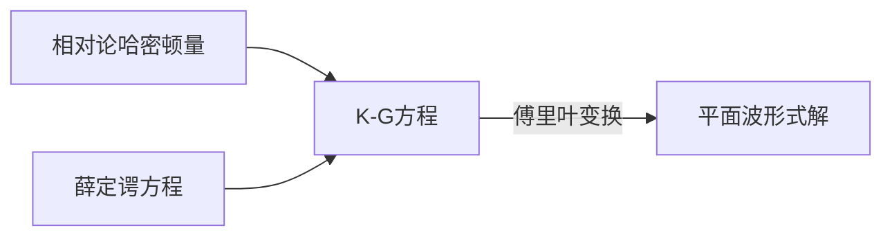

# 量子场论

[TOC]

## 约定

$$
\newcommand{\d}{\mathrm{d}}
\newcommand{\slash}[1]{\not{#1}}
\begin{align}
p=p^\mu&=(E/c,\vec{p})\\
x^\mu&=(ct,\vec{x})\\
g_{\mu\nu}&=(+,-,-,-)\\
p=p^\mu&=(E/c,-\vec{p})\\
E_{\pm p}&=\pm\sqrt{p^2+m^2}, \quad E_{-p}=-E_p
\end{align}
$$

泛函求导用$\eth$表示

## K-G方程

### 哈密顿量

要构建相对论量子力学, 哈密顿量H要满足
$$
p_\mu p^\mu=E^2-p^2=m^2
$$

### 运动方程

利用
$$
p^\mu=-i\hbar \frac{\partial}{\partial {x}^\mu}
$$
得到
$$
-\frac{\partial}{\partial {x}^\mu} \frac{\partial}{\partial {x}_\mu}=m^2
$$
带入薛定谔方程
$$
H \phi = E \phi
$$
得到
$$
\left(\Box ^2 + m^2\right)\phi(x)=0
$$
即为K-G方程

### 方程的解

> 一维..
>
> 二维..
>
> 三维..
>
> 根据以上傅里叶变换的结果得到

$$
\left(\Box ^2 + m^2\right)\phi(x)=0
$$

的傅里叶变换是4维的
$$
\phi(x)=\int \d^4p \operatorname{A}(p)e^{ipx}\delta(p_\mu p^\mu-m^2)+\int \d^4p \operatorname{B}(p)e^{-ipx}\delta(p_\mu p^\mu-m^2)
$$

> 由$\delta$函数的性质,
> $$
> \delta(f(x))=\sum_i{\frac{x-a_i}{\left\vert {f}^\prime(a_i)\right\vert}}
> $$
>

得到
$$
\begin{align*}
\delta(p_\mu p^\mu-m^2)&=\delta\left(p_0p^0-{\vec{p}}^2-m^2\right)\\
&=\delta\left(p_0p^0-({\vec{p}}^2+m^2)\right)\\
&=\delta((p^0)^2-E_p^2)\\
&=\frac{1}{2\left\vert p^0 \right\vert} \left( \delta(p^0-E_p)+\delta(p^0+E_p) \right)
\end{align*}
$$
带入傅里叶变换继续计算
$$
\begin{align*}
\int \d^4p \operatorname{A}(p)e^{ipx}\delta(p_\mu p^\mu-m^2)
&=\int \d^4p \operatorname{A}(p)e^{ipx}\frac{1}{2\left\vert p^0 \right\vert} \left( \delta(p^0-E_p)+\delta(p^0+E_p) \right)\\
&=\int dp^0\int \d^3 {\vec{p} \operatorname{A}(p^0,\vec{p})e^{i(p^0t-\vec{p}\cdot\vec{x})}\frac{1}{2\left\vert p^0 \right\vert} \left( \delta(p^0-E_p)+\delta(p^0+E_p) \right)}\\
\end{align*}
$$

注意到两个$delta$函数只有一个成立, 因此取$p^0\gt 0$的一个

> 之前解方程曾有要求
>
> 是对123维情况的类比, $p^0\gt 0$规定了一个正方向
>
> 这里也可以写成更简单的形式

$$
\begin{align*}
&=\int dp^0\int \d^3 {\vec{p} \operatorname{A}(p^0,\vec{p})e^{i(p^0t-\vec{p}\cdot\vec{x})}\frac{1}{2\left\vert p^0 \right\vert} \delta(p^0-E_p)}\\
&=\int \d^3 \vec{p}\left({ \operatorname{A}(p^0,\vec{p})e^{i(p^0t-\vec{p}\cdot\vec{x})}\frac{1}{2\left\vert p^0 \right\vert} \int dp^0\delta(p^0-E_p)}\right)\\
&=\int \d^3 \vec{p}\left( \int dp^0\delta(p^0-E_p){  \operatorname{A}(p^0,\vec{p})e^{i(p^0t-\vec{p}\cdot\vec{x})}\frac{1}{2\left\vert p^0 \right\vert }} \right)\\
&=\int \d^3 \vec{p} \operatorname{A}(E_p,\vec{p})e^{i(E_pt-\vec{p}\cdot\vec{x})}\frac{1}{2\left\vert E_p \right\vert }\\
&=\int \d^3 \vec{p} \frac{\operatorname{A}(E_p,\vec{p})}{2  E_p }e^{i(E_pt-\vec{p}\cdot\vec{x})}\\
\end{align*}
$$

因此可以将$\phi(x)$写成更简单的形式
$$
\phi(x)=\int \d^3 \vec{p} \left(\frac{\operatorname{A}(E_p,\vec{p})}{2 E_p }e^{i(E_pt-\vec{p}\cdot\vec{x})} + \frac{\operatorname{B}(E_p,\vec{p})}{2 E_p }e^{-i(E_pt-\vec{p}\cdot\vec{x})}\right)
$$

令$a(\vec{p})=\frac{\operatorname{A}(E_p,\vec{p})}{\sqrt{2E_p }}$, $b(\vec{p})=\frac{\operatorname{B}(E_p,\vec{p})}{\sqrt{2E_p }}$(因为$E_p$是$p$的函数), $\phi(x)$可以写为:
$$
\phi(x)=\int \d^3 \vec{p} \left( \frac{a(\vec{p})}{\sqrt{2E_p}}e^{i(E_pt-\vec{p}\cdot\vec{x})} +  \frac{b(\vec{p})}{\sqrt{2E_p}} e^{-i(E_pt-\vec{p}\cdot\vec{x})}\right)
$$

#### 实数解

如果是实标量场, 有$\phi(x)=\phi^\dagger(x)$, 得到
$$
\phi^\dagger(x)=\int \d^3\vec{p}\frac{1}{\sqrt{2E_p}}\left( b^\dagger(\vec{p})e^{i(E_pt-\vec{p}\cdot\vec{x})} +  a^\dagger(\vec{p}) e^{-i(E_pt-\vec{p}\cdot\vec{x})}\right)
$$
得到
$$
\begin{align}
a(\vec{p})&=b^\dagger(p)\\
b(\vec{p})&=a^\dagger(p)
\end{align}
$$

因此实标量场的解为
$$
\phi(x)=\int \frac{\d^3\vec{p}}{\sqrt{2E_p}}\left( a(\vec{p})e^{i(E_pt-\vec{p}\cdot\vec{x})} +  a^\dagger(\vec{p}) e^{-i(E_pt-\vec{p}\cdot\vec{x})}\right)
$$

### 场的量子化

到此为止, 所有的分析都是基于量子力学的, 没有涉及场的概念

这一节的内容就是二次量子化, 引入场的概念

#### 傅里叶变换

先将$a(\vec{p})$用逆傅里叶变换写出, 方便起见, 这里有一个常数
$$
\begin{align*}
\phi(x)&=\int \frac{\d^3\vec{p}}{(2\pi)^{\frac32}\sqrt{2E_p}}\left( a(\vec{p})e^{i(E_pt-\vec{p}\cdot\vec{x})} +  a^\dagger(\vec{p}) e^{-i(E_pt-\vec{p}\cdot\vec{x})}\right)\\
&=\int \frac{\d^3\vec{p}}{(2\pi)^{\frac32}\sqrt{2E_p}} a(\vec{p})e^{i(E_pt-\vec{p}\cdot\vec{x})} + \int \frac{\d^3\vec{p}}{(2\pi)^{\frac32}\sqrt{2E_p}}  a^\dagger(\vec{p}) e^{-i(E_pt-\vec{p}\cdot\vec{x})} \\
&=\int \frac{\d^3\vec{p}}{(2\pi)^{\frac32}\sqrt{2E_p}} a(\vec{p})e^{i(E_pt-\vec{p}\cdot\vec{x})} + \int \frac{\d^3\vec{p}}{(2\pi)^{\frac32}\sqrt{2E_p}}  a^\dagger( {\color{Red}-\vec{p}}) e^{-i(E_{\color{Red}-p}t {\color{Red}+\vec{p}}\cdot\vec{x})} \\
&=\int \frac{\d^3\vec{p}}{(2\pi)^{\frac32}\sqrt{2E_p}} \left(a(\vec{p})e^{i(E_pt-\vec{p}\cdot\vec{x})} + a^\dagger( -\vec{p}) e^{-i(-E_pt +\vec{p}\cdot\vec{x})} \right)\\
&=\int \frac{\d^3\vec{p}}{(2\pi)^{\frac32}\sqrt{2E_p}} \left(a(\vec{p})+a^\dagger( -\vec{p}) \right)e^{ipx}\\
\end{align*}
$$
又有傅里叶变换
$$
\begin{cases}
\phi(x)=\int \frac{\d^3\vec{p}}{(2\pi)^{\frac32}\sqrt{2E_p}} \tilde{\phi}(p) e^{ipx}\\\
\tilde{\phi}(p)  =\int \frac{\d^3\vec{x}}{(2\pi)^{\frac32}\sqrt{2E_p}} \phi(x) e^{-ipx}\\
\end{cases}
$$

> ==这里是三重积分, 四重积分可以转化为三重, 如何证明 文献忘记是哪一个了==

对于共轭动量密度有
$$
\pi(x)=\dot{\phi}(x)
$$
由对时间偏导可以交换到对动量的积分
$$
\begin{align*}
\pi(x)&=\frac{\partial}{\partial t} \int \frac{\d^3\vec{p}}{(2\pi)^{\frac32}\sqrt{2E_p}}\left( a(\vec{p})e^{i(E_pt-\vec{p}\cdot\vec{x})} +  a^\dagger(\vec{p}) e^{-i(E_pt-\vec{p}\cdot\vec{x})}\right) \\
&=\int \frac{\d^3\vec{p}}{(2\pi)^{\frac32}\sqrt{2E_p}}\frac{\partial}{\partial t} \left( a(\vec{p})e^{i(E_pt-\vec{p}\cdot\vec{x})} +  a^\dagger(\vec{p}) e^{-i(E_pt-\vec{p}\cdot\vec{x})}\right) \\
&=\int \frac{\d^3\vec{p}}{(2\pi)^{\frac32}}i\sqrt{\frac{E_p}{2}} \left( -a(\vec{p})e^{i(E_pt-\vec{p}\cdot\vec{x})} +  a^\dagger(\vec{p}) e^{-i(E_pt-\vec{p}\cdot\vec{x})}\right)\\
\end{align*}
$$
同样可以得到类似关系

==待补充==

得到
$$
\begin{align}
a(p)&=\frac12\left(\sqrt{2{E}_p}\tilde{\phi}(p)+i\sqrt{\frac{2}{E_p}}\tilde{\pi}(p)\right)\\
a^\dagger(p)&=\frac12\left(\sqrt{2{E}_p}\tilde{\phi}(-p)-i\sqrt{\frac{2}{E_p}}\tilde{\pi}(-p)\right)
\end{align}
$$
又有
$$
\begin{align*}
\tilde\phi(-p)&=\tilde\phi^\dagger(p)\\
\tilde\pi(-p)&=\tilde\pi^\dagger(p)
\end{align*}
$$

#### 二次量子化

利用共轭动量密度和==???==的对易关系, 可以推导出$a$和$a^\dagger$ 的对易关系
$$
\begin{align}
[a_p,a^\dagger_q]&=a_pa^\dagger_q-a^\dagger_qa_p\\
&=...\\
&=i\delta(\vec{p}-\vec{q})
\end{align}
$$

---

这里$a$与$a^\dagger$原本都是平面波展开的系数, 也就是常数(无论是实数还是复数). 常数的对易应当为零.

但是在推导过程中发现他们的对易不是零. 说明它们是**算符**而不是**数**. 对应地, 说明K-G方程的解$\phi(x)$不是一般意义上的一个波函数(函数值是一个复数), 而是一个算符.

这样把波函数"**看作是**"算符的过程, 叫做二次量子化.

二次量子化具体发生在那哪一步? 发生在认为K-G方程的解(应为波函数)对应场广义坐标密度(算符)的那一步. ==justification?==

------

对应的可以利用$a$和$a^\dagger$表示哈密顿量

哈密顿量$H$和对应地哈密顿量密度$\mathcal{H}$有
$$
H=\int \d^3 x\mathcal{H}
$$
由经典场论的结果
$$
\begin{align}
\mathcal{L}&=\frac12(\partial^\mu\phi)((\partial_\mu\phi)-\frac12m^2\phi^2\\
\pi(x)&=\frac{\eth \mathcal{L}}{\eth (\partial^0\phi)}=\frac{\eth \mathcal{L}}{\eth (\dot\phi)}=...=\dot\phi(x)\\
\mathcal{H}&=\pi(x)\dot{\phi}(x)-\mathcal{L}\\
&=\pi^2(x)-\frac12({(\dot{\phi}(x))}^2-{(\nabla\phi(x))}^2-m^2{\phi(x)}^2)\\
&=\frac12(\pi^2+{(\nabla\phi)}^2+m^2\phi^2)
\end{align}
$$
分别计算三项
$$
\begin{align}
\int \d^3 \vec{x} {(\pi(x))}^2 
&=\int \d^3\vec{x} \left( \int \frac{\d^3\vec{p}}{(2\pi)^{\frac32}}i\sqrt{\frac{E_p}{2}} \left( -a(\vec{p})e^{ipx} +  a^\dagger(\vec{p}) e^{-ipx}\right)\right)
\\& \qquad \cdot \left(\int \frac{\d^3\vec{q}}{(2\pi)^{\frac32}}  i\sqrt{\frac{E_q}{2}} \left( -a(\vec{q})e^{iqx} +  a^\dagger(\vec{q}) e^{-iqx}\right) \right)\\
&=\int \d^3 \vec{x}  \int \d^3\vec{p} \int  \d^3\vec{q} \frac{-1}{2(2\pi)^{3}} \sqrt{E_pE_q}\left( -a(\vec{p})e^{ipx} +  a^\dagger(\vec{p}) e^{-ipx}\right) 
\\& \qquad \cdot \left( -a(\vec{q})e^{iqx} +  a^\dagger(\vec{q}) e^{-iqx}\right)  \\
&=\int \d^3 \vec{x}  \int \d^3\vec{p} \int  \d^3\vec{q} \frac{-1}{2(2\pi)^{3}} \sqrt{E_pE_q}\\
& \qquad \left(a(\vec p)a(\vec q)e^{i(p+q)x}+a^\dagger(\vec p)a^\dagger(\vec q)e^{-i(p+q)x}-a^\dagger(\vec p)a(\vec q)e^{i(q-p)x}-a(\vec p)a^\dagger(\vec q)e^{i(p-q)x}\right)\\
&= \int \d^3\vec{p} \int  \d^3\vec{q} \frac{-1}{2(2\pi)^{3}} \sqrt{E_pE_q}\\
& \qquad \int \d^3 \vec{x} \left(a(\vec p)a(\vec q)e^{i(p+q)x}+a^\dagger(\vec p)a^\dagger(\vec q)e^{-i(p+q)x}-a^\dagger(\vec p)a(\vec q)e^{i(q-p)x}-a(\vec p)a^\dagger(\vec q)e^{i(p-q)x}\right)\\
&= \int \d^3\vec{p} \int  \d^3\vec{q} \frac{- \sqrt{E_pE_q}}{2(2\pi)^{3}}
\left(a(\vec p)a(\vec q)e^{i(E_p+E_q)t}+a^\dagger(\vec p)a^\dagger(\vec q) e^{-i(E_p+E_q)t}\right)\delta(\vec p+\vec q)\\
&\qquad - \int \d^3\vec{p} \int  \d^3\vec{q} \frac{- \sqrt{E_pE_q}}{2(2\pi)^{3}}\left(a^\dagger(\vec p)a(\vec q)e^{i(E_p-E_q)t}+a(\vec p)a^\dagger(\vec q)e^{-i(E_p-E_q)t}\right)\delta(\vec p-\vec q)\\
&= \int \d^3\vec{p}  \frac{-E_p}{2(2\pi)^{3}} \left(a(\vec p)a(-\vec p)e^{2iE_pt}+a^\dagger(\vec p)a^\dagger(-\vec p)e^{-2iE_pt}-a^\dagger(\vec p)a(\vec p)-a(\vec p)a^\dagger(\vec p) \right)\\
\end{align}
$$

其余两项同理可得

因此得到哈密顿量
$$
\begin{align}
\notag  H&=\int \d^3 \vec{x} \mathcal{H} \\ \notag
&=\frac12\int \d^3 \vec{p} E_p \left(a^\dagger(\vec p)a(\vec p)+a(\vec p)a^\dagger(\vec p)\right)\\
\end{align}
$$

和谐振子的很像

### 零点能与normal ordering

一个重大问题在于, 这样的哈密顿量零点能是无穷大. 因为空间每一点都是一个谐振子, 每一个谐振子都有不为零的零点能, 导致场的零点能是无穷大. 
$$
\begin{align}
H &=\frac12 \int \d^3 \vec{p} E_p \left(a^\dagger(\vec p)a(\vec p)+a(\vec p)a^\dagger(\vec p)\right)\\
&=\int \d^3 \vec{p} E_p \left(a^\dagger(\vec p)a(\vec p)+\frac12\left[a(\vec p),a^\dagger(\vec p)\right]\right)\\
&=\int \d^3 \vec{p} E_p \left(a^\dagger(\vec p)a(\vec p)+\frac12\delta(\vec0) \right)\\
\end{align}
$$
但是这并不影响能量差的计算, 毕竟只有能量差才是物理可观测量.

消除零点能, 可以直接计算能量差, 如:
$$
\begin{align}
\langle n |H | n\rangle &=\langle n |\int \d^3 \vec{p} E_p \left(a^\dagger(\vec p)a(\vec p)+\frac12\left[a(\vec p),a^\dagger(\vec p)\right]\right)  | n\rangle\\
&=\int \d^3 \vec{p} E_p \langle n |\left(a^\dagger(\vec p)a(\vec p)+\frac12\left[a(\vec p),a^\dagger(\vec p)\right]\right)| n\rangle  \\
&=\int \d^3 \vec{p} E_p \langle n |a^\dagger(\vec p)a(\vec p)| n\rangle  +\int \d^3 \vec{p} E_p \langle n |\frac12\left[a(\vec p),a^\dagger(\vec p)\right] | n\rangle  \\
&=nE_p+\langle 0 |H | 0\rangle
\end{align}
$$
但对于更复杂的情形(如高次项, 类似晶体中的非谐效应导致不同p之间的耦合) 这样计算较为复杂.

采用Normal Ordering的方式计算更为简便. 即先令$\left[a(\vec p),a^\dagger(\vec p)\right] =0$, 把$a^\dagger(\vec p)$一律放在$a(\vec p)$前面, 再恢复二者对易关系, 往后计算. 这种计算方法在前面的例子中等价于直接舍去对易项. 因此把normal ordering 之后的哈密顿量写作
$$
:H: \equiv \int \d^3 \vec{p} E_p a^\dagger(\vec p)a(\vec p)
$$

### 对称性分析

### 传播子

## Dirac方程

没有在K-G里面讲: 负能量粒子的问题E可正可负

狄拉克想要一个线性方程

方程的提出是一个随机的过程, 但之后人们发现这个方程描述的是自旋$\frac12$的粒子, 而不是狄拉克原先设想的那样. 接下来我们按照狄拉克的思路描写这个方程的产生.

==希望我有时间可以直接从:要描述spin=1/2粒子开始写方程 角度来写==

### 哈密顿量

$$
H^2=p^2+m^2\\
\rightarrow H=\gamma^0(\vec{\gamma}\cdot\vec{p}+m)
$$

可以看作是对哈密顿量的开方操作

#### $\gamma$矩阵的性质

...

### 运动方程

$$
i\hbar \frac{\partial}{\partial t}\psi(x)=\gamma^0(-i\vec{\gamma}\cdot \vec{\nabla}+m)\psi(x)
$$

可以写为
$$
(i\gamma^\mu \partial_\mu-m)\psi(x)=0
$$

### 方程的解

对于平面波$\psi(x)=u(\vec p)e^{-ipx}$, $\psi(x)=v(\vec p)e^{ipx}$ 分别为方程的正频解和负频解
$$
\begin{align}
(p^\mu\gamma_\mu-m)u(\vec p ) &= 0\\
(p^\mu\gamma_\mu+m)v(\vec p ) &= 0
\end{align}
$$
注意狄拉克本来想要只有正能量的解, 可是这里仍然会有负能量的解.

### 场的量子化

#### Dirac场的拉格朗日量
$$
\mathcal{L}=\bar{\psi}(i\not\partial -m)\psi
$$

#### Dirac场的量子化

狄拉克方程有两个解. 类似地可以写成
$$
\psi(x)=\int \d^3\vec{p}
$$

### 对称性分析

### 传播子

## S矩阵

## Wick定理与费曼图

## 散射截面的计算

